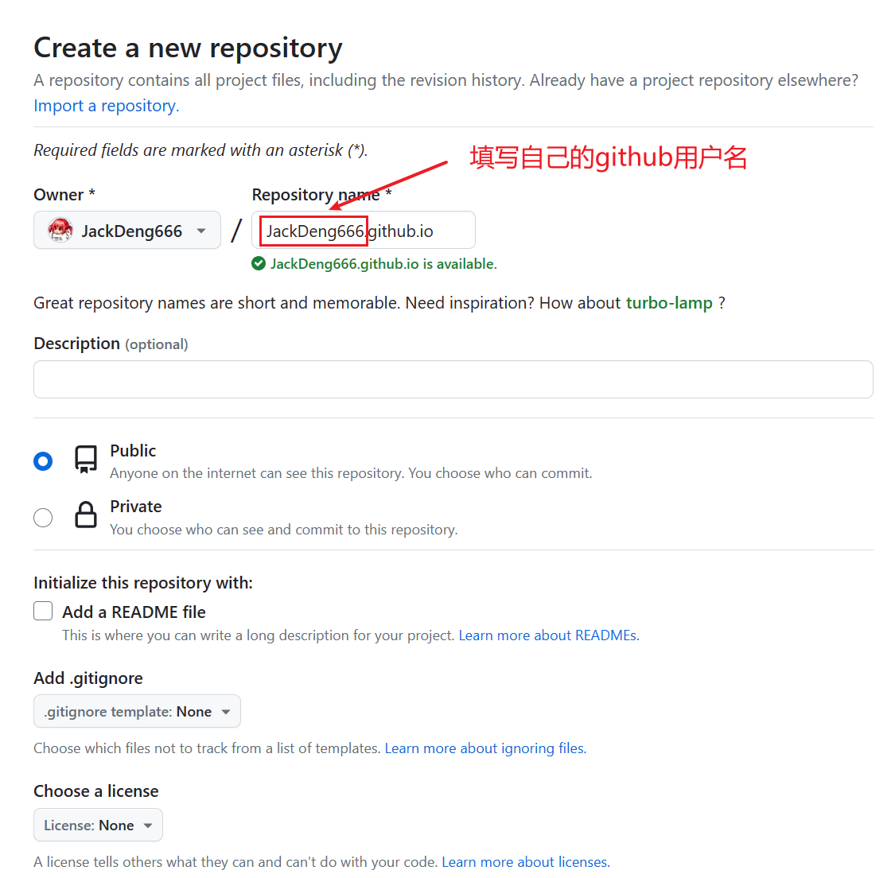
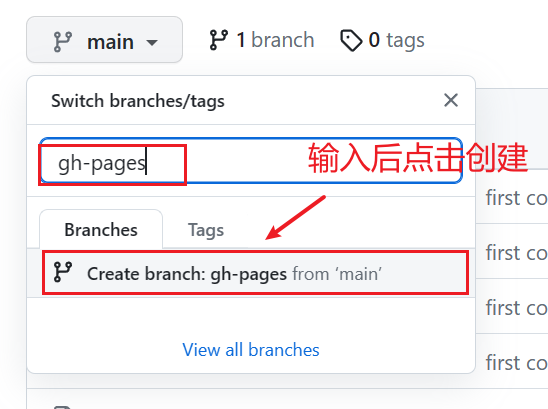
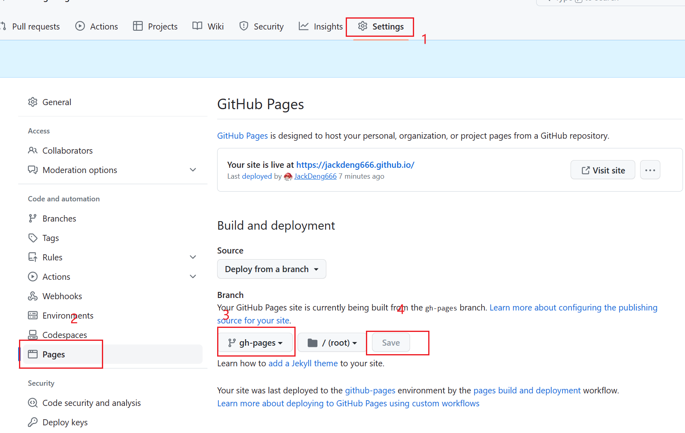

docusaurus 是一个 react 的 ssg 框架，可以生成静态博客，因此可以部署到许多免费的静态文件托管服务上，如 Github Pages、Vercel。

并且 docusaurus 自带自动推送到 Github Pages 的部署命令，所以本篇文章记录一下用 Github Pages 部署的流程。

<!--truncate-->

## github 仓库准备

### 1. github 创建仓库

注意仓库必须以 `<github账号名>.github.io` 命名。



### 2. 把 docusaurus 项目推送到仓库

```shell
git init
git add .
git commit -m "first commit"
git branch -M main
git remote add origin git@github.com:<github账号名>/<github账号名>.github.io.git
git push -u origin main
```

### 3. 新建分支 gh-pages



### 4. 设置部署分支



此时就可以通过连接 `https://<github账号名>.github.io` 访问到仓库 `<github账号名>.github.io` 的 `gh-pages` 分支里的内容。

## 部署

### 1. 修改 docusaurus.config.js

```js title="docusaurus.config.js"
const config = {
  ...
  url: 'https://<github账号名>.github.io',
  baseUrl: '/',

  organizationName: '<github账号名>', // 填写用户名
  projectName: '<github账号名>.github.io', // 填写项目名
  deploymentBranch: 'gh-pages', // 填写分支为gh-pages
  ...
}
```

### 2. 部署检查

观察 package.json

```js title="package.json"
{
  ...
  "scripts": {
    "docusaurus": "docusaurus",
    "start": "docusaurus start",
    "build": "docusaurus build",
    "swizzle": "docusaurus swizzle",
    "deploy": "docusaurus deploy",
    "clear": "docusaurus clear",
    "serve": "docusaurus serve",
    ...
  },
  ...
}
```

在本地先打包，部署检查一下，看看会不会有问题：

```shell
npm run build
npm run serve
```

### 3. 执行部署

没问题就直接部署

```shell
npm run deploy
```

等待执行完成后，打包后的内容将会被传到 `<github账号名>.github.io` 仓库的 `gh-pages` 分支里，浏览器输入 `https://<github账号名>.github.io` 网址就可以看到效果了。

## 其他项目使用 GitHub Pages

假如现在你有一个仓库名称叫 `a`，同时也开启了 GitHub Pages，那么你通过 `https://<github账号名>.github.io/a` 即可访问到项目 `a` 的内容，也就是说 `https://<github账号名>.github.io` 根目录的内容就是由 `<github账号名>.github.io` 仓库所决定的。
