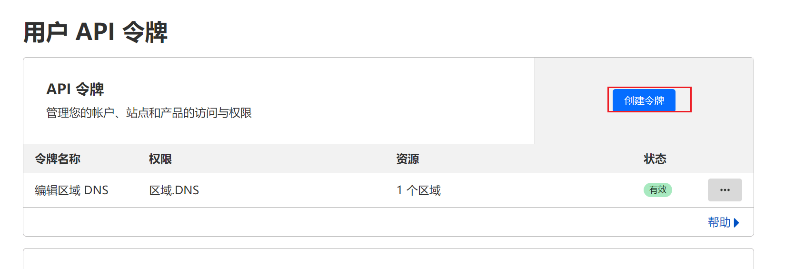
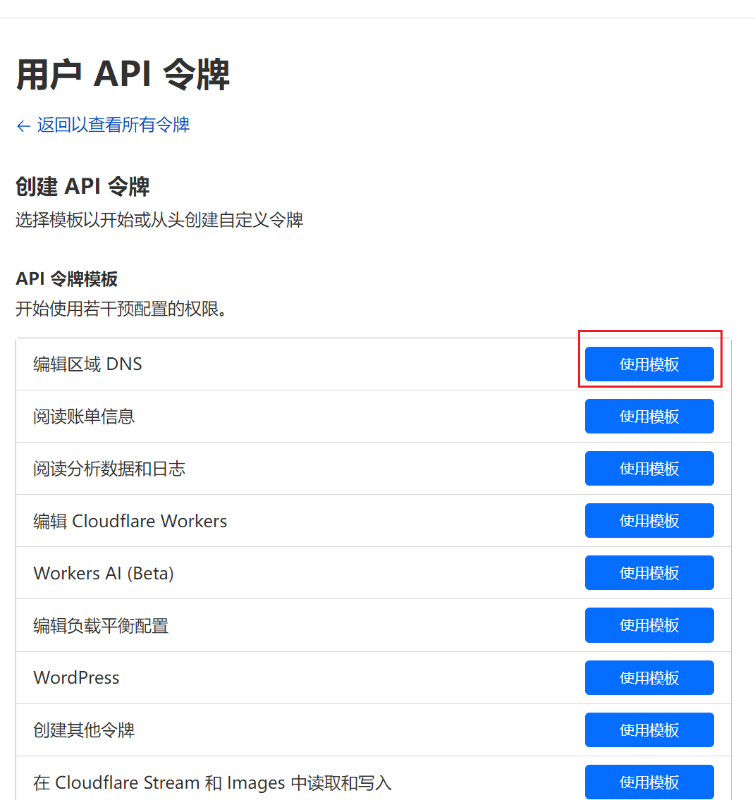
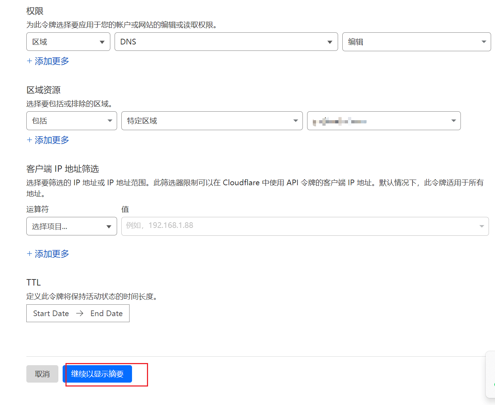
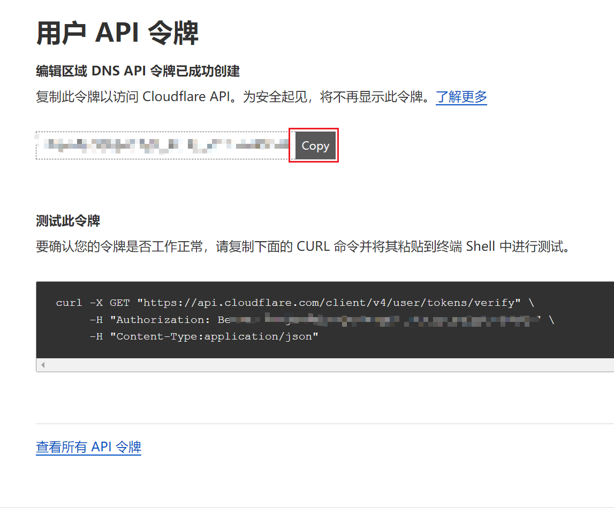
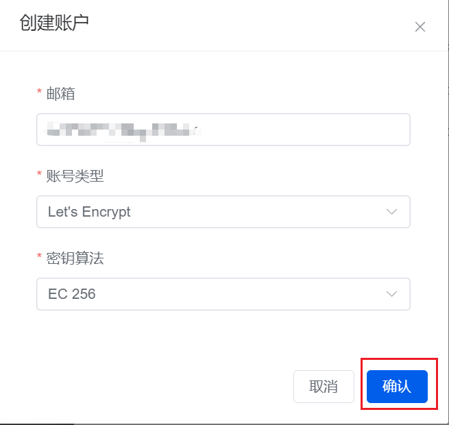
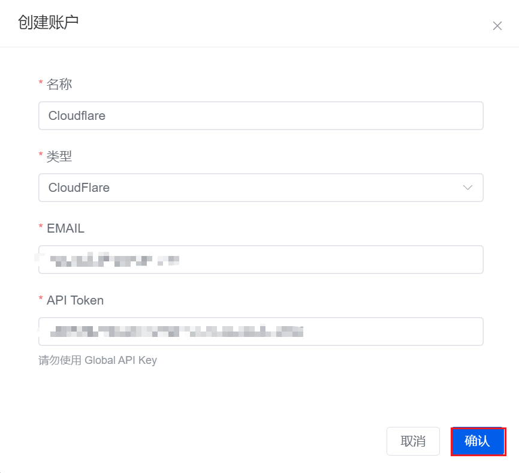
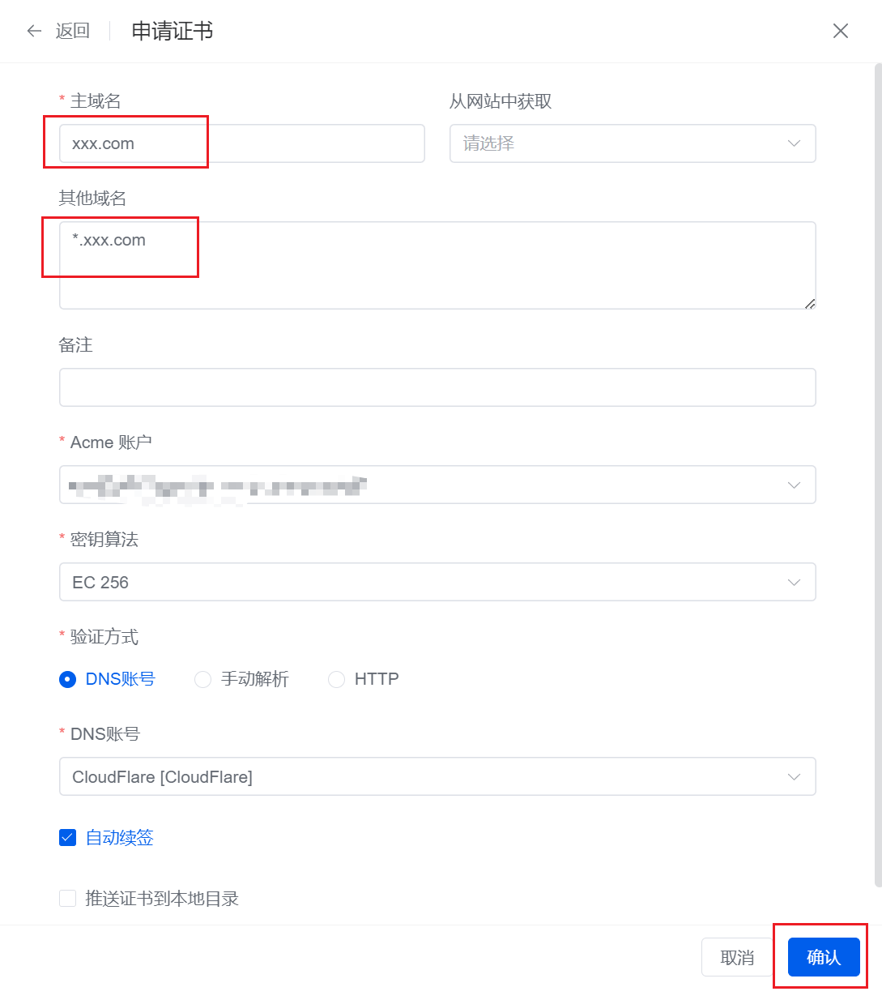

### 在 Cloudflare 中创建 DNS 令牌

要在 1panel 中使用 cloudflare 的 API 申请 Let's Encrypt 的泛域 ssl 证书，首先要在 Cloudflare 中创建 DNS 令牌。

看 Cloudflare 的文档说明，发现有两种方式，第一种就是全局 API 密钥，它具有最大权限，可以执行任意操作，但如果泄漏的话风险就非常大，官方和 1panel 都不建议使用。第二种就是使用用户可自定义权限的 API 令牌，它可以按需给权限，将使用权限限定在指定的范围内，安全性较好，建议使用，即使泄漏也不影响全局。

获取令牌 token 具体方法如下：

<!--truncate-->

1. 登录 Cloudflare，打开“用户 API 令牌”页面（[https://dash.cloudflare.com/profile/api-tokens](https://dash.cloudflare.com/profile/api-tokens)），点击创建令牌；

2. 选择“编辑区域 DNS”，点击“使用模板”；

3. 在详细选项里，“权限”一栏中，依次选择“区域”——“DNS”——“编辑”，指定这个令牌只对编辑 DNS 生效；

4. 在“区域资源”一栏中，如果选择“包括”——“所有区域”，token 将对所有域名都有权限操作，可以选择“特定区域”，然后指定固定的域名。

5. 如果客户端的 IP 是固定的，可以在“客户端 IP 地址筛选”一栏中，指定客户端 IP，这样即使 token 外泄了，但因为客户端来源不在列表中，也不能访问；

6. “TTL”一栏中，可以指定这个令牌的生存周期，我要长期使用，所以不用理会；

继续下一步操作，就生成了所需的令牌了。

### 在 1panel 中申请证书

先到 1panel 的 "网站" -> "证书" 位置，创建好 Acme 账号和 DNS 账号，DNS 账号选 Cloudflare, 把刚刚申请好的 token 放进去即可。

然后点击申请证书，主域名填上对应的域名如，xxx.com，然后在其他域名里填上 \*.xxx.com，这样就可以申请泛域名证书了，选择好 Acme 账号和 DNS 账号，最后点击确认即可。

