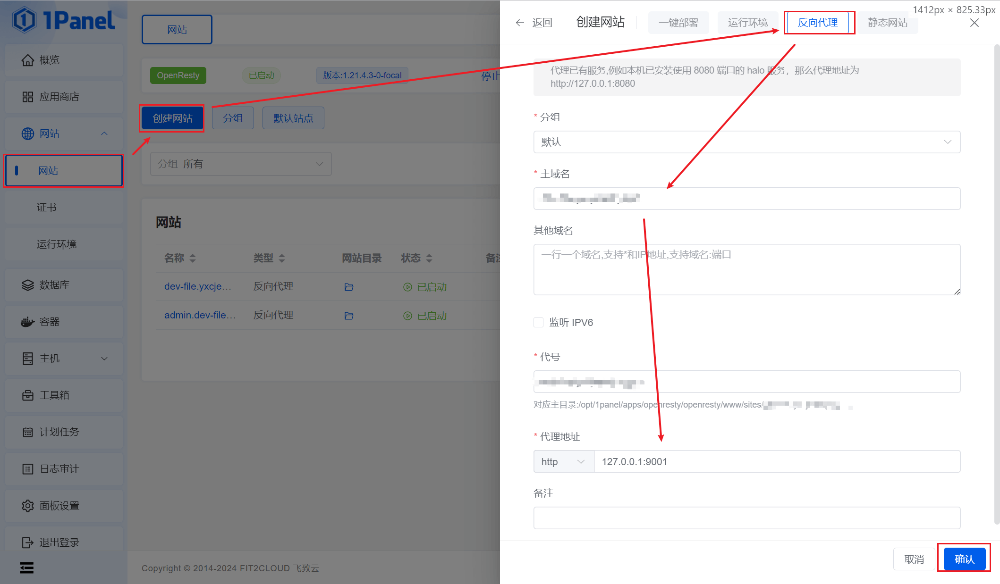
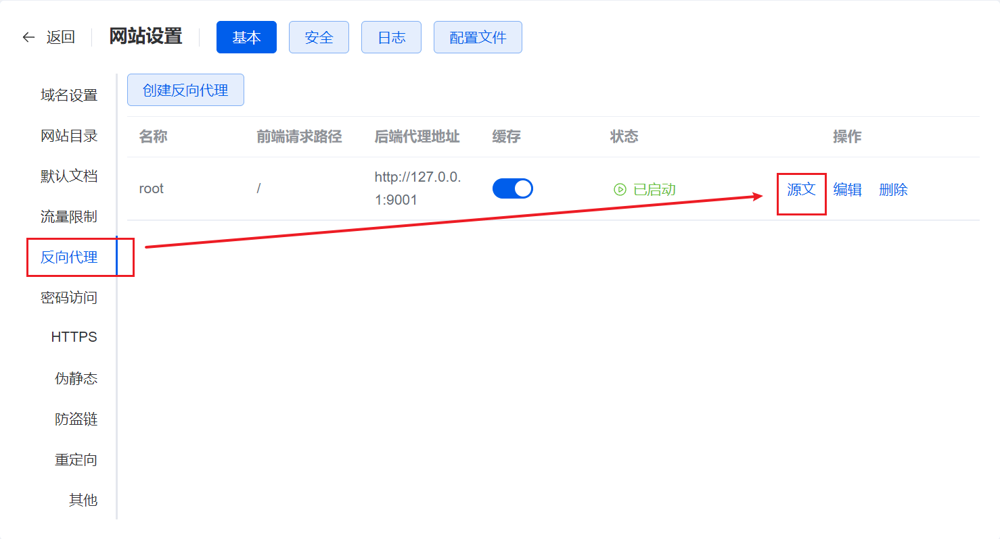
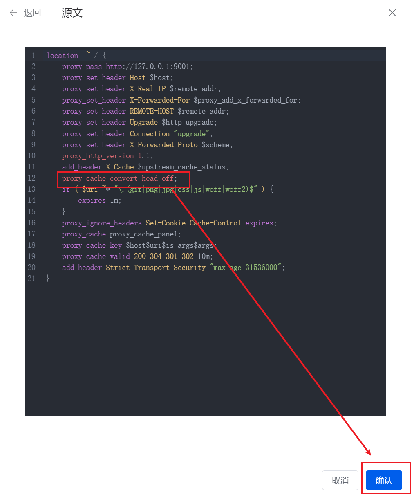

### 启动 minio 并配置 HTTPS

在 1panel 中启动 minio 可以去应用商店直接启动，也可以自己通过 docker 命令去启动，通过命令启动可以查看[这篇文章](/docs/docker/images/minio)。

此时启动完成后，直接通过 ip 去访问后台和在代码里连接 api 服务都是没问题的，那么接下来就开始配置 nginx 的反向代理。

<!--truncate-->

在 1panel 中的话直接通过创建网站即可配置。

地址要选择 MinIO 服务的地址。

创建好网站后，在列表里点击配置，然后点击 HTTPS -> 启动 HTTPS，选好对应的证书即可开启 HTTPS。

### node 客户端无法连接的问题

这时候问题来了，在代码里改成 HTTPS 连接 MinIO 后出现了报错，`S3Error: Valid and authorized credentials required`。

我通过对比 MinIO 官方文档的反向代理配置和 1panel 默认生成的反向代理配置的异同测试了很多遍都不行。

[英文 MinIO Nginx 反向代理](https://min.io/docs/minio/linux/integrations/setup-nginx-proxy-with-minio.html)

[中文 MinIO Nginx 反向代理](https://www.minio.org.cn/docs/minio/linux/integrations/setup-nginx-proxy-with-minio.html)

最后加上了一个 `proxy_cache_convert_head off;` 就解决了。

似乎是 Nginx 反代时，这个配置启动会导致一些信息无法传递过去。
