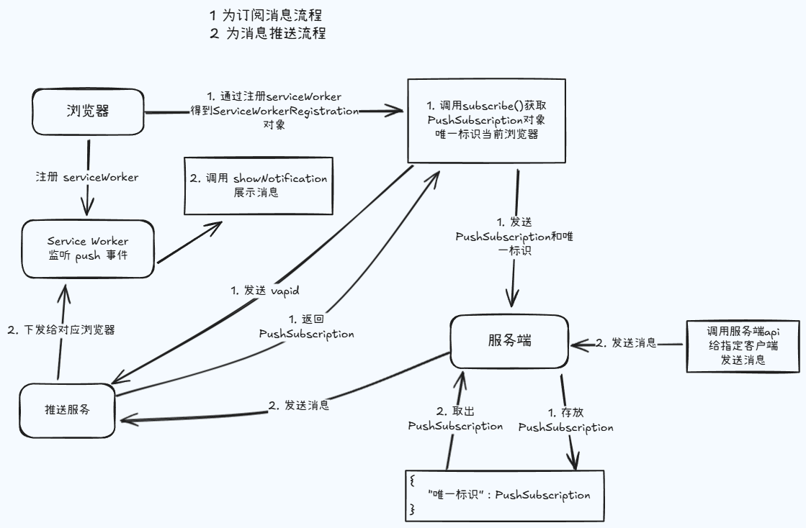

## Web Push

Web Push（网页推送）是一种在 Web 浏览器中向用户发送实时消息的通信技术。它允许网站向用户发送通知，即使用户没有打开或使用网站。当用户同意接收通知后，网站可以通过 Web Push 服务向用户的设备发送推送消息，即使在用户没有打开应用的情况下也可以发送。这些消息将显示在用户的操作系统、浏览器或移动设备上，以吸引用户的注意并提供实时信息。这种技术主要依赖于 [Service Worker](https://developer.mozilla.org/zh-CN/docs/Web/API/Service_Worker_API) ：一个在浏览器后台运行的脚本，可以在用户没有打开网页的情况下响应事件。

> 注意：经过个人测试在 PC 和安卓设备上，Chrome 和 Edge 都能使用 Web Push 通知，在 iOS 设备上目前还不支持。

### Web Push 推送流程

Web Push 推送流程可以分为以下步骤：

- Web 页面向浏览器请求推送权限。此时浏览器会向用户展示对应界面。
- 用户同意后，浏览器会生成一组订阅信息，并将此订阅信息跟请求推送的应用服务器关联起来，发给推送服务。
- Web 应用将订阅信息连同用户的其他信息发送给应用服务器保存。
- 需要给用户推送消息时，应用服务器会按照 [web-push 协议](https://datatracker.ietf.org/doc/html/draft-ietf-webpush-protocol) 的规范构造数据，然后发送给推送服务。
- 推送服务收到消息后做必要的鉴权，然后将消息发送给浏览器。
- 浏览器收到推送后展示提示信息，用户点击推送消息后会打开指定页面或者执行其他操作。

省略掉一些兼容性的判断过程，最简化的整体逻辑如图所示：



## 订阅消息

假设用户启用了通知，现在我们可以订阅推送服务：

```js
async function subscribe () {
  // 注册 service-worker.js 获取 ServiceWorkerRegistration 对象
  let registration = await navigator.serviceWorker.register('/service-worker.js', {scope: '/'})
  // 发起推送订阅
  let pushSubscription = await registration.pushManager.subscribe({
    userVisibleOnly：true,
    applicationServerKey: "BHX-QQ4hyVUMudPeU6U8bqY-bDHYimt2jk5k00LEjoEaEq65A3IyLm3ZjST8WgTtqDQTX9PwWd-shduHJ-G89hw"
  })
  // 将 pushSubscription 发送给应用后端服务器
}
```

在上面的示例中，subscribe 方法接受 userVisibleOnly 参数，如果该参数为 true 但没有调用 Notification API 时，浏览器会弹出默认的提示框提示有应用程序在后台运行，确保每个消息都有匹配的通知。对于部分浏览器而言（如 Chrome for Android），该属性必须设置为 true，不然会报错。

订阅成功后，推送服务器返回订阅信息 pushSubscription 对象， pushSubscription 的结构如下：

```json
{
  "endpoint": "https://fcm.googleapis.com/fcm/send/dpH5lCsTSSM:APA91bHqjZxM0VImWWqDRN7U0a3AycjUf4O-byuxb_wJsKRaKvV_iKw56s16ekq6FUqoCF7k2nICUpd8fHPxVTgqLunFeVeB9lLCQZyohyAztTH8ZQL9WCxKpA6dvTG_TUIhQUFq_n",
  "keys": {
    "p256dh": "BLQELIDm-6b9Bl07YrEuXJ4BL_YBVQ0dvt9NQGGJxIQidJWHPNa9YrouvcQ9d7_MqzvGS9Alz60SZNCG3qfpk=",
    "auth": "4vQK-SvRAN5eo-8ASlrwA=="
  }
}
```

pushSubscription 包含公钥和 endpointURL，应用服务器推送时可以使用公钥对消息加密，endpointURL 是由推送服务器生成包含唯一标识符的 URL，推送服务器通过它判断将消息发送到哪个客户端。

### 使用 VAPID

在上文订阅推送 subscribe 方法中，还传入了一个 applicationServerKey 参数给推送服务，这个参数的作用是什么呢？

Web Push 协议出于用户隐私考虑，在应用和推送服务器之间没有进行强身份验证，这为用户应用和推送服务都带来了一定的风险。解决方案是对 Web Push 使用自主应用服务器标识（VAPID）协议，VAPID 规范允许应用服务器向推送服务器标识身份，推送服务器知道哪个应用服务器订阅了用户，并确保它也是向用户推送信息的服务器。使用 VAPID 服务过程很简单，通过几个步骤可以理解 VAPID 如何实现安全性。

应用服务器创建一对公钥/私钥，并将公钥提供给 Web App 客户端
当用户尝试订阅推送服务时，将公钥添加到 subscribe() 订阅方法中，公钥将被发送到推送服务保存。
应用服务器想要推送消息时，发送包含公钥和已经签名的 JSON Web 令牌到推送服务提供的 API，推送服务验证通过后，将信息推送至 Web App 客户端。
为了避免处理过多加密细节，在这里我们只需简单了解 VAPID 规范即可，因为目前已经有很多库来帮助开发者生成公钥，从而大大减少开发工作量。假设开发者使用 Node.js 作为服务端语言，那么可以通过安装 web-push 来协助生成公钥。

```bash
npm install web-push
```

然后就可以通过命令行生成公钥和私钥了：

```bash
npx web-push generate-vapid-keys --json
```

```json
{
  "publicKey": "BHX-QQ4hyVUMudPeU6U8bqY-bDHYimt2jk5k00LEjoEaEq65A3IyLm3ZjST8WgTtqDQTX9PwWd-shduHJ-G89hw",
  "privateKey": "mm1xKO6SbqftnHnC0VGNiYpkgoMchIwdLIBDVh5zQIM"
}
```

## 消息推送

### 后端服务推送消息

接下来我们来实现后端服务推送消息。正如前面所提到的那样，第三方推送服务是由浏览器决定的，因此可能存在不同的浏览器对应不一样的第三方推送服务，而不同的第三方推送服务所要求的后端配置也是不一样的，因此在开发的时候，需要针对不同浏览器的不同推送服务，开发不同的后端推送服务，当然也可以选择一些现成的跨平台推送方案，如 [OneSignal](https://onesignal.com/)，这些跨平台推送方案已经集成好了多种浏览器的推送服务，使得开发者不再需要去关心不同浏览器的推送服务适配问题。

在这里我们演示一段基于 Chrome 浏览器的后端推送服务代码。Chrome 浏览器所对应的推送服务器为 Firebase 云服务（FCM），假设应用服务后端使用 Node.js，那么我们可以使用 [web-push](https://www.npmjs.com/package/web-push) 库来实现后端向推送服务器发送消息的方法：

```js
const webpush = require('web-push')

const vapidKeys = {
  publicKey:
    'BHX-QQ4hyVUMudPeU6U8bqY-bDHYimt2jk5k00LEjoEaEq65A3IyLm3ZjST8WgTtqDQTX9PwWd-shduHJ-G89hw',
  privateKey: 'mm1xKO6SbqftnHnC0VGNiYpkgoMchIwdLIBDVh5zQIM'
}
webpush.setVapidDetails(
  'mailto:your-email@provider.com',
  vapidKeys.publicKey,
  vapidKeys.privateKey
)

webpush.setGCMAPIKey('<Your GCM API Key Here>')

module.exports = function pushMessage(pushSubscription, message) {
  return webpush.sendNotification(pushSubscription, message)
}
```

其中 vapidKeys 就是前面生成的公钥和私钥，它们也可以通过 webpush.generateVAPIDKeys() 在程序运行时调用该函数生成。但需要注意的是，公钥和私钥只需要生成一次，后续直接使用生成好的值即可。生成的公钥和私钥需要传入 webpush.setVapidDetails() 函数中对 web-push 进行配置。

接着是 webpush.setGCMAPIKey()，这个函数需要传入 Firebase 云服务（FCM）申请到的 GCMAPIKey。

配置好之后，就可以使用 webpush.sendNotification() 方法推送消息了。该方法第一个参数需要传入 pushSubscription，也就是推送订阅的最后一步中，浏览器向后端服务发送的 pushSubscription 对象。

后端服务在存储 pushSubscription 的时候，需要做好用户信息与 pushSubscription 的映射关系，这样，后续想要给哪个用户推送消息，只需要获取对应的 pushSubscription 即可。

sendNotification() 方法传入的第二个参数就是想要推送给用户的信息，它可以是字符串、或者 node Buffer。比如我们可以通过 JSON.stringify(obj) 的方式来向浏览器推送一个对象信息：

```js
webpush.sendNotification(
  pushSubscription,
  JSON.stringify({
    msg: 'Hello World!',
    url: 'https://www.baidu.com'
  })
)
```

### 浏览器接收推送消息

在完成推送订阅之后，浏览器与推送服务器建立了通信，此时浏览器可以在 Service Worker 通过监听 push 事件来接收推送服务发送的消息。

```js
self.addEventListener('push', event => {
  console.log('push event:', event)
  const data = event.data.json()
  console.log('data:', data)

  self.registration.showNotification(data.msg, {
    body: data.msg,
    data
  })
})
```

消息通过事件回调下面的 data 属性获取。data 提供了以下方法来实现不同类型的消息进行解析：

- arrayBuffer()：将消息解析成 ArrayBuffer 对象；
- blob()：将消息解析成 Blob 对象；
- json()：将消息解析成 JSON 对象；
- text()：将消息解析成字符串；

需要注意的是，当推送服务器推送的消息没有任何数据时，data 属性可能为空，因此需要做好代码容错。

消息弹框点击事件：

```js
self.addEventListener('notificationclick', async event => {
  console.log('notificationclick event:', event)
  event.notification.close()
  const data = event.notification.data
  self.clients.openWindow(data.url)
})
```

### 取消订阅

当网站在完成推送订阅之后，Web Push API 也提供了相应的方法来取消订阅。前面提到推送订阅成功之后 PushManager.subscribe() 方法返回的 pushSubscription 对象上有一个 unsubscribe() 就是用来取消订阅的：

```js
pushSubscription.unsubscribe().then(() => {
  console.log('取消订阅成功！')
})
```

在取消订阅之前，我们可以通过 PushManager.getSubscription() 方法来判断用户是否已经订阅，如果用户已经订阅过，那么该函数会返回 pushSubscription 对象，这样接下来再调用 unsubscribe() 方法最终取消订阅。完整的代码如下所示：

```js
registration.pushManager.getSubscription().then(pushSubscription => {
  if (!pushSubscription) {
    // 用户尚未订阅
    return
  }
  // 取消订阅
  return pushSubscription.unsubscribe()
})
```
