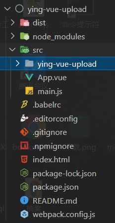
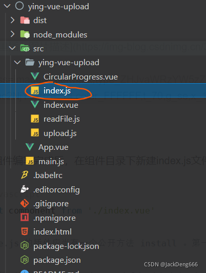
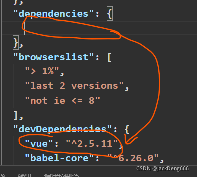

本篇文章来研究一下如何封装 vue 组件并发布到 npm，然后在其他项目下载使用。

<!--truncate-->

### 1. 项目初始化

首先，要创建项目，封装 vue 的插件，初始化 vue 工程一般用：
`vue create [项目名]`，但是我们要写的是一个简单的 vue 组件，不需要依赖那么多而庞大的配置，所以，这里我们用简版的 webapck 配置模板：

```shell
vue init webpack-simple [项目名]
```

但是因为用了 vue-cli 4 以上的版本（我是@vue/cli 4.5.15） ，报了个错

```shell
Command vue init requires a global addon to be installed.
Please run yarn global add @vue/cli-init and try again.
```

解决方法：

```shell
npm install -g @vue/cli-init
```

然后继续创建`vue init webpack-simple [项目名]`。

完成后安装依赖，启动项目

```shell
npm install
npm run dev
```

### 2.把组件写好并查看效果

此时编写组件就像平时写项目里封装组件一样，写好并查看效果，我这里写了个图片上传组件：



App.vue 里就正常引入查看效果：

```js title="src/App.vue"
<template>
  <div id="app">
    <div class="center">
      <yingVueUpload
        ref="upload"
        width='90px'
        height='90px'
        :maxCount="9"
        proBarColor="#E10602"
        uploadUrl="http://localhost:3033/nav/uploadImg"
        :uploadCallBack="upCallBack"></yingVueUpload>
    </div>
    <button style="margin-top: 100px;" @click="getData">
      获取数据
    </button>
  </div>
</template>

<script>
import yingVueUpload from './ying-vue-upload'; // 引入
export default {
  components: {
    yingVueUpload
  },
  name: 'app',
  data () {
    return {

    }
  },
  methods: {
    getData() {
      console.log(this.$refs['upload'].getDataList())
    },
    upCallBack(res) {
      return res.url
    }
  }
}
</script>
```

觉得组件编写完成后，在组件目录下新建 index.js 文件，写入代码如下：



```js title="src/ying-vue-upload/index.js"
import component from './index.vue' // 引入当前组件

// Vue.js 的插件应当有一个公开方法 install 。第一个参数是 Vue 构造器，第二个参数是一个可选的选项对象
// 参考：https://cn.vuejs.org/v2/guide/plugins.html#%E5%BC%80%E5%8F%91%E6%8F%92%E4%BB%B6
// 此处注意，组件需要添加name属性，代表注册的组件名称，也可以修改成其他的
component.install = (Vue) => Vue.component(component.name, component) //注册组件

export default component
```

Vue 的插件必须提供一个公开方法 install，该方法会在你使用该插件，也就是 Vue.use(yourPlugin)时被调用。这样也就给 Vue 全局注入了你的所有的组件。

### 3.修改配置项

我们只需单独打包编写好的 vue 组件即可，
修改 webpack.config.js ，主要是 entry,output

```js title="webpack.config.js"
const NODE_ENV = process.env.NODE_ENV;
module.exports = {
  entry: NODE_ENV == 'development' ? './src/main.js' : './src/ying-vue-upload/index.js',// 开发模式编译整个项目查看组件效果，编译打包模式直接打包组件
  output: {
    path: path.resolve(__dirname, './dist'),
    publicPath: '/dist/',
    filename: NODE_ENV == 'development' ? 'build.js' : 'ying-vue-upload.js', // 打包出的组件写个名称，到时package.json读取这个文件作为入口
    library: 'ying-vue-upload', // 指定的就是你使用require时的模块名
    // 这里照写即可
    libraryTarget: 'umd', // 指定输出格式
    umdNamedDefine: true // 会对 UMD 的构建过程中的 AMD 模块进行命名。否则就使用匿名的 define
  },
  .....
  .....
}
```

原来在依赖里的 vue 移动到开发依赖



修改完成后执行

```shell
npm run build
```

完成将生成 dist 文件夹，里面是编译后的组件代码。

修改 package.json 文件：

```json title="package.json"
{
  "private": false, // 发布开源需要将这个字段改为 false
  "main": "dist/ying-vue-upload.js", // 指定入口文件， import xx 的时候它会去检索的路径
  ...
}
```

创建`.npmignore`文件，上传到 npm 时，将忽略文件内定义的内容。

```js title="npmignore"
.*
*.md
*.yml
src/
node_modules/
index.html
webpack.config.js
```

### 4.接下来直接发布组件到 npm

在 npm 官网注册账号，地址：[https://www.npmjs.com](https://www.npmjs.com) ，注意邮箱要验证，会发送验证链接到你的注册邮箱，没有验证的话是不能发布代码的，看一下 package.json 中 author 尽量与 npm 账户一致。

在项目根目录下输入：

```shell
npm login
```

然后登录 npm 账号，输入用户名、密码、邮箱，完成后执行：

```shell
npm publish
```

### 5.下载安装，应用

进入任意 vue 项目

```shell
npm install ying-vue-upload --save
```

在 main.js 中使用

```js
import myPlugin from 'ying-vue-upload'
Vue.use(myPlugin)
```
