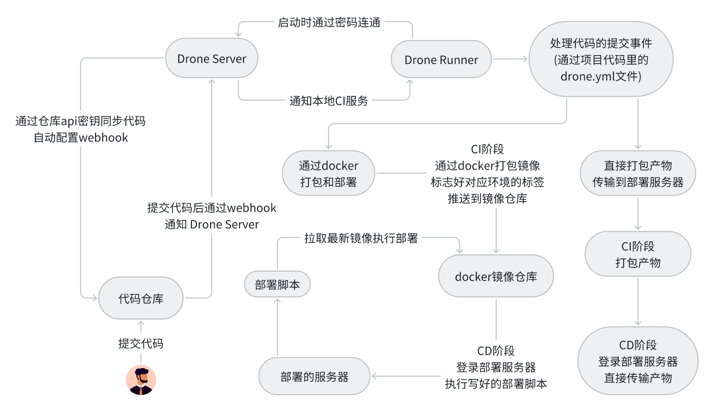
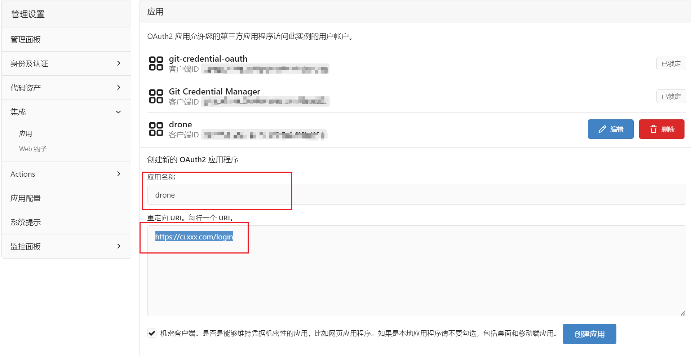

## Drone 介绍

Drone 是一个使用 Go 语言编写的自助式的持续集成平台，和 Gitea 一样可以完全基于容器部署，轻松扩展流水线规模。开发者只需要将持续集成过程通过简单的 YAML 语法写入 Gitea 仓库目录下的描述文件 .drone.yml 就可以完成 CI/CD 配置。

由于 CI/CD 任务的特殊性，工作繁忙时会占用较多的系统资源，因此为了提高系统整体可靠性，不建议将代码仓库、Drone Server、Drone Runner 安装在同一台服务器上的，在我的这本篇记录中，我是将代码仓库 和 Drone Server 同时运行在一台服务器上， Drone Runner 则运行在一台多余的本地机器上。

### CICD 架构图

## 准备工作

首先要安装好 Gitea 代码仓库，可以查看这篇的地址 [Gitea 安装](https://jackdeng666.github.io/docs/docker/images/Gitea)。

### 在 Gitea 上创建 OAuth2 应用程序

登录 Gitea 的超级管理员账号，进入 `管理后台` - `集成` - `应用`，创建一个 Gitea OAuth2 应用程序。

- 应用名称

  可以任取一个名字，此案例中填写 drone

- 重定向 URL

  授权回调 URL 形如 `http(s)://<YOUR_DRONE_SERVER>:<PORT>/login`，必须使用设定的 Drone 服务器协议和主机地址。如果使用非标准的 HTTP(S)端口，还应该指定准确的端口。

在添加后把客户端 ID 和客户端秘钥记录下来，下一篇在安装好 drone 时用来作为连接凭证。
