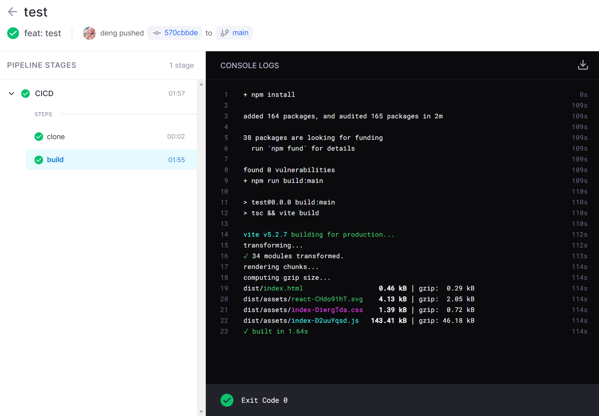

drone 的流水线是基于`.drone.yml` 文件配置去执行的，本篇我们将会实践编写这个文件，实现直接通过打包产物传输到服务器去部署前端项目的 CICD。

### 项目创建

打开代码仓库，创建好一个项目，然后创建一个简单的前端项目，最后推送到代码仓库。

这时候在 drone 服务里是看不到这个项目的，需要点击一下 `sync` 同步一下。


### 激活仓库

同步好后仓库列表会出现刚刚新增的项目，点击进入我们需要进行 CICD 处理的仓库，点击 `Settings` --> `ACTIVATE REPOSITORY`，然后可以看到提示激活成功，并且 `Settings` 页面会出现很多选项，按如下配置即可。


这里要把`Trusted`配置上，后面[添加打包缓存](#添加打包缓存)会用到。

### CI 操作

在项目的根目录下添加一份`.drone.yml`文件。

```yml
kind: pipeline
type: docker
name: CICD

steps:
  - name: build
    image: node:18-alpine
    commands:
      - npm install
      - npm run build:${DRONE_BRANCH}

trigger:
  branch:
    - test
    - main
  event:
    - push
```

现在基于 docker 的 pipeline，我们定义了一个打包的 `step`，基于 `node:18-alpine` 镜像去打下载并打包我们的项目，`${DRONE_BRANCH}`是流水线触发时的分支，我们可以用这个去区分执行不同的打包操作。

`trigger` 配置那里表示，我们要在 test 和 main 分支被 push 代码时，才会执行我们的 pipeline。

写好后此时可以把代码推送到代码仓库简单地测试一下。

此时可以在 drone server 上看到仓库的`Builds`选项里多了一个`EXECUTIONS`，点击进去，可以看到 runner 正在运行流水线。



### CD 操作

前端项目的部署，我们只需要把打包出来的产物直接上传到服务器环境即可，可以基于 `appleboy/drone-scp` 这个 drone 插件去传输文件，在 `.drone.yml` 文件中添加一个新的 `step`。

```yml
# ...
steps:
  - name: build
    # ...
  - name: deploy:test
    image: appleboy/drone-scp
    depends_on: [build]
    settings:
      host:
        from_secret: test_server_host
      username:
        from_secret: test_server_username
      key:
        from_secret: test_server_key
      port:
        from_secret: test_server_port
      source: ./dist/*
      target: /opt/1panel/apps/openresty/openresty/www/sites/test.xxx.com/index
      strip_components: 1
      rm: true
    when:
      branch: test
# ...
```

`settings` 里的配置是需要传给 `appleboy/drone-scp` 镜像使用的，`source` 填写本地打包好的要传输的文件，`target` 填写服务中的文件夹路径，这里执行时会自动登录服务器并把打包后`dist`里的文件都传输到指定的`target`文件，还有`strip_components`、 `rm`等参数，具体这里的参数都有些什么作用，去查看 [drone-scp 文档](https://plugins.drone.io/plugins/scp) 即可。

配置里的 `when.branch` 可以看到指定了`test`，这表明这个部署操作只有是 test 分支的代码提交了才会触发，这样就可以区分不同的环境去部署了。

还有配置里的 `host`、`username`、`key`、 `port` 这里登录服务器需要用到的敏感数据都用了 `from_secret` 去读取，这里敏感数据不能直接明文写在`.drone.yml`文件中，除非只有自己一个人维护这个项目，所以需要使用 `from_secret` 从 drone server 去读取配置好的字符串，接下来去配置一下。

点击 `Settings` --> `Secrets` --> `NEW SECRET`。


依次配置好对应的 4 个变量后，把代码提交到 test 分支，然后推送到代码仓库测试一下。


可以看到没有报错即可，自行检查你对应的服务是否更新，这里的`target`文件夹在我的服务已经添加好 nginx 的代理了，只要文件更新，那么重新访问就会生效。

### 添加打包缓存

这个时候你会发现有个问题，打包的操作是在一个 docker 容器里面进行，这样每次进行任何更新都要重新下载 `node_modules` 依赖，太浪费资源了。

接下来通过添加宿主机的挂载卷去解决这个问题。

```yml
# ...
# 声明宿主机 映射到 drone 执行器的数据卷
volumes:
  - name: node_modules # 数据卷名称
    host:
      path: /home/drone/test/cache/node_modules # 宿主机的绝对路径

steps:
  - name: build
    image: node:18-alpine
    volumes:
      - name: node_modules # 数据卷名称
        path: /drone/src/node_modules # 容器内的绝对路径
    commands:
      - npm install
      - npm run build:${DRONE_BRANCH}
# ...
```

drone runner 使用 `volumes` 是需要这个项目配置好权限的，这就是前面配置了 `Trusted` 的作用，否则 build 时运行时会报 `untrusted repositories cannot mount host volumes` 的错。

直接提交代码打包一次，这一次你会看到打包的时间并没有减少，因为这是第一次挂载`volumes`，下一次打包就有 `node_modules` 的缓存了，随便提交点代码再测试一下。


可以看到时间只用了 9s，比之前减少很多了。
