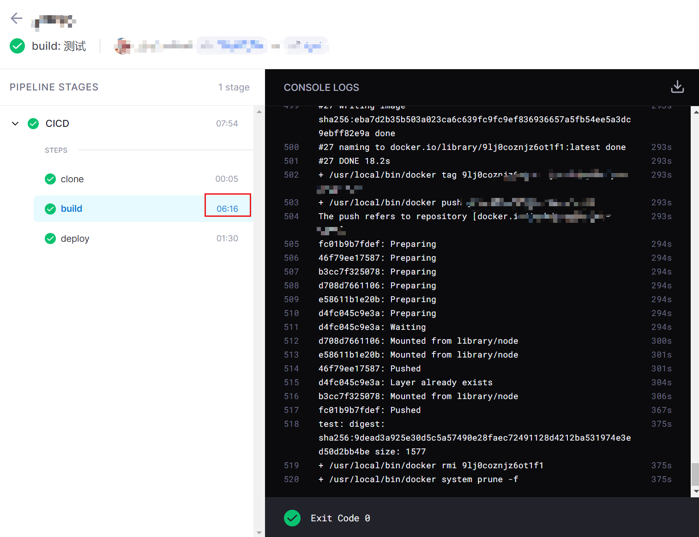
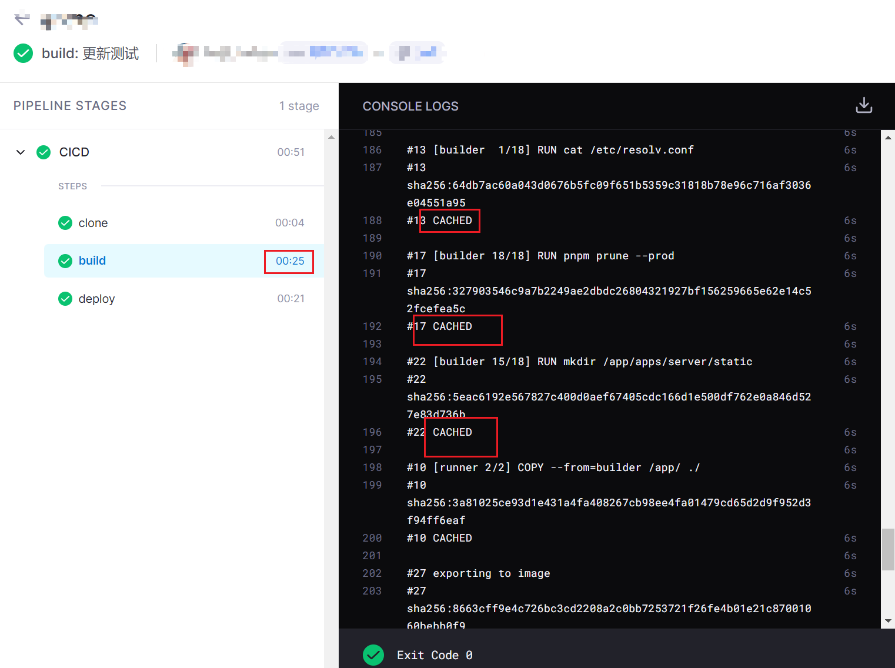

本篇我们将会通过 drone 去打包 docker 镜像来实现 CICD。

### 准备

这里需自行写好一个项目，并在里面编写好自己的 `Dockerfile` 文件用于打包镜像，请先在本地测试打包好的镜像可以使用。

### CI 操作

drone 有一个官方插件镜像[plugins/docker](https://plugins.drone.io/plugins/docker)，它支持打包 docker 镜像并顺便传输到对应的镜像仓库，接下来开始编写 `.drone.yml` 文件把它加上。

```yml
kind: pipeline
type: docker
name: CICD

steps:
  - name: build
    image: plugins/docker
    settings:
      username:
        from_secret: docker_username
      password:
        from_secret: docker_password
      repo: xxx/test-project
      dockerfile: Dockerfile
      build_args:
        - BRANCH=${DRONE_BRANCH}
      tags:
        - ${DRONE_BRANCH}
trigger:
  branch:
    - test
    - main
  event:
    - push
```

配置特别简单，通过 `username` 和 `password` 指定了从密钥读取的用户名和密码(这个需自定配置，请看上一篇)，再定义一个仓库名`repo`，到时镜像打包完成就会自动推送到 docker 官方的镜像仓库了，`dockerfile` 指定根目录的 Dockerfile，tags 直接指定成 `${DRONE_BRANCH}`，这个参数可以获取当前触发的分支，我要以这个作为镜像的标签，配置 `build_args` 相当于配置 `docker build --build-arg`，我的 dockerfile 里需要一个`BRANCH`的`ARG`变量，所以也加上了。

如果还需要自定义更多功能，如推送到私人的镜像仓库，具体更多的用法可以自行前往[文档](https://plugins.drone.io/plugins/docker)查看。

### CD 操作

接下来的 CD 操作按照之前写的架构图，是需要登录到部署服务器进行的，drone 里也有一个插件[appleboy/drone-ssh](https://plugins.drone.io/plugins/ssh)实现了这个功能。

```yml
# ...

steps:
  # ...
  - name: deploy:test
    image: appleboy/drone-ssh
    depends_on: [build]
    settings:
      host:
        from_secret: test_server_host
      user:
        from_secret: test_server_username
      key:
        from_secret: test_server_key
      port:
        from_secret: test_server_port
      command_timeout: 2m
      script:
        - echo ====开始部署=======
        - cd /deploy/test
        - docker pull xxx/test-project:test
        - docker compose -p test-project down
        - docker compose up -d
        - docker rmi $(docker images -f dangling=true -q)
        - echo ====部署成功=======
    when:
      branch: test
# ...
```

可以看到配置也是特别简单，设置好要登录服务器的登录信息后，在 `script` 里逐行添加脚本，我这里是先去到`/deploy/test`这个目录，服务器里这个目录下面提前写好了一个 `docker-compose.yml` 文件，所以脚本只需拉取一下最新的镜像并把旧的容器停止，最后重新启动一下，顺便把无效的旧镜像删除即可。

文件写好后直接测试一下。



### 添加 docker 打包的缓存

这个时候还有一个问题，`plugins/docker` 打包镜像时，是使用一个临时容器内的 docker 去打包的，并不是使用宿主机的 docker，这样打包镜像时都会没有之前构建时缓存的层而导致完全重新构建，如上图的话，也就是会花个 6 分中，这样浪费太多资源了。

接下来可以通过把容器内的`/var/run/docker.sock`映射为宿主机的`/var/run/docker.sock`去解决这个问题，因为 docker 的打包命令其实是 docker client 向 `/var/run/docker.sock`这个文件通知 docker server 去打包的，这样相当于容器内调用打包命令时，其实是在通知宿主机的 docker server 去打包镜像，宿主机是会有缓存的。

```yml
# ...
volumes:
  - name: docker # 数据卷名称
    host:
      path: /var/run/docker.sock # 宿主机的绝对路径
steps:
  - name: build
    image: plugins/docker
    volumes:
      - name: docker # 数据卷名称
        path: /var/run/docker.sock # 容器内的绝对路径
    settings:
      # ...
# ...
```

最终测试一下。



可以看到时间少了很多，没有变动的层都有上一次构建的缓存。
