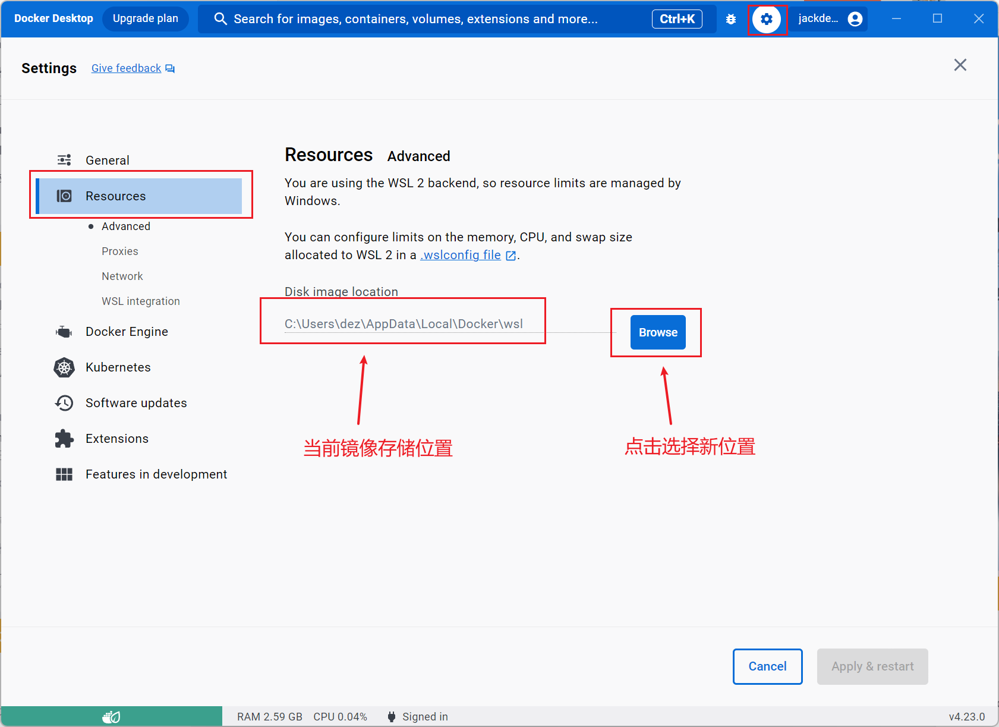

## 下载 docker desktop

[Docker 官方下载地址](https://www.docker.com/get-started/)

本文档编写时，是在 windows 11 环境下，Docker Desktop 安装的版本是 4.23.0 ，选择 windows 版下载后，直接双击安装程序安装完成，然后需要重启，重启后即安装完成。

打开 Docker Desktop，等待几十秒即可启动成功，此时如果没有梯子会提示某些东西连接不上，如登录帐号登录不了，先不管，因为现在已经可以使用 docker 命令了。

```shell
docker search mysql
```

这时候用命令行执行下载相关的 docker 命令应该是会正常执行的，但如果想用图形化界面操作则需要梯子。

## Docker Desktop 更改镜像存储位置

Docker Desktop 默认安装在系统盘 C 盘，并且没有给予选择盘符安装的操作，在使用过程中会下载大量 docker 镜像进行练习，这时需要调整镜像目录，打开设置。



直接选择一个新位置会多一个 DockerDesktopWSL 文件夹，最后点击 Apply 即可。

然后测试下载新的 image 后文件夹变化情况

```shell
docker pull mysql
docker pull elasticsearch
```

## 自定义 Docker 软件目录

Docker 软件也有差不多 3 个 g，都在 `C:\Program Files\Docker`。

如果要把软件转移到`D:\program\Docker`，先把 docker 退出，把`C:\Program Files\Docker`文件转移到`D:\program\Docker`，然后删除文件夹`C:\Program Files\Docker`。

接下来将 C 盘的目录软链接到 D 盘目录，以管理员权限打开命令行，然后执行以下命令：

```shell
mklink /J "C:\Program Files\Docker" "D:\program\Docker"
```

最后重新启动 Docker Desktop 看看是否正常。

注意，这样操作后，如果需要更新 docker 将会无法更新，需要把文件转移回去才能成功。
