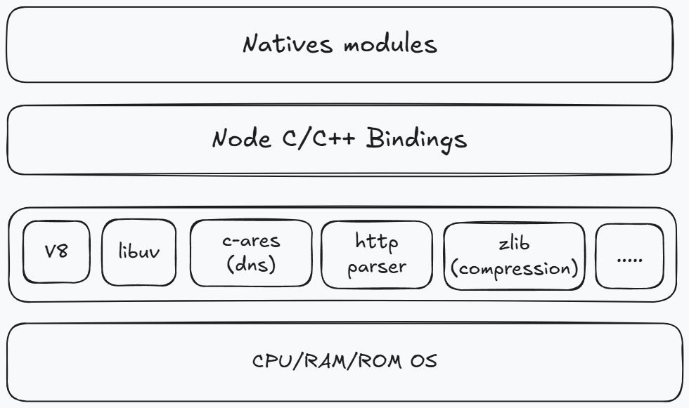

## nodejs 架构图

### Natives modules

native modules 里边的内容，都是由 js 来进行实现的，它提供了我们许多当前应用程序呢是可以直接去进行调用的库，其实也就是我们日常所说的内置核心模块，如 fs、path、http 等等模块，但是我们也都知道，js 语言编写的程序是无法直接来操作硬件设备的，因此 nodejs 核心模块与硬件设备之间，如果想要通信是还需要有一个桥梁的，这个桥梁就是下面的 Builtin modules (胶水层)。

### Builtin modules

通过这个桥梁，我们就可以让 nodejs 的核心模块来获取到具体的服务支持，从而去完成更底层的操作，例如文件的读写行为，那在上图中我们就使用 Node C/C++ Bindings 来进行表示。当然在这一层当中，除了内置的模块之外，是还有很多第三方的模块来充当桥梁的，而我们只是需要去了解在这一层当中，它里边的内容主要是由 C++ 的代码来进行编写而成的，例如 socket、http 这样的一些基础功能，关于这一点，我们还要再去强调一下，在这一层当中的 http、socket 等我们所提到的这些功能模块，它们并不是真正代码级别上的功能实现，它们更像是一个功能调用的对照表，这就好比是我们要在 js 层去调用一个 a 功能，但是呢这个 a 功能的最终实现的是通过 C/C++ 加加语言来实现的，而且呢这个实现之后的内容又被放在了另外一个地方，这个时候呢我们就需要有人来帮助我们，真正的去找到这个 a 功能的实现，那此时 Builtin modules 就起到了帮助我们去调用具体的 c 加加函数的作用，

### 底层库

再往图下边去看一下，下一层的主要内容就是 v8、libuv 库和一些具体的功能模块。

其中 v8 这个引擎主要的功能是有两个，第一个功能就类似于我们之前所了解的虚拟机，主要来负责完成 js 代码的执行，这里要被执行的代码一般呢会分为三种情况，一个是我们自己编写的 js 代码、内置的 js 代码和第三方的 js 代码。
第二个功能就是提供桥梁接口，那这里提供的接口有什么用呢，在前面我们也提到过，开发者在使用 node js 的时候，看起来呢我们在代码里边是直接调用了某个 js 函数，但是呢真正起效果的是由 C/C++ 编写的函数，而这个中间的转换和调用的具体实现，就是需要我们的 v8 引擎来赋能完成，说白了就是 js 与 C/C++ 之间的转换功能。

总的来说就是 v8 为 nodejs 提供了初始化的操作，他创建了执行上下文环境和作用域这些内容，有了 v8 之后，nodejs 就已经具备了执行和调用功能的大前提，而最终 nodejs 代码在执行的过程中还会存在着很多的细节，例如说事件循环，事件驱动和 异步 io 等需要处理的问题，而这些呢就需要 libuv 来进行参与和实现了，那有了 v8 和 libuv 库之后，nodejs 的功能就已经非常的强大了。

那余下的就是一些具体的第三方功能模块，这些功能模块呢会去完成相对应的功能，最后再去说明一下，在之前我们讨论的 nodejs 平台下 js 的组成的时候，我们会认为它是由核心的 api 再去加上 ECMAScript 来组成的，这与我们当前所说的内容呢其实并不冲突，因为我们这里讨论的不是 nodejs 与 javascript，而是在说明 nodejs 本身的核心组成。

## 总结

那最后我们再总结一下, node js 的核心是由三层组成的，分别呢是最上层的内置核心模块，那在这一层当中呢是暴露了相应的 cs 功能接口，那么供开发者可以直接去进行调用，而中间呢就是帮助我们找到对应功能的 C/C++ 实现的 Builtin modules，而这个过程是需要 v8 引擎来配合实现的，然后在第 3 层当中呢就会有 v8 引擎，它除了去构建 nodejs 的运行环境之外呢，还会负责 gi 代码的最终执行，然后就是 libuv 库，他可以去处理具体的 node 环境下代码执行过程中的许多细节，再有就是具体的模块，我们只需要知道这些不同的模块都对应着不同的功能，如此之后，我们就可以去使用 js 在 node 的平台下，去完成 fs 或者说 http 服务，tcp 服务等等这样的一些在浏览器平台下，我们使用 js 无法实现的一些功能，那也就是所谓的 nodejs，它只是一个平台，而这个平台呢就扩展了 js 的功能，这在我们之前浏览器平台下是没有办法去实现的。
