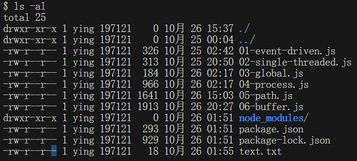

## fs 模块介绍

我们都知道在 node js 中存在着 buffer 和 stream 这两个非常常见的概念，一个就是缓冲区，另外一个就是数据流，之前我们通过图示也都知道了，buffer 它其实就是存储的中间变量，目的就是能够去为了方便 cpu 在执行数据存取操作的时候，可以有一个中间的存储区域，而流操作其实就类似于水流一样，可以通过管道来传输数据，还可以将数据去进行分段，但是这些又跟 fs 有什么关系呢？这个时候还是要从服务端的角度来进行分析，在 nodejs 中的 buffer 和 stream 可谓是处处体现，而他们操作的一般又都是二进制数据，所以从这个点上来说，他们和 fs 就密不可分了，fs 是一个内置的核心模块，所有跟文件相关的操作都是通过 fs 模块来进行实现的，比如说文件以及目录的创建，删除信息的查询，或者说文件的读取和写入操作等等，那直白的讲就是如果我们要想去操作文件系统中的二进制数据，那么就需要去使用到 fs 模块所提供的 api，而在这个操作过程中，buffer 和 stream 又是密不可分的，我们在后续的 api 中也会去具体的感知到这一点。

不过在我们了解文件的操作方法之前，我们要去介绍一些关于系统和文件的一些前置知识，例如文件的权限位、标志位、描述符等。

### 权限位

首先我们先来说一说权限位，这里的权限指的就是在当前操作系统内不同的用户角色对于当前的文件可以执行的不同权限操作，而文件的权限操作又被分为三种，分别就是 r、w、x，其中 r 就是读权限，w 就是写权限，x 就是执行权限，如果采用八进制的数字来进行表示，r 对应 4，w 对应 2，x 对应 1，如果说不具备该权限，它其实就是一个 0，然后操作系统中又将用户分成了三类，分别就是文件的所有者，一般也就指的是当前用户他自己，再有就是文件的所属组，那类似于当前用户的家人，最后还有一个其他用户，例如我们常见的访客用户。清楚了这两个概念之后，我们再来看一下当前这张图示里的一些内容。

在图中存在着三种用户，每个用户都可以去操作一个文件，而每个文件又都有三种操作权限，如图我们所看到的其实就是一个最大权限的分配，任意的用户对于当前的文件都是具有一个 777 的满级操作了，或者说是满权的行为，那这个操作在实际的工作过程中肯定是不被推荐的，为了更好的去进行说明，我们再来展示一张，在本机某一个目录中，我们去执行 `ls -al` 命令之后，我们所看到的一个结果，如图所示。

我们这里只关心第一列，算上一个`-`，一共刚好是十位，除去第一位的 d 或者说 `-`，那后边的每三位就会被算作是一组，这样的话就提供了当前文件的类型，以及不同用户对它具备的一个操作权限了，其中 d 就表示当前的文件就是一个文件夹，因为在类 unix 系统当中，我们一般都会习惯的去说一切皆文件，那如果说是一个 `-`，则说明当前就是一个普通的文件，然后三位一组，rwx 就表示当前的位置是满级的权限，那如果遇到了不具备的权限，我们就去使用一个`-`来去进行表示。这些内容一般是常见于 linux 或者说是 unix 系统，当中而在 windows 系统中，文件的权限一般默认都是可读可写，但是不可执行的，那如果采用数值去表示，其实就是 0o666，0o 也就是我们八进制的一个表示，6 其实就是 r + w + x 的值， 即为 4 + 2 + 0，那么把这个八进制如果转换成十进制之后，它对应的就是 438，那知道这个之后，我们在后续去使用 api 的时候，刚好涉及到 mode 的时候，我们可以去传一个 0o666，刚好其实就是一个 438，那么这时候就明白他是什么意思了。

### 标志位 flag

标志位，也就是 flag，在 nodejs 中，它就代表着对文件的操作方法，比如说当前是否可读可写，那又或者说是既可读又可写的行为，我们常见的 flag 其实有很多，在这儿不去一一列举了，先去列举出几个最常见的标识符。

- r: 表示可读
- w: 表示可写
- s: 表示同步
- +: 表示相反的操作

  比如说我们的 r+， r 它既然是一个可读的，然后加再增加一个相反操作，那读的相反操作其实就是写，所以 r+ 就是可读又可写了

- x: 表示排他操作
- a: 表示追加操作

有了这几个之后，我们就可以去进行组合使用，那再或者说我们遇到组合之后的 flag，我们也可以去分析它所代表的一些含义。关于 flag 的使用，我们这里再简单的去做一个常见的对比，当目标文件是不存在的时候，那么如果我们当前是一个 r+ 的行为，那是不会去创建这个文件的，而是直接抛出一个异常，但如果我们采用的是 w+，那么这时候他就会去先创建这个文件，那如果说我们的目标文件已经存在，如果我们再去采用 r+，它是不会清空当前的文件，可是如果我们采用的是 w+ 操作，它就会自动的把文件中已有的内容去清空，然后再去执行写操作。

### 描述符 fd

我们再来说一下文件描述符 fd，当一个文件被打开的时候，操作系统就会为它去分配一个数值标识，这个标识就是我们所说的文件标识符，通过这个标识符文件操作就可以识别，并且追踪到某个特定的文件，由于 windows 系统它采用的是一个不同但是概念又与文件描述符有一些类似的机制来追踪资源，所以 nodejs 和处理 io 操作是一样的，又专门的去抽象了一下不同操作系统之间的一些差异，为所有打开的文件分配了数值的文件描述符，在 nodejs 中每操作一个文件，文件的描述符就会递增一次，并且这个描述符一般是从 3 开始的，因为 012 这三个值是已经被标准的输入和标准输出，以及标准错误给占用了，所以这时候我们在后期去执行 fs.open 打开某一个文件的时候，我们可以得到一个 fd，而这个 fd 刚好就是从 3 开始的。
