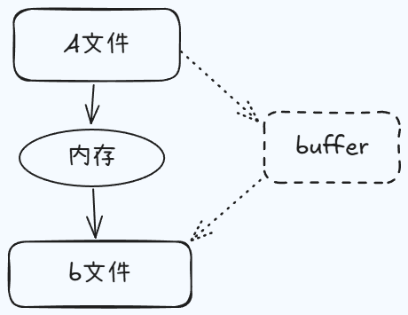

## 打开与关闭操作

我们要先来说一下文件的打开与关闭操作，之前我们使用 `readFile` 与 `writeFile` 时，已经可以实现文件的读写操作了，既然可以实现文件内容的读取，那就肯定也包含了文件的打开，那为什么 nodejs 还要专门去提供一个单独的打开操作呢？原因也非常简单，因为 `readFile` 与 `writeFile` 的工作机制是将文件里的内容一次性的全部读取，或者说写入到内存里，而这种方式对于大体积的文件来讲，显然那是不合理的，因此我们后期需要一种可以实现边读边写，又或者说是边写边读的操作方式，这时我们就应该去将文件的打开读取，写入和关闭去看作是各自独立的环节，所以也就有了 `open` 与 `close`。

### open

```js
fs.open('text.txt', (err, fd) => {
  console.log(fd)
})
```

### close

有打开的情况下，我们就对应的会有一个关闭，对一个文件操作完成之后，就跟数据库是一样的，我们应该把这个所占用的资源链接给它释放掉，所以这个时候的话我们就应该去考虑一下如何关闭文件，那这里边 nodejs 又提供了一个 `close` api，我们的关闭行为，一般都是要建立在我们打开这样一个操作之后的。

```js
fs.open('text.txt', (err, fd) => {
  console.log(fd)

  fs.close(fd, () => {
    console.log('关闭成功')
  })
})
```

## 读写操作

我们通过一张图示来进行简单的说明。

<p class="text--center">

</p>

这里我们还是假定数据的传输场景就是磁盘的读写，所以 a 文件中的数据如果要想拷贝至 b 文件当中，默认情况下是需要内存来作为中转的，当然如果是一次性的操作，那么就会存在内存占满并且溢出的潜在问题，因此我们更喜欢的是用一个中间暂存区来一点一点的读取，然后再一点一点的写入，而这个中间暂存区就是之前我们所提到的 buffer。

### read 操作

准备一个 `text.txt` 写入 1234567890 用于测试。

```js
const buf = Buffer.alloc(6)
fs.open('text.txt', 'r', (err, rfd) => {
  console.log('rfd:', rfd)
  // 将数据从磁盘文件中写入到 buffer 里
  // 第2个参数 offset 表示从 buffer 哪个位置开始写入
  // 第3个参数 length 表示当次要读取的数据的字节数
  // 第4个参数 position 表示从文件中哪一个字节开始读取
  fs.read(rfd, buf, 0, 3, 3, (err, bytesRead, buffer) => {
    // bytesRead 表示实际读取了多少字节
    // buffer 表示当前 buffer 里的数据
    console.log('bytesRead:', bytesRead)
    console.log('buffer:', buffer)
    console.log('bufferStr:', buffer.toString())
  })
})
```

### write 操作

```js
const buf = Buffer.from('1234567890')
fs.open('text2.txt', 'w', (err, wfd) => {
  console.log('wfd:', wfd)
  // 将缓冲区里的内容写入到磁盘文件中
  // 第2个参数 offset 表示从 buffer 哪个位置开始读取数据
  // 第3个参数 length 表示当次要写入的数据的字节数
  // 第4个参数 position 表示从文件中哪一个字节开始写入
  fs.write(wfd, buf, 2, 6, 2, (err, written, buffer) => {
    // written 表示实际写入了多少字节
    // buffer 表示当前 buffer 里的数据
    console.log('written:', written)
    console.log('buffer:', buffer)
    console.log('bufferStr:', buffer.toString())
  })
})
```

## 自定义文件拷贝操作

默认情况下 nodejs 中已经提供了 copyFile 这样的一个 api，但是这个行为是基于 readFile 和 writeFile 的一次性读写操作，针对于大体积的文件来说，它是不合适的，因此这里我们就利用上面的文件读写操作的几个 api 来完成一个拷贝行为，从而让我们可以方便地去处理大文件的拷贝。

```js
const buf = Buffer.alloc(5)
const BUFFER_SIZE = buf.length
let readOffset = 0

fs.open('text1.txt', 'r', (err, rfd) => {
  fs.open('text2.txt', 'a', (err, wfd) => {
    function next() {
      fs.read(rfd, buf, 0, BUFFER_SIZE, readOffset, (err, bytesRead) => {
        if (!bytesRead) {
          // 如果没有读取到的字节，说明已经读取完成
          fs.close(rfd)
          fs.close(wfd)
          console.log('读取完毕')
          return
        }
        readOffset += bytesRead // 改变下一次从文件中哪一个字节开始读取
        // 把当前读取到 buffer 里的数据全部写入到要写的文件中
        fs.write(wfd, buf, 0, bytesRead, () => {
          next()
        })
      })
    }
    next()
  })
})
```
