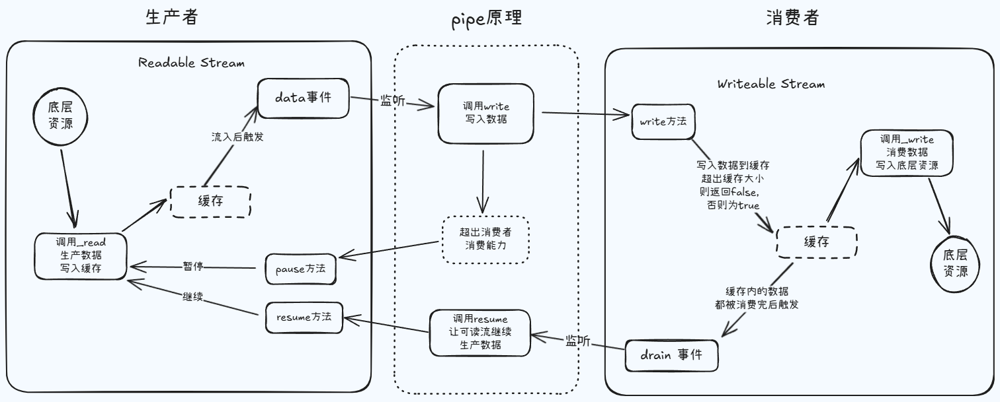

本篇我们来说一下 nodejs 流操作当中的背压机制，具体到使用层面上的，其实也就是 `pipe` 方法，现在我们要看的就是数据读写的过程以及背压机制解决了什么样的问题，还有就是 `pipe` 方法它的内部实现的原理大概是什么样的。

首先的话我们就来看一段代码，看看数据的读写可能会存在一些什么样的问题。

```js
const fs = require('fs')

const rs = fs.createReadStream('text1.txt')
const ws = fs.createWriteStream('text2.txt')

rs.on('data', chunk => {
  ws.write(chunk)
})
```

代码主要逻辑其实就是将 `text1.txt` 文件里的内容去拷贝至 `text2.txt` 文件当中，咋一看这个操作是不存在什么问题的，但是我们需要去注意一下，数据从磁盘里边被读取出来的速度，它远远是大于被写入磁盘的速度的，换句话说就是消费者的速度往往是跟不上生产者的速度，这样的话就会出现产能过剩，而 `Writeable` 的内部又维护了一个队列，在它不能实时的去消费由上游所传输过来的数据时，它就会去尝试着把当前那些不能被消化掉的数据，先给它缓存到这个队列里，但是这个队列的内存大小它肯定是有上限的，因此在读写的过程中，很有可能就会出现内存溢出，进而让其他的进程工作也会变得十分缓慢，而且 gc 也要频繁地出来去进行扫地，至于这种场景，我们就需要有一种可以让数据的生产者与消费者之间的平滑流动的机制，这就是所谓的背压机制。



在这张图里，我们将数据的读操作分为三个部分，第一就是我们需要有一个底层的数据，第二的话就是我们需要有一个空间来缓存，将来被读取出来的底层数据，这个空间的大小它也是有上限的，默认情况下在 `Readable` 里面呢就是 16kb，但是在我们的这个文件可读流里边，他做了一个重新的定义，就是 64kb，第三就是数据需要有一个消费者，他通过主动的去调用 `read` 方法，或者说去监听 `data` 事件来消费数据，除此之外，对于可读流来说，它还有两种工作模式，一种就是流动模式，一种就是暂停模式，而暂停模式是默认的行为，知道了这些之后，我们就可以去打一个比方，从消费者的视角来看，可读流其实就是一个水池，它的里边装满了我们想要消费的数据，但是这个池子的外部它会有一个水龙头开关，如果说我们采用流动的模式，就相当于是让他一直放水，直到放完为止，如果我们在这个过程中，用水的人跟不上放水的速度了，他就会去想办法来告诉可读流，我当前有点吃不消了，你先停一会儿，等我先消化消化，此时可读流就可以去调用 `pause` 方法，将流动的模式先去切换为暂停的模式，放水的阀门这样也就被关闭了，现在的话用水的人就可以先慢慢的消化他之前所缓冲的水资源，等到他把缓冲的水资源都消费的差不多之后，就会去告诉水池，又可以去继续放水了，但是现在有一个问题就是用水的人该如何去通知放水的人呢？数据从上游的生产者传递过来，然后可写流去调用 `write` 方法来消费数据，在可写流的内部同样也有一片内存空间来充当缓存的队列，它同样也具有一个水位线，如果某个时刻上游过来的数据超过了这个上限，那就说明了当前是无法再去消费更多的水资源了，此时 `write` 方法就会在调用之后返回一个 false 给上游的生产者，让他先去暂停放水，等到可写流将缓存中的数据消费的差不多之后，就会再去触发 `drain` 事件来告诉上游的生产者可以继续放水了，这个时候就可以去调用 `resume` 方法再次的去打开阀门即可，如此往复就能够去保证数据的平滑流动，既不会去出现内存被撑爆的情况，也不会在某个时刻无水可用，这就是 `pipe` 方法内部的实现原理。

接下来我们通过上述图解完成代码编写。

```js
const fs = require('fs')

const rs = fs.createReadStream('text1.txt', {
  highWaterMark: 4
})

const ws = fs.createWriteStream('text2.txt', {
  highWaterMark: 1 // 为了模拟速度慢写少一点
})

let flag = true

rs.on('data', chunk => {
  flag = ws.write(chunk)

  if (!flag) {
    console.log('暂停读取了')
    rs.pause()
  }
})

ws.on('drain', () => {
  console.log('drain 触发了')
  rs.resume()
})
```

以上其实就是 pipe 方法其内部的实现原理了。

以上操作改用 `pipe` 就非常简单。

```js
const fs = require('fs')

const rs = fs.createReadStream('text1.txt', {
  highWaterMark: 4
})

const ws = fs.createWriteStream('text2.txt', {
  highWaterMark: 1 // 为了模拟速度慢写少一点
})

rs.pipe(ws)
```
