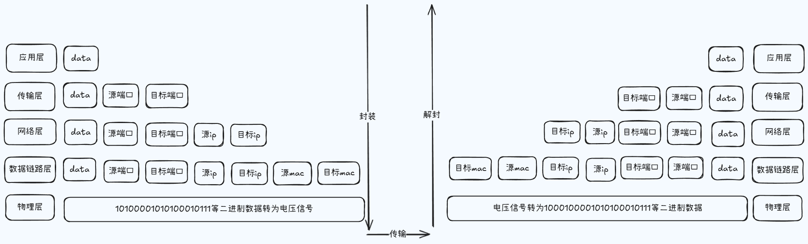

## 通讯基本原理

这一块我们来看一下网络通信的基本原理，我们都听说过网络通信模型，也都使用过 http 协议，当然除了这些之外，我们还听过 tcp/ip、ftp、arp/ip 协议等等，这些模型和具体的协议，它最终解决的本质问题，其实还是主机与主机之间的网络通信。这里我们就先从最基本的两台主机之间是如何进行通信的，来作为开始，然后再去认识网络通信模型，以及每层当中都做了什么事情。

我们假设 a、b 两台主机之间如果想要去完成通信，需要满足以下条件。

- 主机之间需要要有传输介质

  首先我们要保证两台主机之间是一个联通的状态，所以不同的主机之间是需要有传输介质的，例如各种网线，光纤蓝牙，或者说 wifi。

- 主机上必须有网卡设备

  当两台主机之间建立了连接之后，那我们就要去考虑一下数据是以什么样的形式在进行传输，因为我们都知道，不论我们采用的是哪一种编程语言来进行开发，那其实计算机都是不认识的，因为在计算机的世界里边所有的数据最终都会被转成二进制，但即便如此，也只是解决了当前计算机识别数据的问题，而我们需要的是数据可以通过介质来进行传输，那这里我们就以普通的网线为例，它能传输的就是电信号源源不断的高低电压，而不是 1010 这样的数字，所以这个时候每个通信的主机上边就需要有一块网卡设备，因为网卡可以去完成信号的调制与解调制，其中把二进制的信息转为高低电压的过程，就是数据的调制过程，我们现在有 a、b 两台主机去建立了网线的连接，然后想进行通信，那么这时候主机上边就会将封装好的数据，来经过 a 的网卡之后进行调制，然后把它处理成电信号，有了这个电信号之后，再经过网线就传到了 b 主机上边，b 主机上的网卡就可以去进行解调制，那么拿到封装之后的数据之后，再由 b 主机它本身的一个通讯体系来进行拆包解包，最终在某一个应用程序里边就获取到了这个 a 主机发送过来的数据。

- 主机之间需要协商网络速率

  因为 a、b 两台主机的网卡可能在速率上是不一样的，它们每秒传输的电信号也就不一样了，所以在通信之前还要先去协商一下网络速率。

## 网络通讯方式

网络通讯过程中最常见的两种通讯方式。

- 交换机通讯
- 路由器通讯

我们日常所处的网络不可能只存在着两台主机，依据通讯的基础条件，我们首先要考虑的问题就是，如何让我们的电脑与别的电脑去进行连接，假如我们当前需要与另外的十台电脑去进行通讯，那么我们是不可能购买一台具有十个网卡设备的电脑的，所以这个时候我们就可以去通过交换机来完成这件事情，简单的说一下，我们这里是不考虑交换机的层级，只是去说明通过交换机我们可以将多台电脑设备进行连接，他们也就形成了一个网络，而这个网络也就是我们日常所说的局域网，假设在这个局域网内，我们的主机名称叫 a，还有另外一台主机，它的名称叫 b，当我们的 a 想和 b 主机去进行通讯的时候，我们又遇到了一个问题，那就是该如何来找到这个 b，因为对于主机 a 来说，它是不认识其他主机的，那这个操作最终会由交换机来完成，交换机来确定 b 的方式就是，对于任意的一台主机来说，它都有一个唯一标识网卡设备的地址，也就是 mac 地址，我们称之为是物理地址，那这样 a 主机就可以去把消息发送给我们的交换机，然后交换机器接收到这个消息之后再通知其他所有的机器，注意我们这里是以广播的方式为例来进行说明，那在这个过程中，其他所有的机器就都会收到这条消息，然后真正的 b 主机就会发现，a 想找的人是自己，而其他的主机就会将这一次的消息当作垃圾丢弃，那这个过程就是通过交换机来完成局域网通信的一个操作，那这种通讯的模式就会有一些小的问题，同时它也无法满足我们当前的互联网需求，例如说我们是不可能将所有的电脑都放在一个局域网内，因为没有哪种交换机，它的接口数量是无限的，而且如果我们把所有的机器放在了一个局域网里，那么这个时候广播风暴的问题就会显得尤为明显，因为任意的一条消息的发送都需要被其他所有的机器去进行接收，基于这种情况，网络就被分成了很多个较小的局域网，然后就是城域网，直到最大的互联网，那也正是基于此，我们现在就可以去访问淘宝的服务器了，但是很明显的我们和这个主机它并不在一个局域网内，所以我们和淘宝的服务器是分属于两个不同的局域网，那这两个局域网之间该如何去建立通讯呢？

那这里我们就需要去使用到路由器来完成数据的交换了，首先我们的主机 a 要想去访问淘宝的服务器 b，那么我们不仅需要知道 b 的网卡地址，还需要去知道它在哪一个网络里，那这一块我们就需要用到 ip 地址了，我们的数据在发送的时候，它不仅仅只包含了我们的程序代码所接收到的数据，还有源 mac 地址，源 ip 地址，目标 mac 地址以及目标 ip 地址等等，那这些内容首先会被组装成一条大的数据之后，再去发送到路由器上边，然后路由器是可以识别当前要找的主机，它在不在这样的一个局域网内，如果说他不在当前的局域网内，那么这个时候它就会按照路由表上所记录的一些信息，去帮助我们通过网络路由来找到对应的网络，那之后再去把这个数据发送过去，那么发送到对应的网络之后，由那边的交换机就可以完成最后的定位功能，那这样的话我们就通过路由器去实现了不同网络之间的主机通讯。

这里不用去理解网络通信发生的每一个细节，例如静态路由以及动态路由的设置，或者说 ip 地址的动态分配等，我们更多的是明确通讯的流程和一些核心的概念，例如通讯需要具备哪些条件，以及通讯是双向的，一定是有来有回，数据在传输的过程中会与 ip 地址和 mac 地址是包裹在一起的。

## 网络层次模型

这里我们来说一下网络层次模型，主要的目的就是对网络的分层有一个清晰的结构认识，我们是不需要去掌握每一层是如何完成具体工作的，那我们都知道对于网络通信来说，它是一个复杂的工程，它需要有很多的基础硬件设备，而这些设备又有很多的厂商在进行生产，所以为了方便网络的实施管理和维护，就会有组织来推出相应的行业标准规范。

目前的最常见的就是 OSI 七层模型和 TCP/IP 四层模型。

那这一块我们再简单的说明一下，我们这里所提到的 TCP/IP ，它并不单指这两个协议，只是在 OSI 七层模型的基础之上进行了一些简化，然后去形成了另外的一个所谓的网络通信模型，但是不论我们现在采用的是哪一种模型，它们都是对通讯的过程进行分层。

### OSI 七层模型

- 应用层：用户与网络的接口

  它是用户与网络以及应用程序与网络之间的一个接口，我们可以去利用不同的协议来完成用户请求的各种服务，例如说我们可以去利用 http 协议来完成网站服务，去利用 ftp 协议完成文件的传输服务，就利用 ssh 来完成远程登录服务等等。

- 表示层：数据加密、转换、压缩

- 会话层：控制网络连接建立与终止

- 传输层：控制数据传输的可靠性

  这一层是一个基于端口的协议层，所以我们的数据在封装的时候，还必须要去携带上目标程序所占用的端口号，例如呢我们在访问网站的时候，总会去携带上 80 端口。

- 网络层：确定目标网络

  这一层的作用就是通过路由来找到目标网络，常见的就是 ip 协议，让我们可以去依据 ip 地址来确定源和目标的网络。

- 数据链路层：确定目标主机

  这一层就好比是我们已经确定了目标网络，然后直接进入到某一个局域网内，那接下来要做的事情，很显然就是想办法来通过 mac 地址去确定目标主机，那这里最常见的就是有一个 ARP 寻址协议。

- 物理层：各种物理设备和标准

### TCP/IP 四层模型

`TCP/IP四层模型`就是在`OSI七层模型`的基础之上将前三层进行合并，统一叫做应用层，然后再将数据链路和物理层合在一起，叫做接入层，那中间的网络层就改了名字叫主机层。

## 数据的封装与解封装

这里我们依据网络通信的层次模型来具体的说一下，被传输数据的封装与解封装的过程，首先我们采用的是 TCP/IP 的五层划分模式，下面我们就通过图示来进行说明。

第一步就是在应用层去产出真正的要被传输的数据，我们这里使用 data 来进行表示，然后数据就传向了传输层。

在这一层里边对于我们来说最常见的就是 tcp 与 udp 协议，这两个协议都是基于端口的，而这个端口的作用也就是在主机上用于唯一确定一个应用进程，所以数据在这层上边就会被包裹上，目标应用端口和应用在当前主机上的源端口，然后数据传向了网络层。

因为我们的主机它都是处于不同的网络里的，所以我们需要去通过 ip 协议来确定目标主机所在的网络，因此数据在这一层当中会被包裹上目标主机的 ip 地址与当前主机的源 ip 地址，那有了这些信息之后，我们只是能确定某一个网络，并不能去确定在这个网络里边，到底哪一台机器呢是我们想要的，所以接下来数据就到达了链路层。

在这一层当中最主要的就是通过 mac 地址来完成寻址操作，所以数据在这层当中会被包裹上，目标主机的 mac 地址与源主机的 mac 地址，至此一条具有完整信息的数据就被封装 ok 了，最后到达物理层。

我们都知道网线是不能识别这些二进制的信息的，所以经过网卡的调制之后，就会变成高低电压，经过路由器的网络分配和传输介质的运输，电压信号最终就到达了目标主机的网卡，这个时候他首先会去做数据的解调，将电压先变为二进制，然后再向上层去传递至数据链路层，那这个时候他就会去分析一下目标的 mac 地址，是不是当前主机的 mac 地址，如果是则继续向上传递至网络层，然后在这一层当中，他就要去看一下目标的 ip 是不是当前自己的 ip，那如果是则继续向上的传输至传输层，那这个时候再去确定一下当前的目标端口是不是自己，那如果是的话，则再次拆解数据向上传递至应用层，那这样当前网络里的目标主机上的一个应用，也就拿到了由另外一个网络当中的某一台主机上的某一个应用所传递过来的数据。

这个过程就是数据在通信过程中的封装与解封的步骤。
