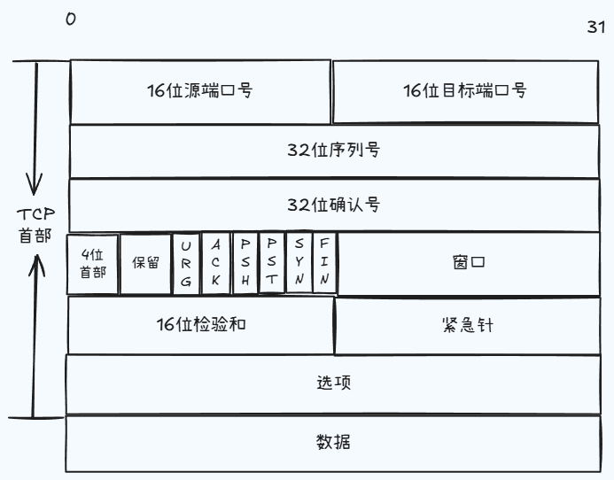
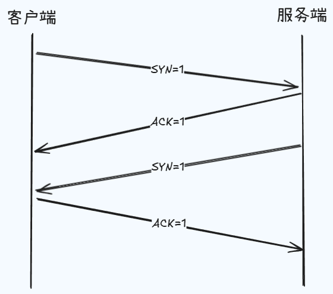
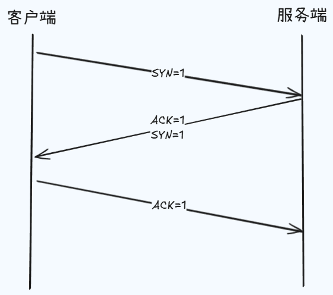
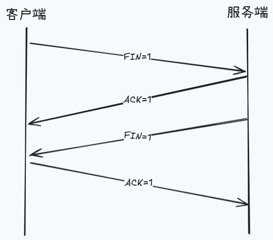

本篇我们来看一下 TCP 协议的一些内容，在网络分层当中，它是存在于传输层里的一个协议，是直接面向连接的网络协议，一般它用于去处理实时的通信，也正是因为如此，所以它具有数据传输可靠性高的这样一个特点，但具有了实时的这样一个特点之后，也就意味着在传输效率上相对于 UDP 来说就会低一些。

那在这下面的图里面，我们再来看一下它的报文结构。

我们给出了一个完整的 tcp 协议报文应该具有的信息，而对于我们来说，只需要去了解端口和几个常见控制字段的意思就可以了，首先端口的作用就是为了标明自己和目标应用进程，而在控制字段中，`SYN=1` 的时候就表示当前主机要请求建立一个连接，`FIN=1` 的时候就表示要去请求断开连接， `ACK=1` 的时候就表示数据信息的确认。

### 三次握手与

那明确了这些之后，我们就可以去看一下三次握手的建立过程。

首先建立握手很明显的是两个人的事情，所以这里我们就以 cs 网络架构为例，那左侧我们就表示客户端，右侧我们就表示服务端，第一次的时候，客户端要向服务端发送一个建立连接的请求，我们就用 `SYN=1` 来进行表示，然后服务端接收到了这个请求之后，就会回送一条消息，表示确认接收到了客户端的请求，我们就去用 `ACK=1` 来进行表示。

任何一次完整的通信都是有来有回的，这两次请求和回送完成之后，就相当于是建立了一条由客户端向服务端发送数据的通道，注意只是客户端向服务端，所以服务端如果想要去发送消息给客户端，他还需要再去发送一个请求给客户端，表示他也想去建立一个连接，那我们也用 `SYN=1` 来进行表示，同样客户端也需要去回送一个确认消息给服务端，表示接收到了这个请求，我们同样是使用 `ACK=1` 来进行表示，至此就建立了一条由服务端向客户端发送数据的通道。

所以这四次连接发生之后，我们就有了一个客户端与服务端之间，去进行数据通信的一个双向通道。不过我们这里看起来是四次握手，而不是三次，本身来说就应该是四次握手，只不过在实际处理的时候，服务端会在回复客户端 `ACK=1` 的时候，同时再去发送一个 `SYN=1`，也就是说他会去将这两次握手进行合并，那这样最终的就是三次握手。

### 四次挥手

说完了握手之后，我们再来看一下挥手，当客户端与服务器的数据传输结束之后，就应该去断开连接，让服务端可以去处理其他客户端的请求。

首先客户端会去发送一个断开连接的请求给服务端，然后服务端会回送一个消息确认，那这个时候就相当于是断开了客户端到服务端的数据通道，那接着服务端会发送一个断开连接的请求给客户端，客户端收到之后也会回送一个确认消息给服务端，那这样的话就断开了服务端与客户端之间的数据通道，所以这个过程就有了四次挥手。

那说到这里，我们可能会想，为什么不将服务端回送确认消息给客户端的请求和服务端请求与客户端断开连接的请求去进行合并呢？那这样我们不就也是三次挥手了吗，这是因为一个服务端要服务于多个客户端，我们不能保证某一个客户端将请求发送给服务端之后，服务端就能立即将结果数据全部传输回给当前的客户端，那意思就是说，有些时候客户端的确已经把所有的数据都发给服务端了，但是服务端还没有将客户端想要的数据都全部传回，所以在断开连接的时候，我们是要分开处理的，因此挥手是要有四次，而握手就可以合并为三次。
