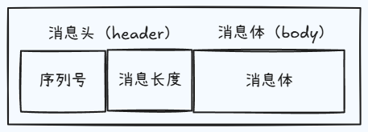

## 数据粘包问题

本篇我们来看一下 TCP 通信当中常见的数据粘包问题，首先我们还是先来简单的分析一下这个问题的由来，我们都知道数据的通信至少是包含接收端和发送端两个部分，而发送端在工作的时候，并不是实时的将手里的数据不停地传给接收端，而是会存在一个缓冲区，它会等待数据的量达到一定的程度之后，再去执行一次发送操作，那同样的道理，接收端在处理数据的时候，也不是立马使用数据，他也会去把收到的数据先去放在一个缓存中，然后再去执行数据的获取和使用，那这样的设计好处就是可以减少 io 操作而带来的性能消耗，但是对于数据的使用来说，就会产生粘包的问题。

接下来通过代码去查看一下粘包问题。

```js
server.on('connection', socket => {
  socket.on('data', chunk => {
    const msg = chunk.toString()

    console.log(msg, '--------') // 在服务端获取到数据时加个打印
  })
})
```

```js
socket.on('connect', () => {
  // 在客户端直接连续发送3个消息
  socket.write('哇咔咔1')
  socket.write('哇咔咔2')
  socket.write('哇咔咔3')
})
```

最后可以看到服务端的打印为

```bash
哇咔咔1哇咔咔2哇咔咔3 --------
```

或者重新再发一次会变成这样

```bash
哇咔咔1 --------
哇咔咔2哇咔咔3 --------
```

并没有想象中会打印 3 次，也就是说有时候我们想分批发的数据会粘在一起，这就是所谓的叫数据粘包的现象，也正是基于流的发送操作和我们当前 TCP 的实现，所以才会产生这样的一个问题。

最简单的一种方法解决这个问题，就是把这个数据的发送之间的时间间隔去给它拉长一些，那这样的话我们上下两条或者说前后两条数据，它就不会跟的那么紧，也就不会产生所谓的粘包现象了。当然我们这样做完之后，它的缺点也是很明显的，因为我们这样肯定是降低了时间，或者说降低了数据的传输效率。

## 数据封包与拆包

接着来说一下使用封包然后再去拆包的数据传输方式去解决数据传输过程中的粘包问题，其实它的核心思想就是按照我们约定好的制定规则，先去把数据进行打包，那将来再去使用数据的时候，我们再按照指定的规则去把数据进行拆包即可，那我们这里使用的就是长度编码的方式，来约定通信双方的数据传输方式。

<p class="text--center">

</p>

如图我们要先去把被传输的消息分为定长的消息头，和不定长的消息体这样的两个部分，其中的头部我们使用 `header` 来进行表示，消息体的话就用 `body` 来进行表示，同时我们再将头部分为序列号和消息体长度两个部分，也就是说一条完整的消息，我们规定它会有三个部分组成，最外层的话就是头部和主体，而在头部的里边，我们为了去区分不同的消息包，又拆分出一个存放编号的位置，然后为了确定每次取多少个长度的内容，那作为本次的数据，我们又定义了一个存放每条数据长度的位置，当然这里的大小都是我们自定义的。

那知道了这个模型之后，我们再来看一下此时的数据传输过程，首先我们会人为地对数据进行编码，因为客户端输入的一般都是字符串，或者说数字等等，那我们就利用自定义的 `encode` 的方法，将它们先去转为二进制，在转换的过程中，我们也会按照我们上述的规则去把数据先封装成一个包，然后数据的接收端拿到这个包之后，就可以按照我们约定好的长度来取出相应位置上的内容就可以了，那这个操作我们就可以去通过自定义的 `decode` 来进行实现，这样的话我们就去把二进制解码成了字符串，显然在这个过程中，我们需要去使用 nodejs 里的 buffer，对于他来说，我们肯定都并不陌生了，只是还要去补充两个读写的操作，首先我们在执行编码操作的时候，需要去往内存中执行数据的写入，因此我们可以去采用 `writeInt16BE` 来完成，在使用的时候会有两个参数，第一个就是我们要写入的具体值，第二个就是偏移量，可以用来指定从 buffer 的个位置呢来开始执行写操作，那有写就会有读操作，因此我们在执行解码操作的时候，就需要从内存里边往外去读取数据，这个时候的话我们就可以去使用 `readInt16BE` 来完成我们当前的读操作，那它在使用的时候，就只需要接收一个参数就可以了，表示我们从 buffer 的哪个位置上来读取数据，与他们类似的，还有一个 32b 的操作，但是对于 16b 来说，我们就可以满足当前的使用了。

转换逻辑。

```js
let packageHeaderLen = 4
let serialNum = 0
let serialLen = 2

class Transformer {
  static encode(data, num) {
    const body = Buffer.from(data)

    // 按照指定的长度申请一片内存空间作为 header 使用
    const headerBuf = Buffer.alloc(packageHeaderLen)

    headerBuf.writeInt16BE(num || serialNum)
    headerBuf.writeInt16BE(body.length, serialLen)

    if (num === undefined) {
      serialNum++
    }

    return Buffer.concat([headerBuf, body])
  }

  static decode(buffer) {
    const headerBuf = buffer.slice(0, packageHeaderLen)
    const bodyBuf = buffer.slice(packageHeaderLen)

    return {
      serialNum: headerBuf.readInt16BE(),
      bodyLength: headerBuf.readInt16BE(serialLen),
      body: bodyBuf
    }
  }

  // 在使用的过程中，要去考虑一下当前这个数据包它里边还有没有数据，现在的编码和解码都是某一次的操作，数据放在一起的时候，就得判断我们当前还有没有数据需要去获取，所以这个时候的话增加一个获取当前要读取的数据包长度的方法。
  // 如果说我们发现这个数据包的长度它为 0，那就证明现在包里没有数据，是没办法去拆的，如果说发现整个包的长度大于等于了包头的长度就说明它还有东西，那我们就应该去把整个消息长度返回。
  static getPackageLen(buffer) {
    if (buffer.length < packageHeaderLen) {
      return 0
    } else {
      return packageHeaderLen + buffer.readInt16BE(serialLen)
    }
  }
}

module.exports = Transformer
```

服务端逻辑修改。

```js
const net = require('net')
const Transformer = require('./transformer')

const PORT = 1234
const HOST = 'localhost'

const server = net.createServer()

server.listen(PORT, HOST)

server.on('listening', () => {
  console.log(`服务端已经开启在 ${HOST}:${PORT}`)
})

let overageBuffer = null // 保存上一次没处理完的 buffer

server.on('connection', socket => {
  socket.on('data', chunk => {
    if (overageBuffer) {
      chunk = Buffer.concat([overageBuffer, chunk])
    }

    let packageLen = 0
    while ((packageLen = Transformer.getPackageLen(chunk))) {
      const packageContent = chunk.slice(0, packageLen)

      const ret = Transformer.decode(packageContent)
      if (ret.body.length === ret.bodyLength) {
        handleMessage(ret)
      } else {
        // 如果是不完整的包体把剩下数据保存下次 data 事件处理
        overageBuffer = chunk
      }

      chunk = chunk.slice(packageLen)
    }
    // 如果 packageLen 为 0，说明消息体内容没有，把剩下数据保存下次 data 事件处理
    overageBuffer = chunk
  })

  socket.on('error', () => {})
})

function handleMessage(ret) {
  console.log('内容：', ret.body.toString())
}
```

客户端逻辑修改。

```js
const net = require('net')
const Transformer = require('./transformer')

const PORT = 1234
const HOST = 'localhost'

const socket = net.createConnection({
  port: PORT,
  host: HOST
})

socket.on('close', () => {
  console.log('断开连接了')
})

socket.on('error', err => {
  console.log(err)
})

socket.on('connect', () => {
  socket.write(Transformer.encode('哇咔咔1'))
  socket.write(Transformer.encode('哇咔咔2'))
  socket.write(Transformer.encode('哇咔咔3'))
})
```
