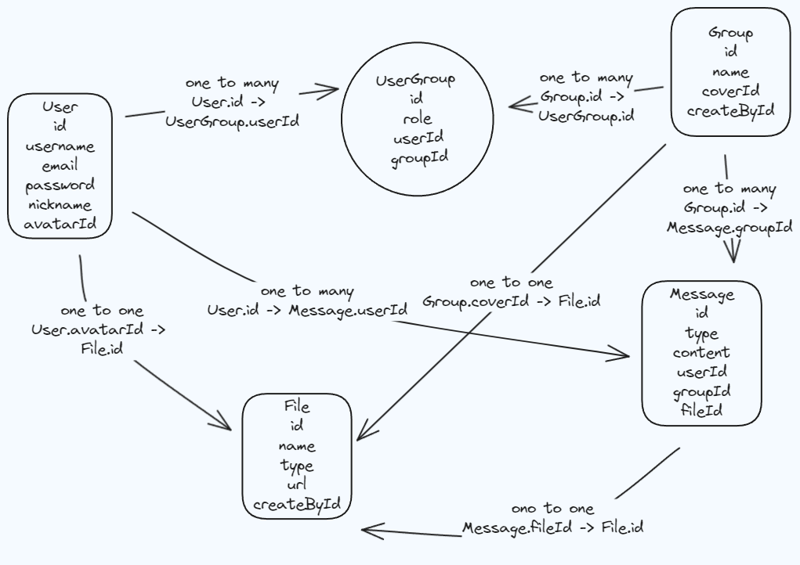

因为最近刚学习完 react， nestjs，docker，monorepo 项目架构相关的东西，所以准备使用这一套东西写一个全栈项目，因此构思出了这个应用。

这是一个即时通讯的消息聊天 web 应用，一个客户端和服务端，目前只实现了登录注册，建群加群，文本、图片、视频消息的群聊功能。项目最后可用 docker 直接打包成镜像使用。

可以直接通过以下链接直接查看 github 代码，里面写了详细的项目启动方法。

[github 源码](https://github.com/JackDeng666/ying-chat)

### 表结构图

