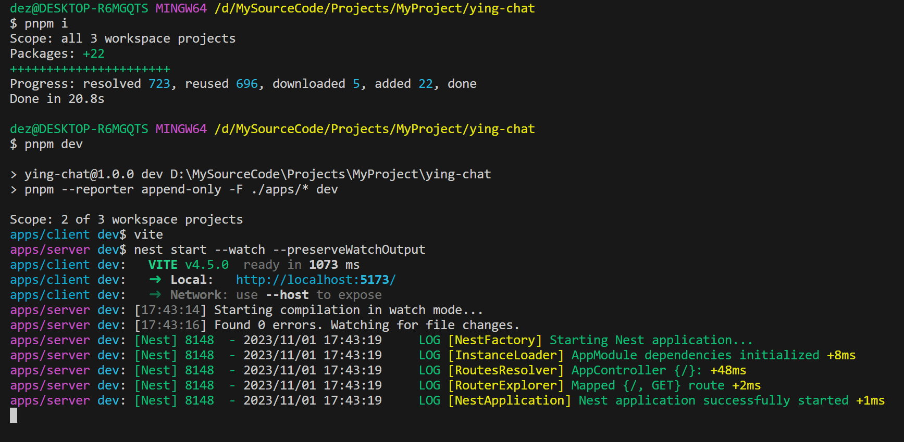

项目的 node 版本和 pnpm 版本

```shell
node -v
v18.18.2
```

```shell
pnpm -v
8.9.2
```

### 创建项目

```shell
mkdir ying-chat # 创建项目根文件夹
cd ying-chat
pnpm init # 初始化package.json
mkdir apps # 创建apps目录
cd apps
```

### 创建 nestjs 服务端项目

```shell
nest new server --skip-git --skip-install -p pnpm
```

`--skip-git` 不要初始化 git 仓库，因为我们要在最外层创建 git 仓库

`--skip-install` 不要自动下载依赖

`-p` 指定使用的包管理器

nest 命令需全局安装 @nestjs/cli

```shell
npm i @nestjs/cli -g
```

最后在 package.json 加多一条 dev 命令

```json title="apps/server/package.json"
{
  ...
  "scripts": {
    ...
    "start": "nest start",
    "dev": "nest start --watch --preserveWatchOutput",
    "start:dev": "nest start --watch",
    ...
  }
  ...
}
```

### 创建 vite react 前端项目

```shell
pnpm create vite
```

项目名输入 client，选择 react，选择 typescipt

### 配置工作区

在项目根目录创建`pnpm-workspace.yaml`，填入以下内容

```json title="pnpm-workspace.yaml"
packages:
  - "apps/*"
```

这个文件的作用是告诉 pnpm 当前文件夹是一个 monorepo 项目，并且该项目有一个位于 apps 文件夹下的 workspace，也就是说这个文件夹下的子文件夹都是独立的项目。

### 添加启动命令

在项目的根目录下

```json title="package.json"
{
  ...
  "scripts": {
    "dev": "pnpm --reporter append-only -F ./apps/* dev",
    "build": "pnpm -F ./apps/* build"
  },
  ...
}
```

`--reporter append-only` 是让启动的项目日志打印为累计添加，否则默认有新的日志会覆盖前面的内容

比如执行 `dev` 脚本，pnpm 会找到 apps 下的所有子项目的 package.json 的 `dev` 脚本执行，这样我们就可以一条命令启动多个项目了。

### 下载依赖启动项目

在项目的根目录下

```shell
pnpm i
pnpm dev
```



启动完成后，访问以下链接查看效果

[http://localhost:5173](http://localhost:5173)

[http://localhost:3000](http://localhost:3000)

### 初始化 git 仓库

添加 `.gitignore` 文件

```json title=".gitignore"
node_modules
dist
```

```shell
git init
git add .
git commit -m "init"
```
