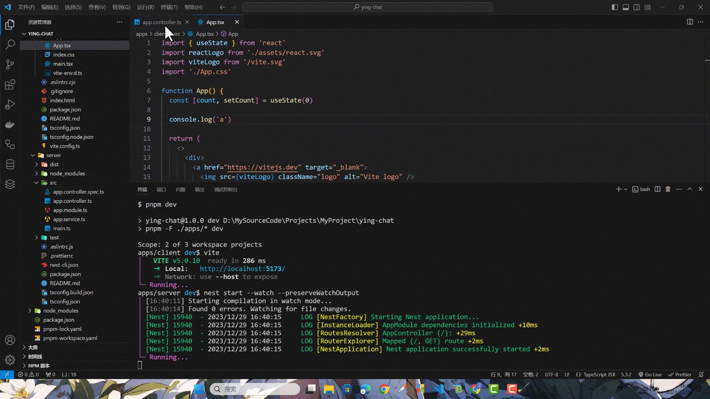
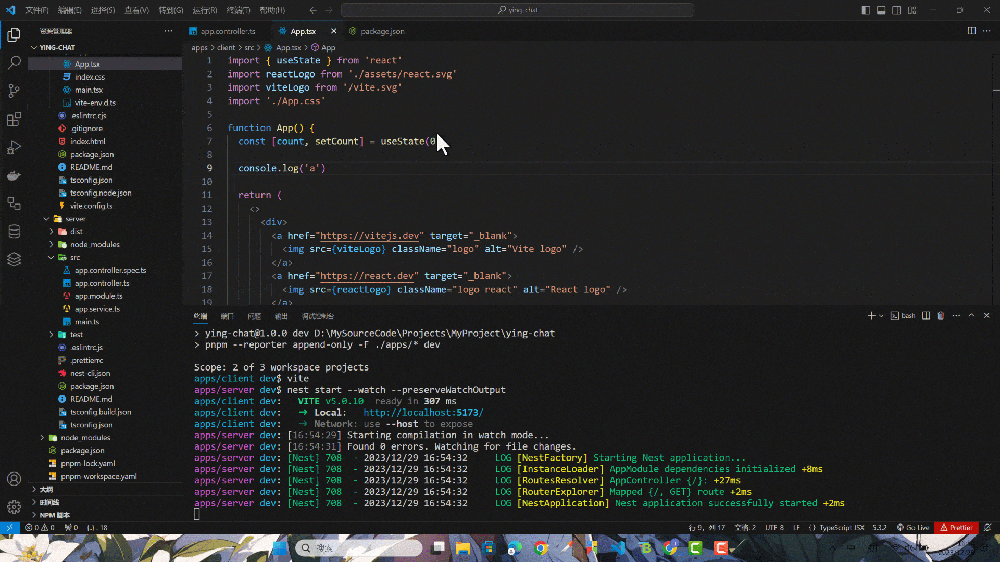

本项目开发时的 node 版本和 pnpm 版本为

```shell
node -v
v18.18.2
```

```shell
pnpm -v
8.9.2
```

使用 vscode 进行开发

### 创建项目

首先创建项目根文件夹叫 `ying-chat`，接着进入到里面执行 `pnpm init` 初始化一个 `package.json` 文件，然后继续创建一个 `apps` 的文件夹，最后进入里面。

```shell
mkdir ying-chat
cd ying-chat
pnpm init
mkdir apps
cd apps
```

### 创建 nestjs 服务端项目

直接在 apps 目录下执行以下命令，创建一个 nestjs 项目。

```shell title="apps"
nest new server --skip-git --skip-install -p pnpm
```

`--skip-git` 不要初始化 git 仓库，等会要在最外层创建 git 仓库

`--skip-install` 不要自动下载依赖，等会要通过 pnpm 统一下载。

`-p pnpm` 指定使用的包管理器为 pnpm

nest 命令需全局安装 @nestjs/cli

```shell
npm i @nestjs/cli -g
```

### 创建 vite react 前端项目

继续在 apps 目录下执行以下命令，创建一个 vite 项目。

```shell title="apps"
pnpm create vite
```

项目名输入为 client，选择 react，选择 typescipt。

没有报错的话，这样前端项目也创建好了。

### 配置 pnpm 工作区

回到项目的根目录，创建`pnpm-workspace.yaml`，填入以下内容：

```json title="pnpm-workspace.yaml"
packages:
  - "apps/*"
```

这个文件的作用是告诉 pnpm 当前文件夹是一个 monorepo 项目，并且该项目有一个位于 apps 文件夹下的 workspace，也就是说这个文件夹下的子文件夹都是独立的项目。

### 添加启动命令

在项目的根目录的 `package.json` 里面添加一个 `dev` 命令。

```json title="package.json"
{
  ...
  "scripts": {
    "dev": "pnpm -F ./apps/* dev"
  },
  ...
}
```

现在执行 `dev` 脚本，pnpm 会找到 apps 下的所有子项目的 package.json 的 `dev` 脚本执行，这样我们就可以一条命令启动多个项目了。

但是现在服务端的 package.json 里并没有 dev 命令，现在需要在里面加一下，内容和原来 nestjs 项目的开发命令`start:dev`一致即可。

```json title="apps/server/package.json"
{
  ...
  "scripts": {
    ...
    "start": "nest start",
    "dev": "nest start --watch",
    "start:dev": "nest start --watch",
    ...
  }
  ...
}
```

### 下载依赖启动项目

在项目的根目录下执行以下命令

```shell
pnpm i
pnpm dev
```

启动完成后，访问以下链接查看效果

[http://localhost:5173](http://localhost:5173)

[http://localhost:3000](http://localhost:3000)

按照目前的配置，当改动 nestjs 项目的代码，nestjs 的热更新将会重新覆盖控制台内容，前面的内容就看不到了，开发体验将会很难受，所以接下来在 nest start 时加上 `--preserveWatchOutput` 即可解决这个问题。

```json title="apps/server/package.json"
{
  ...
  "scripts": {
    ...
    "dev": "nest start --watch --preserveWatchOutput",
    ...
  }
  ...
}
```

pnpm 默认会把两个项目的是输出分成两块，如果同时对前后端代码一块修改，会看到效果有点怪：



在项目的根目录下，给 `dev` 命令添加一个 `--reporter append-only`。

```json title="package.json"
{
  ...
  "scripts": {
    "dev": "pnpm --reporter append-only -F ./apps/* dev"
  },
  ...
}
```

`--reporter append-only` 是让启动的项目日志打印为累计添加，不会分成两块。

重新启动看看效果。



这样就舒服多了。

### 初始化 git 仓库

先添加 `.gitignore` 文件，填入以下内容：

```json title=".gitignore"
node_modules
dist
```

最后初始化一下

```shell
git init
git add .
git commit -m "project init"
```

那么 monorepo 项目的初始化就到这里完结。
