monorepo 的一个优势点是，可以让我们在多个项目中，标准化一套代码 prettier、eslint、git hook 等配置。

当编码完成时，我们使用 eslint 按照一定的规则对代码进行代码质量和格式检查，检查通过后再提交代码。

eslint 也可以对代码进行一定的自动格式化，但这并不是 eslint 的侧重点，所以我们还会引入 prettier 来对我们的代码进行自动格式化以统一代码风格。

如果仅有 eslint 和 prettier，那我们需要在代码提交前手动执行 prettier 和 eslint ，对代码进行格式化以及代码质量和格式检查，这时候可以使用 git 的 hook 功能，而 husky 工具可以创建管理仓库中的所有 git hooks。

随着代码存储库的代码量增多，如果在每次提交代码时，我们都对全量代码执行格式化和检查，将会性能低下，我们希望提交代码时只对当前发生了代码变更的文件执行格式化和检查，那么我们就需要 lint-staged 工具。

同时我们还希望对 commit message 进行格式检查确保其基本符合 Angular 规范，这有利于根据 commit message 自动生成 changelog 和 release note，此时就需要用上 commitlint 工具。

### 配置 eslint、prettier

首先把 client 和 server 共同的 eslint、prettier 相关依赖抽离到根目录的 package.json，同时添加两条新的 script，虽然 vite 创建的 client 项目并没有 prettier，但等会我们自己加上一些配置。

```json title="package.json"
{
  ...
  "scripts": {
    "format": "prettier --config .prettierrc . --write",
    "lint": "pnpm --reporter append-only -F ./apps/* lint",
    ...
  },
  "devDependencies": {
    "@types/node": "^20.8.7",
    "@typescript-eslint/eslint-plugin": "^6.8.0",
    "@typescript-eslint/parser": "^6.8.0",
    "eslint": "^8.52.0",
    "eslint-config-prettier": "^9.0.0",
    "eslint-plugin-prettier": "^5.0.1",
    "prettier": "^3.0.3",
    "ts-node": "^10.9.1",
    "typescript": "^5.2.2"
  }
}
```

format 命令使用 .prettierrc 文件的配置对根文件夹下的所有文件进行格式化，但现在没有我们先创建一下。

```json title=".prettierrc"
{
  "semi": false,
  "singleQuote": true,
  "printWidth": 80,
  "tabWidth": 2,
  "useTabs": true,
  "trailingComma": "none",
  "arrowParens": "avoid",
  "endOfLine": "lf"
}
```

这是我个人喜欢的风格，可以[查阅链接](https://prettier.io/docs/en/options)了解 prettier 各项配置。

再添加一份 prettier 的忽略文件

```json title=".prettierignore"
node_modules
dist
pnpm-lock.yaml
pnpm-workspace.yaml
```

先修改一下以下文件，把原来的--fix 去掉，有 --fix 执行 lint 会自动修复，我们现在要它报错。

```json title="apps/server/package.json"
{
  ...
  "script": {
    ...
    // "lint": "eslint \"{src,apps,libs,test}/**/*.ts\" --fix",
    "lint": "eslint \"{src,apps,libs,test}/**/*.ts\"",
  }
}
```

这时先安装两个插件，搜索 `eslint` 和 `prettier`。

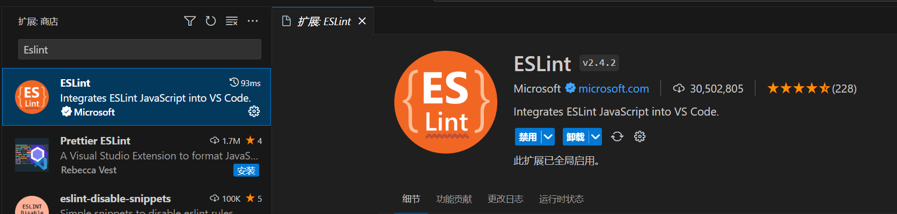

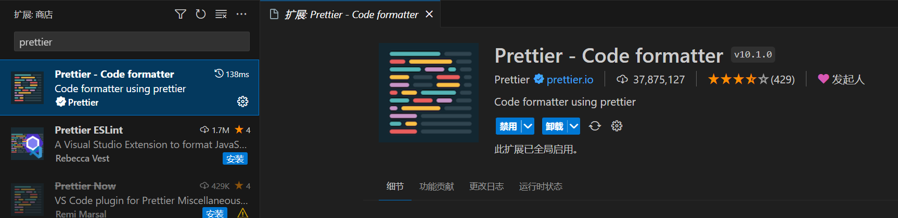

因为我设置了 prettier 规则的"semi" 为 false，这个配置是让代码不需要`;`结尾，此时添加一个分号到 `apps/server/src/main.ts` 上，你会发现编辑器会有对应的报错提示，当你点击保存，代码将被 prettier 自动格式化了。

因为接下来先测试一下 lint 和 format 命令。所以先把自动格式化清除。

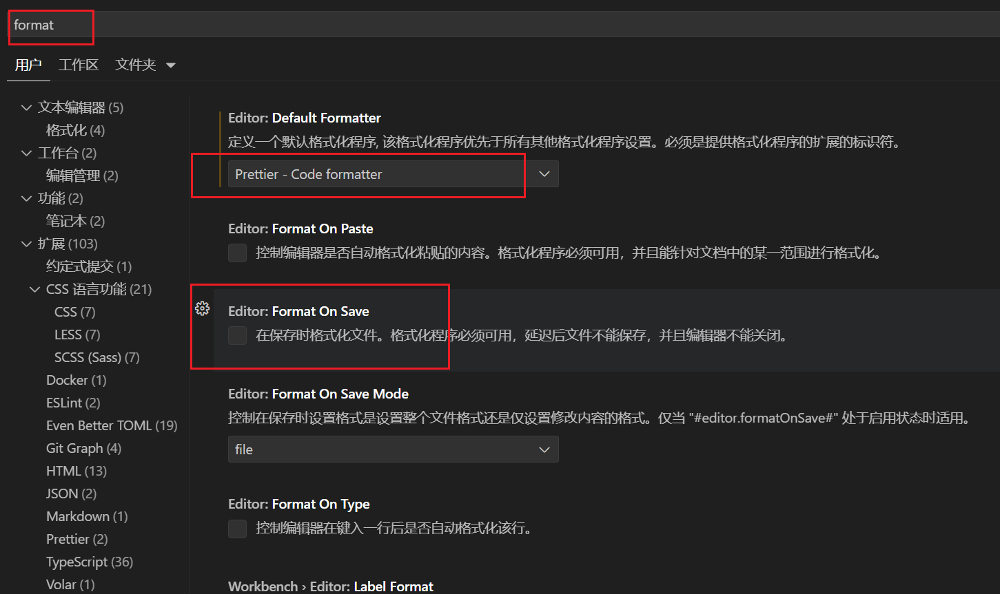

把 Format On Save 取消勾选即可。

此时我们分别在 `apps/client/src/main.tsx` 和 `apps/server/src/main.ts` 代码里随便上添加一个`;`号，保存(此时不会自动修复了)然后执行 pnpm lint。

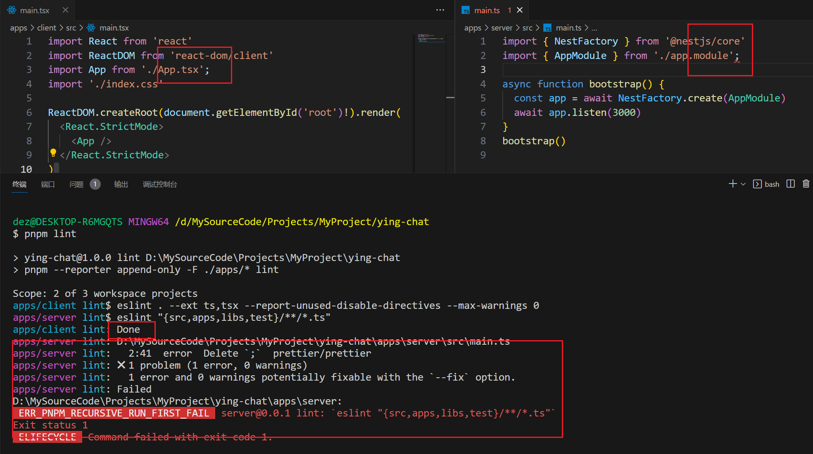

此时可以看到 client 那边没有任何错误提示，而 server 这边有，并且项目根目录下执行 pnpm lint 也只有 server 会报错。这是因为我前面说了 vite 创建的 client 项目并没有 prettier，所以现在需要在 eslint 的 extends 加入一个 prettier 的规则来使 prettier 的规则在 eslint 生效。

```js title="apps/client/.eslintrc.cjs"
module.exports = {
  root: true,
  parser: '@typescript-eslint/parser',
  env: { browser: true, es2020: true },
  extends: [
    'eslint:recommended',
    'plugin:@typescript-eslint/recommended',
    'plugin:react-hooks/recommended',
    'plugin:prettier/recommended' // 加入这句
  ],
  ignorePatterns: ['dist', '.eslintrc.cjs'],
  plugins: ['react-refresh'],
  rules: {
    'react-refresh/only-export-components': [
      'warn',
      { allowConstantExport: true }
    ]
  }
}
```

此时应该可以看到编辑器报错了，并且 client 的 lint 也不会通过。

### husk 管理 git hook

首先在项目根目录 初始化 git 仓库

添加 `.gitignore` 文件

```json title=".gitignore"
# Logs
logs
*.log
npm-debug.log*
yarn-debug.log*
yarn-error.log*
pnpm-debug.log*
lerna-debug.log*

node_modules
dist
dist-ssr
*.local

# Editor directories and files
.vscode/*
!.vscode/extensions.json
.idea
.DS_Store
*.suo
*.ntvs*
*.njsproj
*.sln
*.sw?
```

```shell
git init
git add .
git commit -m "init"
```

然后在项目根目录安装 husky 包

```shell
pnpm i -w -D husky
```

`-w` 表示在根目录的 node_modules 下载安装

然后通过 npx 执行 husky install 命令启用 git hook

```shell
npx husky install
```

我们在根目录 `package.json` 文件添加一个 prepare 脚本，这样其他人克隆该项目并安装依赖时会自动通过 husky 启动 git hook。

```json title="package.json"
{
  ...
  "scripts": {
    "prepare": "husky install",
    ...
  },
}
```

### 添加 pre-commit hook

我们需要的第一个 git hook 是在提交 commit 之前，执行 eslint 工具对代码进行质量和格式检查，也就是在提交 commit 之前执行 package.json 中的 lint 脚本。

我们通过 husky 命令来创建 pre-commit 这个 git hook 。

```shell
npx husky add .husky/pre-commit "pnpm lint"
```

可以看到生成了一下文件

```json title=".husky/pre-commit"
#!/usr/bin/env sh
. "$(dirname -- "$0")/_/husky.sh"

pnpm lint
```

我们再来验证一下是否生效，再在代码里随便加一个`;`号，然后提交一个 commit。

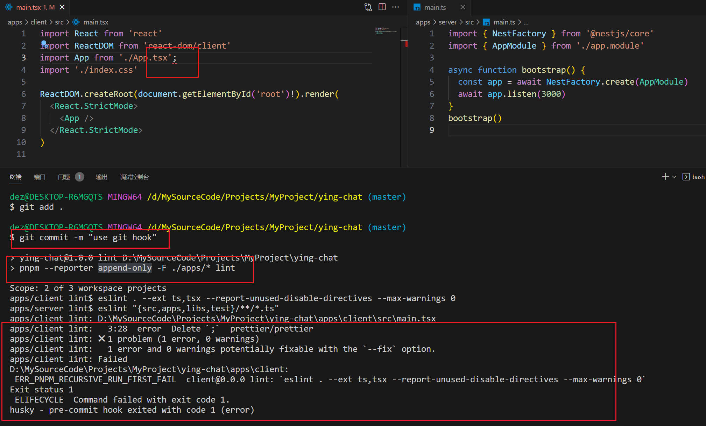

可以看到确实执行 package.json 中的 lint 脚本，然后输出了错误信息，并且中断了 git commit 过程。

删掉 `;` 号重新提交 commit，可以看到成功提交了。

### lint-staged 使用

[lint-staged](https://www.npmjs.com/package/lint-staged) 的作用是仅对变更的文件执行相关操作，在这里就是执行 eslint 检查，先安装。

```shell
pnpm i -w -D lint-staged
```

修改以下文件

```json title="apps/client/package.json"
{
	...
	"lint-staged": {
		"*.ts": "eslint",
		"*.tsx": "eslint"
	},
  ...
}
```

```json title="apps/server/package.json"
{
  ...
  "lint-staged": {
    "*.ts": "eslint"
  },
  ...
}
```

最后修改 pre-commit hook

```json title=".husky/pre-commit"
#!/usr/bin/env sh
. "$(dirname -- "$0")/_/husky.sh"

# pnpm lint
npx lint-staged
```

我们再来验证一下是否生效，再在代码里随便加一个`;`号，然后提交一个 commit。

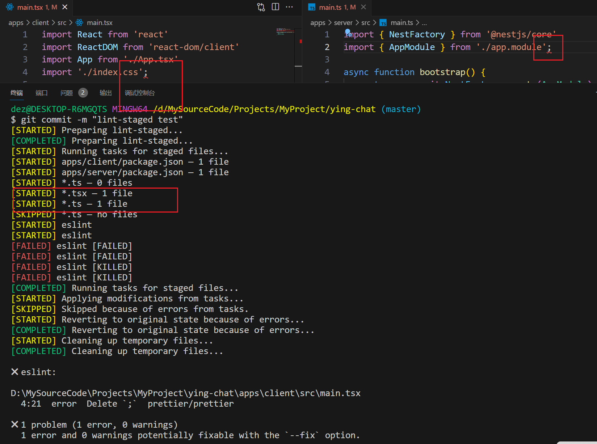

可以看到提交中断了。

### 使用 commitlint 对提交消息检查

在项目根目录下载

```shell
pnpm i -w -D @commitlint/cli @commitlint/config-conventional
```

添加`.commitlintrc.json`文件

```json title=".commitlintrc.json"
{
  "extends": ["@commitlint/config-conventional"]
}
```

添加 commit-msg 的 git hook

```shell
npx husky add .husky/commit-msg 'npx --no -- commitlint --edit "$1"'
```

它的作用是在我们提交 commit 或者修改 commit message 时对 commit message 进行相关校验，这样就可以确保我们的项目拥有一个统一的 commit message 风格。

我们随便提交一下看看。

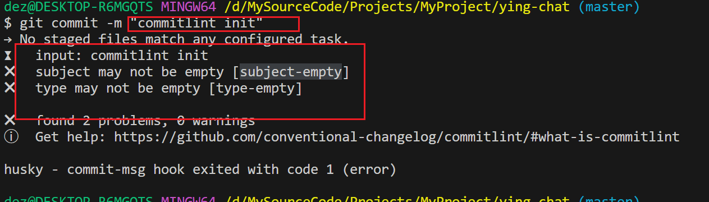

可以看到消息不符合规范，commit 被中断了，那怎么符合规范呢，这时候试试一个符合规范的 message 。

```shell
git commit -m "feat: commitlint init"
```

这时候便提交成功了，对于这个 commit message 的规范，可以去看看 commitlint 的文档，而我推荐使用一个 vscode 插件进行提交，这样会有提示，搜索`Conventional Commits`。

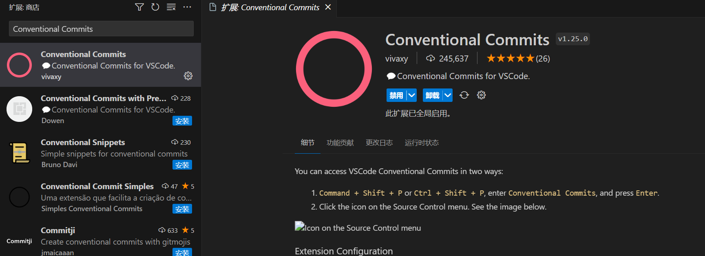

以后需要提交代码时就， `ctrl` + `shift` + `P`

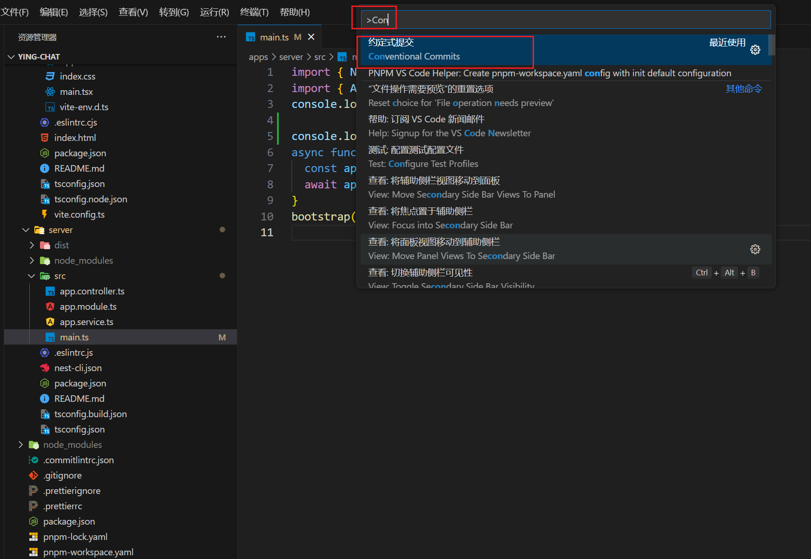

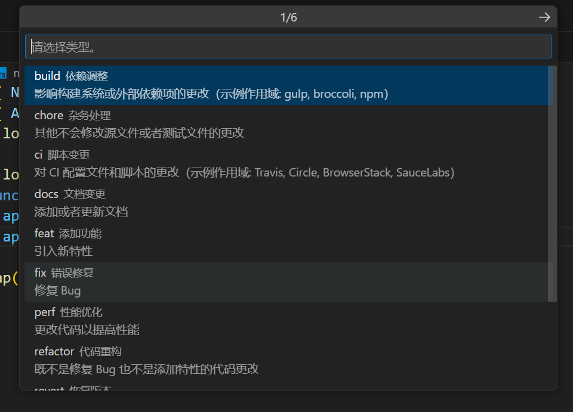

你可以看到对应的提交类型，按照你对文件的修改属于什么性质选择即可。

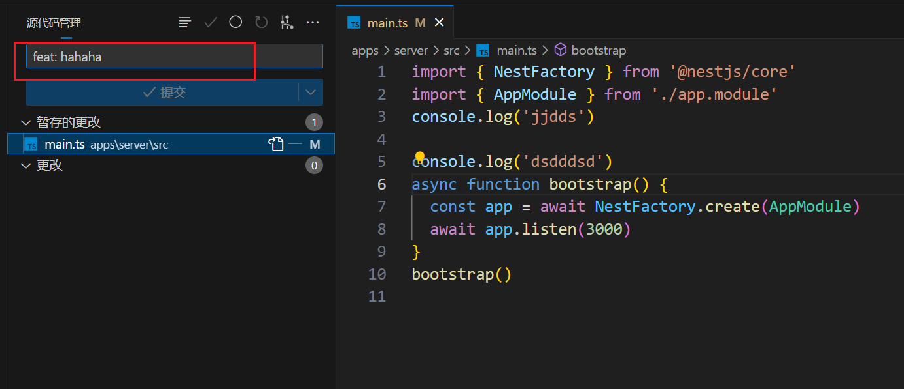

其实就是给你生成了对应的前缀，已方便后续管理提交历史。
