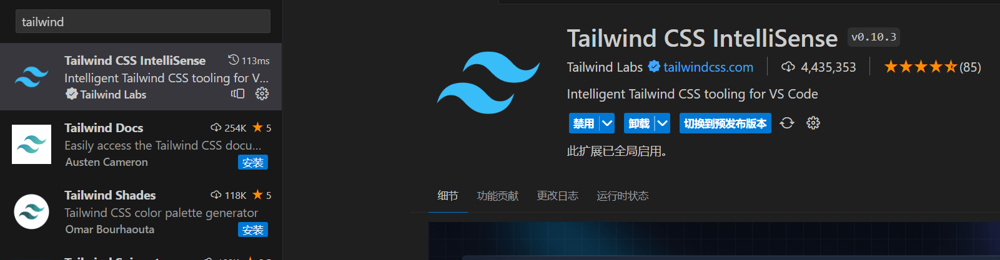

[vite 中引入 tailwindcss 英文](https://tailwindcss.com/docs/guides/vite)

[vite 中引入 tailwindcss 中文](https://www.tailwindcss.cn/docs/guides/vite)

### 引入 tailwindcss

在 client 目录执行

```shell title="apps/client"
pnpm i -D tailwindcss postcss autoprefixer
```

然后

```shell title="apps/client"
npx tailwindcss init -p
```

可以看到此时生成了一个 `postcss.config.js` 和 `tailwind.config.js` 文件，往 `tailwind.config.js` 添加以下内容。

```js title="apps/client/tailwind.config.js"
/** @type {import('tailwindcss').Config} */
export default {
  content: ['./index.html', './src/**/*.{js,ts,jsx,tsx}'],
  theme: {
    extend: {}
  },
  plugins: []
}
```

修改 src 下的 index.css 为

```css title="apps/client/src/index.css"
@tailwind base;
@tailwind components;
@tailwind utilities;
```

修改 src 下的 App.tsx 为

```tsx title="apps/client/src/App.tsx"
function App() {
  return <h1 className="text-3xl font-bold underline">Hello world!</h1>
}

export default App
```

看看是否生效，编写 tailwindcss 推荐使用一个 vscode 插件，可以有良好的代码提示。



### 引入 antd

[antd 官方文档](https://ant-design.antgroup.com/)

client 下执行

```shell title="apps/client"
pnpm install antd --save
```

修改 App.tsx

```tsx title="apps/client/src/App.tsx"
import { Button } from 'antd'

function App() {
  return (
    <div>
      <h1 className="text-3xl font-bold underline">Hello world!</h1>
      <Button type="primary">Click me</Button>
    </div>
  )
}

export default App
```

可以看到按钮出来了，但是因为 antd 和 tailwindcss 的样式冲突，按钮颜色不对，需要修改一下以下文件。

```js title="apps/client/tailwind.config.js"
/** @type {import('tailwindcss').Config} */
export default {
  content: ['./index.html', './src/**/*.{js,ts,jsx,tsx}'],
  theme: {
    extend: {}
  },
  plugins: [],
  corePlugins: {
    preflight: false
  }
}
```
