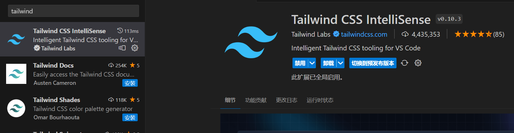

本节来 client 项目引入 Tailwind CSS 和 NextUI

### 引入 Tailwind CSS

[vite 中引入 tailwindcss 英文](https://tailwindcss.com/docs/guides/vite)

[vite 中引入 tailwindcss 中文](https://www.tailwindcss.cn/docs/guides/vite)

在 client 目录执行

```shell title="apps/client"
pnpm i -D tailwindcss postcss autoprefixer
```

然后执行

```shell title="apps/client"
npx tailwindcss init -p
```

可以看到此时生成了 `postcss.config.js` 和 `tailwind.config.js` 文件，往 `tailwind.config.js` 添加以下内容。

```js title="apps/client/tailwind.config.js"
/** @type {import('tailwindcss').Config} */
export default {
  content: ['./index.html', './src/**/*.{js,ts,jsx,tsx}'],
  theme: {
    extend: {}
  },
  plugins: []
}
```

修改 src 下的 index.css 为

```css title="apps/client/src/index.css"
@tailwind base;
@tailwind components;
@tailwind utilities;
```

修改 src 下的 App.tsx 为

```tsx title="apps/client/src/App.tsx"
function App() {
  return <h1 className="text-3xl font-bold underline">Hello world!</h1>
}

export default App
```

看看是否生效，编写 tailwindcss 推荐使用一个 vscode 插件，可以有良好的代码提示。



### 引入 NextUI

[NextUI 文档](https://nextui.org/)

在 client 目录执行

```shell title="apps/client"
pnpm add @nextui-org/react framer-motion
```

然后修改 `tailwind.config.js` 文件

```js
import { nextui } from '@nextui-org/react'

/** @type {import('tailwindcss').Config} */
export default {
  content: [
    './index.html',
    './src/**/*.{js,ts,jsx,tsx}',
    './node_modules/@nextui-org/theme/dist/**/*.{js,ts,jsx,tsx}'
  ],
  theme: {
    extend: {}
  },
  darkMode: 'class',
  plugins: [nextui()]
}
```

然后在 `App.tsx` 试着引入一下组件

```tsx title="apps\client\src\App.tsx"
import { NextUIProvider, Button } from '@nextui-org/react'

function App() {
  return (
    <NextUIProvider>
      <div>
        <h1 className="text-3xl text-center font-bold underline">
          Hello world!
        </h1>
        <Button>asdas</Button>
      </div>
    </NextUIProvider>
  )
}

export default App
```

以上按照官方文档的操作，发现组件根本不会出现，排查一下发现 `tailwind.config.js` 里配置的 `@nextui-org/theme` 根本就没下载，文档也没写要去下载，那接下来手动安装一下。

```shell
pnpm add @nextui-org/theme
```

然后重启一下应用即可，这时候即使把 `NextUIProvider` 去掉按钮也会出来，这番体验下来发现 NextUI 目前这个文档的坑挺大的。

到这里本节引入 Tailwind CSS 和 NextUI 就到此结束。
