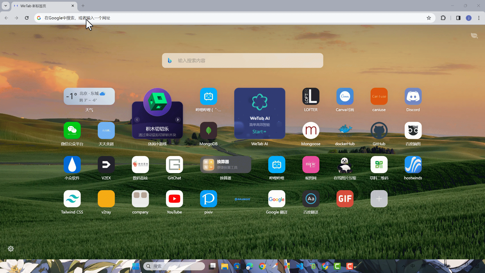

这节我们用 react-router-dom v6 来搭建整个页面框架。

### 支持 `@` 符号代表 src

在 client 目录下下载依赖

```shell title="apps/client"
pnpm add react-router-dom
```

首先我们需要往 `tsconfig.json` 文件添加以下配置。

```json title="apps/client/tsconfig.json"
{
  "compilerOptions": {
    // ...
    "paths": {
      "@/*": ["./src/*"]
    }
  }
}
```

然后在 `vite.config.ts` 添加一个 `resolve` 如下

```ts title="apps/client/vite.config.ts"
import path from 'path'
// ...

export default defineConfig({
  // ...
  resolve: {
    alias: {
      '@': path.resolve(__dirname, './src')
    }
  }
})
```

这样项目就支持 `@` 符号代表 src 引入了。

先给全局的 css 加上些初始化样式

```tsx title="apps/client/src/index.css"
// ...

* {
	margin: 0;
	padding: 0;
}

html,
body,
#root {
	height: 100%;
}

.fc {
  @apply flex justify-center items-center;
}

.no-scrollbar::-webkit-scrollbar {
  display: none;
}
```

`fc` 是使用了 tailwindss 的 `flex justify-center items-center`，把它们组合在一起简写了，`.no-scrollbar`让`scrollbar`消失。

### 登录注册页面

先直接写入两个简单的登录注册页面

```tsx title="apps/client/src/pages/account/login.tsx"
export const Login = () => {
  return <div>Login</div>
}
```

```tsx title="apps/client/src/pages/account/register.tsx"
export const Register = () => {
  return <div>Register</div>
}
```

### 搭建路由

新添加一下两个新的路由文件

```tsx title="apps/client/src/router/routes.tsx"
import { Login } from '@/pages/account/login'
import { Register } from '@/pages/account/register'

export const routes = [
  {
    path: '/login',
    element: <Login />
  },
  {
    path: '/register',
    element: <Register />
  }
]
```

```tsx title="apps/client/src/router/index.tsx"
import { createBrowserRouter } from 'react-router-dom'
import { routes } from './routes'

export const router = createBrowserRouter(routes)
```

再修改一下 `App.tsx` 。

```tsx title="apps/client/src/App.tsx"
import { RouterProvider } from 'react-router-dom'
import { router } from './router'

function App() {
  return <RouterProvider router={router}></RouterProvider>
}

export default App
```

分别查看以下链接可以看到对应的效果

[http://localhost:5173/login](http://localhost:5173/login)

[http://localhost:5173/register](http://localhost:5173/register)

### 主页面框架

接下来我们来把主页面的框架搭建一下。

在 client 下先安装一下 `lucide-react` 这个图标库。

```shell title="apps/client"
pnpm add lucide-react
```

先后创建 `ContactPage` 和 `ConversationPage` 两个页面。

```tsx title="apps/client/src/pages/contact/index.tsx"
export const ContactPage = () => {
  return <div className="w-full h-full fc">ContactPage</div>
}
```

```tsx title="apps/client/src/pages/conversation/index.tsx"
export const ConversationPage = () => {
  return <div className="w-full h-full fc">ConversationPage</div>
}
```

创建一个 layout 组件，里面用 `<Outlet />` 接收上面写的两个组件。

```tsx title="apps/client/src/components/layout/index.tsx"
import { Outlet } from 'react-router-dom'
import { NavSidebar } from './nav-sidebar'

export const AppLayout = () => {
  return (
    <div className="h-full flex flex-row">
      <NavSidebar />

      <main className="h-full flex-1">
        <Outlet />
      </main>
    </div>
  )
}
```

这个是左边的侧边栏

```tsx title="apps/client/src/components/layout/nav-sidebar.tsx"
import { useNavigate, useLocation } from 'react-router-dom'
import { Users, MessageSquare } from 'lucide-react'
import { cn } from '@nextui-org/react'

export const NavSidebar = () => {
  const navigate = useNavigate()
  const { pathname } = useLocation()

  return (
    <div className="flex flex-col gap-4 items-center w-[72px] py-4 bg-content1">
      <div className="flex-1 flex flex-col gap-2">
        <div
          className={cn(
            `fc text-xl w-[48px] h-[48px] cursor-pointer rounded-full transition-all duration-700`,
            'hover:rounded-2xl text-foreground bg-default',
            pathname.startsWith('/conversation') && 'rounded-2xl bg-primary'
          )}
          onClick={() => {
            navigate('/conversation', { replace: true })
          }}
        >
          <MessageSquare />
        </div>
        <div
          className={cn(
            `fc text-xl w-[48px] h-[48px] cursor-pointer rounded-full transition-all duration-700`,
            'hover:rounded-2xl text-foreground bg-default',
            pathname.startsWith('/contact') && 'rounded-2xl bg-primary'
          )}
          onClick={() => {
            navigate('/contact', { replace: true })
          }}
        >
          <Users />
        </div>
      </div>
    </div>
  )
}
```

接下来修改一下 `routes.tsx` 把 `AppLayout` 引入。

```tsx title="apps/client/src/router/routes.tsx"
import { Navigate } from 'react-router-dom'
// ...
import { AppLayout } from '@/components/layout'
import { ConversationPage } from '@/pages/conversation'
import { ContactPage } from '@/pages/contact'

export const routes = [
  {
    path: '/',
    element: <AppLayout />,
    children: [
      {
        index: true,
        element: <Navigate to="conversation" />
      },
      {
        path: 'conversation',
        element: <ConversationPage />
      },
      {
        path: 'contact',
        element: <ContactPage />
      }
    ]
  }
  // ...
]
```

保存完成后查看效果


