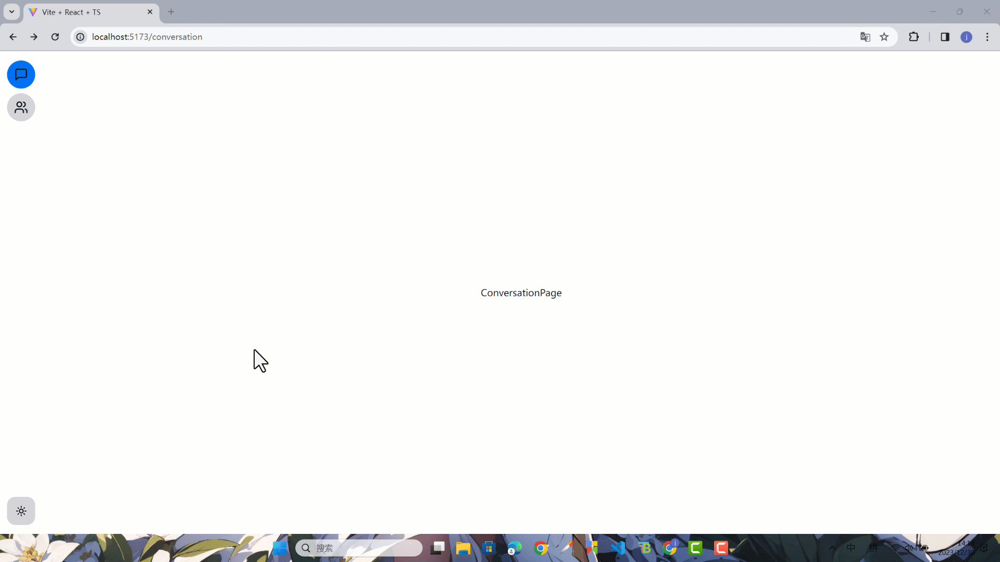

本节来把整个前端的页面样式完善一下，再把主题切换的逻辑加上。

### 登录注册样式完善

现在使用 `NextUI` 的组件把基础的表单写出来

```tsx title="apps/client/src/pages/account/login.tsx"
import { useNavigate } from 'react-router-dom'
import {
  Button,
  Card,
  CardBody,
  CardHeader,
  Divider,
  Input
} from '@nextui-org/react'
import { CircleUserRound, Lock } from 'lucide-react'

export const Login = () => {
  const navigate = useNavigate()

  return (
    <div className="h-full flex justify-center items-center">
      <Card className="w-[25rem]">
        <CardHeader>Login</CardHeader>
        <Divider />
        <CardBody>
          <form>
            <Input
              variant="underlined"
              label="loginName"
              autoComplete="loginName"
              endContent={<CircleUserRound />}
            />
            <Input
              label="Password"
              variant="underlined"
              endContent={<Lock />}
              type="password"
              autoComplete="password"
            />

            <Input label="Code" variant="underlined" maxLength={4} />

            <div className="flex flex-col gap-4 mt-4">
              <Button color="primary" type="submit">
                Log in
              </Button>
              <Button
                onClick={() => {
                  navigate('/register')
                }}
                variant="ghost"
              >
                Register now
              </Button>
            </div>
          </form>
        </CardBody>
      </Card>
    </div>
  )
}
```

```tsx title="apps/client/src/pages/account/register.tsx"
import { useNavigate } from 'react-router-dom'
import {
  Button,
  Card,
  CardBody,
  CardHeader,
  Divider,
  Input
} from '@nextui-org/react'
import { CircleUserRound, Mail, Lock } from 'lucide-react'

export const Register = () => {
  const navigate = useNavigate()

  return (
    <div className="h-full flex justify-center items-center">
      <Card className="w-[25rem]" title="Register">
        <CardHeader>Register</CardHeader>
        <Divider />
        <CardBody>
          <form>
            <Input
              endContent={<CircleUserRound />}
              label="Username"
              autoComplete="new-username"
              variant="underlined"
            />
            <Input endContent={<Mail />} label="Email" variant="underlined" />
            <Input
              endContent={<Lock />}
              type="password"
              label="Password"
              autoComplete="new-password"
              variant="underlined"
            />
            <Input
              endContent={<Lock />}
              type="password"
              label="Input password again"
              autoComplete="off"
              variant="underlined"
            />

            <Input
              label="Code"
              variant="underlined"
              maxLength={6}
              endContent={
                <Button color="primary" radius="sm">
                  Send Code
                </Button>
              }
            />

            <div className="flex flex-col gap-4 mt-4">
              <Button color="primary" type="submit">
                Register now
              </Button>
              <Button
                variant="ghost"
                onClick={() => {
                  navigate('/login')
                }}
              >
                Log in now
              </Button>
            </div>
          </form>
        </CardBody>
      </Card>
    </div>
  )
}
```

### 主题切换

[NextUI 暗黑主题文档](https://nextui.org/docs/customization/dark-mode)

接下来添加暗黑亮色主题切换功能，NextUI 官方文档写得很难受，它是在父元素上添加一个 `dark` 属性去切换，我参考 `shadcn/ui` 的写法加了一个更好使的。

[shadcn/ui 暗黑主题文档](https://ui.shadcn.com/docs/dark-mode/vite)

先添加一个 `ThemeProvider`。

```tsx title="apps/client/src/components/theme-provider.tsx"
import { createContext, useContext, useEffect, useState } from 'react'

type Theme = 'dark' | 'light' | 'system'

type ThemeProviderProps = {
  children: React.ReactNode
  defaultTheme?: Theme
  storageKey?: string
}

type ThemeProviderState = {
  theme: Theme
  setTheme: (theme: Theme) => void
}

const initialState: ThemeProviderState = {
  theme: 'system',
  setTheme: () => null
}

const ThemeProviderContext = createContext<ThemeProviderState>(initialState)

export function ThemeProvider({
  children,
  defaultTheme = 'system',
  storageKey = 'vite-ui-theme',
  ...props
}: ThemeProviderProps) {
  const [theme, setTheme] = useState<Theme>(
    () => (localStorage.getItem(storageKey) as Theme) || defaultTheme
  )

  useEffect(() => {
    const root = window.document.documentElement

    root.classList.remove('light', 'dark')

    if (theme === 'system') {
      const systemTheme = window.matchMedia('(prefers-color-scheme: dark)')
        .matches
        ? 'dark'
        : 'light'

      root.classList.add(systemTheme)
      return
    }

    root.classList.add(theme)
  }, [theme])

  const value = {
    theme,
    setTheme: (theme: Theme) => {
      localStorage.setItem(storageKey, theme)
      setTheme(theme)
    }
  }

  return (
    <ThemeProviderContext.Provider {...props} value={value}>
      {children}
    </ThemeProviderContext.Provider>
  )
}

export const useTheme = () => {
  const context = useContext(ThemeProviderContext)

  if (context === undefined)
    throw new Error('useTheme must be used within a ThemeProvider')

  return context
}
```

然后把 `ThemeProvider` 添加到根组件，把 `defaultTheme` 设置成 `dark`。

```tsx title="apps/client/src/App.tsx"
import { RouterProvider } from 'react-router-dom'
import { ThemeProvider } from '@/components/theme-provider'
import { router } from '@/router'

function App() {
  return (
    <ThemeProvider defaultTheme="dark">
      <RouterProvider router={router}></RouterProvider>
    </ThemeProvider>
  )
}

export default App
```

再添加一个 `ModeToggle` 组件。

```tsx title="apps/client/src/components/mode-toggle.tsx"
import { Moon, Sun } from 'lucide-react'
import {
  Dropdown,
  DropdownTrigger,
  DropdownMenu,
  DropdownItem,
  Button
} from '@nextui-org/react'
import { useTheme } from '@/components/theme-provider'

export function ModeToggle() {
  const { setTheme } = useTheme()

  return (
    <Dropdown>
      <DropdownTrigger>
        <Button size="lg" isIconOnly>
          <Sun className="h-[1.2rem] w-[1.2rem] rotate-0 scale-100 transition-all dark:-rotate-90 dark:scale-0" />
          <Moon className="absolute h-[1.2rem] w-[1.2rem] rotate-90 scale-0 transition-all dark:rotate-0 dark:scale-100" />
        </Button>
      </DropdownTrigger>
      <DropdownMenu aria-label="mode menu">
        <DropdownItem onClick={() => setTheme('light')}>Light</DropdownItem>
        <DropdownItem onClick={() => setTheme('dark')}>Dark</DropdownItem>
        <DropdownItem onClick={() => setTheme('system')}>System</DropdownItem>
      </DropdownMenu>
    </Dropdown>
  )
}
```

最后把 `ModeToggle` 组件放到 `NavSidebar` 里。

```tsx title="apps/client/src/components/layout/nav-sidebar.tsx"
// ...
import { ModeToggle } from '@/components/mode-toggle'

export const NavSidebar = () => {
  // ...

  return (
    <div className="flex flex-col gap-4 items-center w-[72px] py-4 bg-content1">
      // ...
      <ModeToggle />
    </div>
  )
}
```

最后查看一下效果


