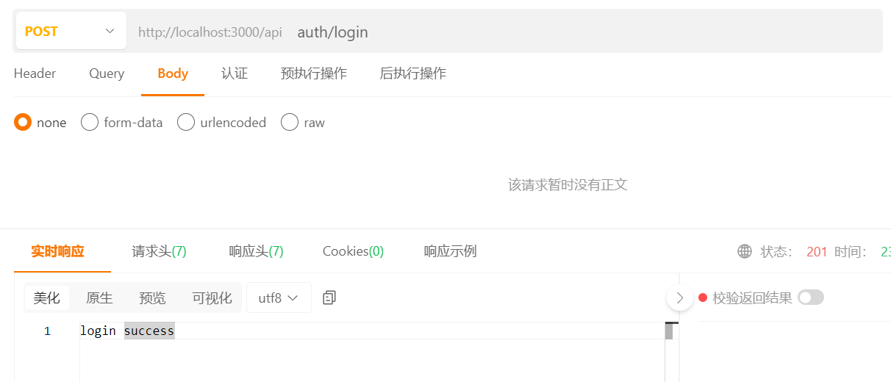
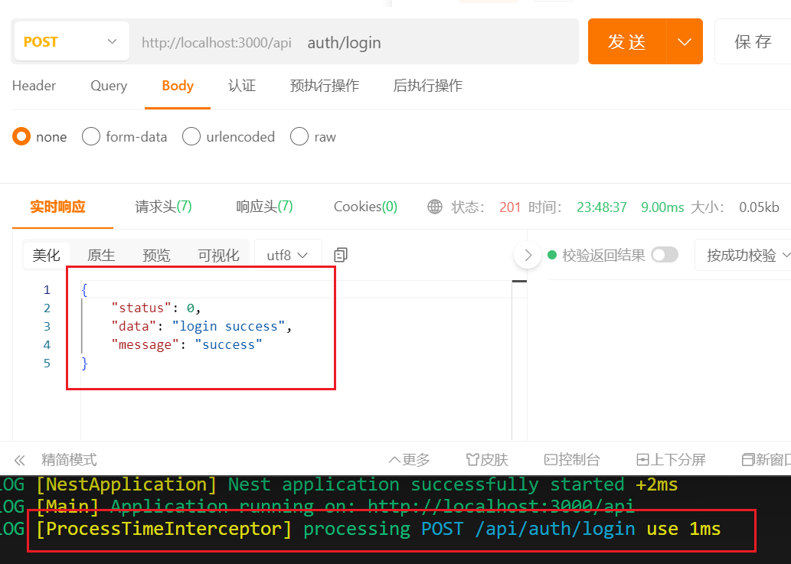

本节来对 `server` 进行一些统一的初始化配置。

## 支持 `@` 符号代表 src

往 `server` 的 `tsconfig.json` 文件添加以下配置。

```json title="apps/server/tsconfig.json"
{
  "compilerOptions": {
    // ...
    "paths": {
      "@/*": ["./src/*"]
    }
  }
}
```

## 添加 api 配置

在 sever 目录安装 nestjs 的 config 模块。

```shell title="apps/server"
pnpm add @nestjs/config
```

然后我们添加一个 `.env` 环境变量文件

```json title="apps/server/.env"
# api
SERVER_PORT=3000
```

然后在以下路径添加一个 `api.config.ts` 文件。

```ts title="apps/server/src/config/api.config.ts"
import { registerAs } from '@nestjs/config'

export const apiConfig = registerAs('apiConfig', () => {
  return {
    port: process.env.SERVER_PORT || 3000
  }
})
```

新建一个 `index.ts` 文件把它导出。

```ts title="apps/server/src/config/index.ts"
export * from './api.config'
```

然后在 `AppModule` 里引入 `ConfigModule`。

原来初始化项目带的 `app.controller.ts`、`app.controller.spec.ts`、`app.service.ts` 这几个文件都可以直接删了，不需要了。

```ts title="apps/server/src/app.module.ts"
import { Module } from '@nestjs/common'
import { ConfigModule } from '@nestjs/config'
import { apiConfig } from '@/config'

@Module({
  imports: [
    ConfigModule.forRoot({
      isGlobal: true,
      load: [apiConfig]
    })
  ]
})
export class AppModule {}
```

在 `bootstrap` 的启动逻辑里获取配置。

```ts title="apps/server/src/main.ts"
// ...
import { ConfigType } from '@nestjs/config'
import { apiConfig } from '@/config'
import { Logger } from '@nestjs/common'
// ...
async function bootstrap() {
  const app = await NestFactory.create(AppModule)
  const apiConf = app.get<ConfigType<typeof apiConfig>>(apiConfig.KEY)
  app.setGlobalPrefix('/api')
  await app.listen(apiConf.port)
  Logger.log(
    `Application running on: http://localhost:${apiConf.port}/api`,
    'Main'
  )
}
bootstrap()
```

保存查看效果

## 用户模块添加

创建好 `AuthController`，我们在里面添加两个 `Post` 接口，登录注册的逻辑后面再实现。

```ts title="apps/server/src/modules/user/auth.controller.ts"
import { Controller, Post } from '@nestjs/common'

@Controller('auth')
export class AuthController {
  @Post('login')
  login() {
    return 'login success'
  }

  @Post('register')
  register() {
    return 'register success'
  }
}
```

接下来新建一个 `UserModule` 模块。

```ts title="apps/server/src/modules/user/user.module.ts"
import { Module } from '@nestjs/common'
import { AuthController } from '@/modules/user/auth.controller'

@Module({
  controllers: [AuthController]
})
export class UserModule {}
```

然后在 `AppModule` 里面导入。

```tsx title="apps\server\src\app.module.ts"
// ...
import { UserModule } from '@/modules/user/user.module'

@Module({
  imports: [
    // ..
    UserModule
  ]
})
export class AppModule {}
```

调用 login 接口看到成功返回 `login success`。



## 统一拦截器

添加一个打印每个接口处理时间的拦截器。

```ts title="apps/server/src/common/interceptor/process-time.interceptor.ts"
import {
  CallHandler,
  ExecutionContext,
  Injectable,
  NestInterceptor,
  Logger
} from '@nestjs/common'
import { Observable } from 'rxjs'
import { tap } from 'rxjs/operators'

@Injectable()
export class ProcessTimeInterceptor implements NestInterceptor {
  intercept(context: ExecutionContext, next: CallHandler): Observable<any> {
    const { method, path } = context.switchToHttp().getRequest()
    const now = Date.now()
    return next.handle().pipe(
      tap(() => {
        const useTime = Date.now() - now
        if (useTime > 1000) {
          Logger.warn(
            `processing \x1B[36m${method} ${path}\x1B[0m \x1B[31muse ${useTime}ms\x1B[0m`,
            ProcessTimeInterceptor.name
          )
        } else {
          Logger.log(
            `processing \x1B[36m${method} ${path}\x1B[0m \x1B[33muse ${useTime}ms\x1B[0m`,
            ProcessTimeInterceptor.name
          )
        }
      })
    )
  }
}
```

添加一个把所有返回结果包装一下的拦截器。

```ts title="apps/server/src/common/interceptor/response-wrap.interceptor.ts"
import {
  CallHandler,
  ExecutionContext,
  Injectable,
  NestInterceptor
} from '@nestjs/common'
import { map } from 'rxjs/operators'
import { Observable } from 'rxjs'

type ResponseWrap<T> = {
  status: number
  data: T
  message: string
}

@Injectable()
export class ResponseWrapInterceptor<T> implements NestInterceptor<T> {
  intercept(
    context: ExecutionContext,
    next: CallHandler
  ): Observable<ResponseWrap<T>> {
    return next.handle().pipe(
      map(data => {
        return { status: 0, data, message: 'success' }
      })
    )
  }
}
```

把这两个拦截器通过 `index.ts` 暴露出去。

```ts title="apps/server/src/common/interceptor/index.ts"
export * from './process-time.interceptor'
export * from './response-wrap.interceptor'
```

在 `main.ts` 里使用 `useGlobalInterceptors` 使用这两个拦截器。

```ts title="apps/server/src/main.ts"
// ...
import {
  ProcessTimeInterceptor,
  ResponseWrapInterceptor
} from '@/common/interceptor'
// ...
async function bootstrap() {
  // ...
  app.useGlobalInterceptors(new ProcessTimeInterceptor())
  app.useGlobalInterceptors(new ResponseWrapInterceptor())
  // ..
}
```

再调用 login 接口看看看效果。



## 统一错误过滤器

先添加一个 Http 错误过滤器。

```ts =title="apps/server/src/common/filter/http-exception.filter.ts"
import {
  ArgumentsHost,
  Catch,
  ExceptionFilter,
  HttpException
} from '@nestjs/common'
import { Request, Response } from 'express'

@Catch(HttpException)
export class HttpExceptionFilter implements ExceptionFilter {
  catch(exception: HttpException, host: ArgumentsHost) {
    const ctx = host.switchToHttp()
    const response = ctx.getResponse<Response>()
    const request = ctx.getRequest<Request>()

    const status = exception.getStatus()
    const exceptionRes = exception.getResponse()

    const error =
      typeof exceptionRes === 'string'
        ? { message: exceptionRes }
        : (exceptionRes as object)

    response.status(status).json({
      status,
      timestamp: new Date().toISOString(),
      path: request.url,
      ...error
    })
  }
}
```

再添加一个其他错误的过滤器。

```ts =title="apps/server/src/common/filter/other-exception.filter.ts"
import {
  ArgumentsHost,
  Catch,
  ExceptionFilter,
  HttpStatus
} from '@nestjs/common'

@Catch()
export class OtherExceptionFilter implements ExceptionFilter {
  catch(exception: any, host: ArgumentsHost) {
    const ctx = host.switchToHttp()
    const response = ctx.getResponse()
    const request = ctx.getRequest()

    response.status(HttpStatus.INTERNAL_SERVER_ERROR).json({
      status: HttpStatus.INTERNAL_SERVER_ERROR,
      timestamp: new Date().toISOString(),
      path: request.url,
      message: exception.toString()
    })
  }
}
```

这两个错误过滤器比原来默认的效果，是统一加了一个 `timestamp` 和 `path` 字段，后面如果要把错误上报到一些日志平台就在这里面加逻辑即可。

最后把这两个错误过滤器通过 `index.ts` 暴露出去。

```ts title="apps/server/src/common/filter/index.ts"
export * from './http-exception.filter'
export * from './other-exception.filter'
```

在 `main.ts` 里使用 `useGlobalFilters` 使用这两个错误过滤器。

```ts title="apps/server/src/main.ts"
// ...
import { OtherExceptionFilter, HttpExceptionFilter } from '@/common/filter'

async function bootstrap() {
  // ...
  app.useGlobalFilters(new OtherExceptionFilter())
  app.useGlobalFilters(new HttpExceptionFilter())
  // ..
}
bootstrap()
```

效果的话自行加一些报错逻辑查看即可，本节就到这里结束了。
