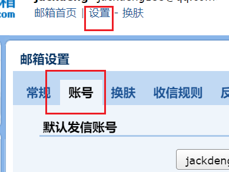
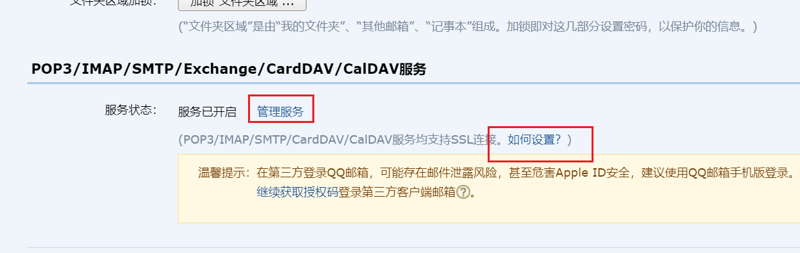
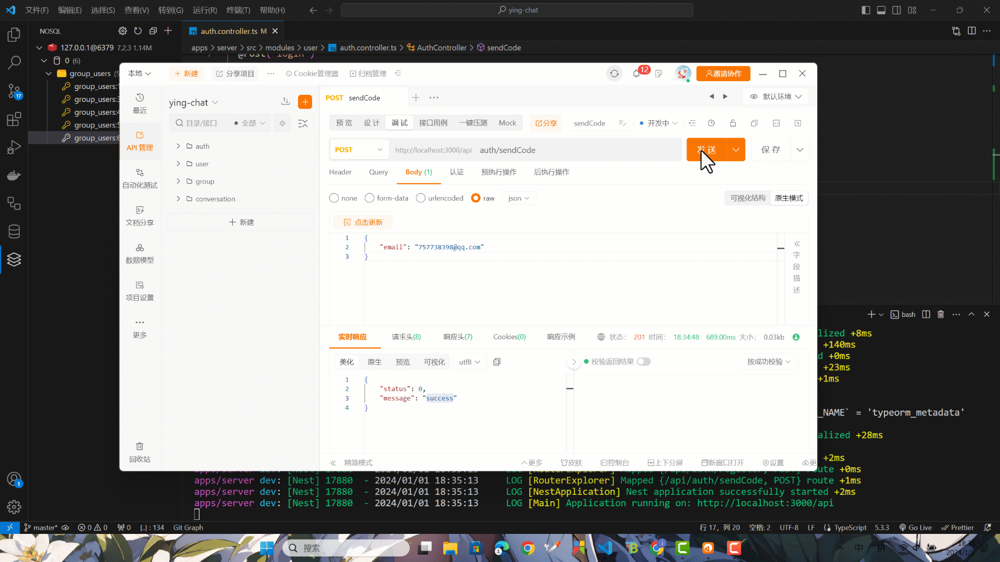

本节来实现注册接口。

本项目使用邮箱去注册账号，整个注册流程是先发送验证码到用户的邮箱，此时服务端把用户邮箱和对应的验证码存到 redis，然后在注册时先通过 redis 验证对应传过来的邮箱和验证码是否匹配，如果匹配则插入一个新用户到数据库。

那么在实现注册接口之前，先把 MySQL 和 Redis 引入一下。

## 引入 MySQL

我的开发环境下是使用 docker 启动 MySQL，如果有其他环境忽略下面。

```shell
docker run --name mysql-test \
  -p 3306:3306 \
  -v D:/docker-backup/mysql-data:/var/lib/mysql \
  -e MYSQL_ROOT_PASSWORD=ying123456 \
  -e TZ=Asia/Shanghai \
  -d mysql
```

创建一个数据库 ying_chat。

```shell
CREATE DATABASE IF NOT EXISTS ying_chat CHARACTER SET utf8mb4 COLLATE utf8mb4_general_ci;
```

在 `server` 下载需要的相关依赖。

```shell title="apps/server"
pnpm i @nestjs/typeorm typeorm mysql2
```

### MySQL 配置

把 MySQL 的相关配置写入配置文件。

```json title="apps/server/.env"
// ...
# mysql
DB_HOST=localhost
DB_PORT=3306
DB_USER=root
DB_PASSWORD=ying123456
DB_NAME=ying_chat
```

再添加一个 `db.config.ts` 文件。

```shell title="apps/server/src/config/db.config.ts"
import { registerAs } from '@nestjs/config'

export const dbConfig = registerAs('dbConfig', () => {
  if (!process.env.DB_HOST) {
    throw new Error('DB_HOST is not exist')
  }
  if (!process.env.DB_PORT) {
    throw new Error('DB_PORT is not exist')
  }
  if (!process.env.DB_USER) {
    throw new Error('DB_USER is not exist')
  }
  if (!process.env.DB_PASSWORD) {
    throw new Error('DB_PASSWORD is not exist')
  }
  if (!process.env.DB_NAME) {
    throw new Error('DB_NAME is not exist')
  }
  return {
    host: process.env.DB_HOST,
    port: +process.env.DB_PORT,
    username: process.env.DB_USER,
    password: process.env.DB_PASSWORD,
    database: process.env.DB_NAME
  }
})
```

在 `config` 里导出。

```ts title="apps/server/src/config/index.ts"
export * from './api.config'
export * from './db.config'
```

### DbModule 模块

创建一个 `DbModule` 模块。

```ts title="apps/server/src/modules/db/db.module.ts"
import { Global, Module } from '@nestjs/common'
import { TypeOrmModule } from '@nestjs/typeorm'
import { ConfigType } from '@nestjs/config'
import { dbConfig } from '@/config'

@Global()
@Module({
  imports: [
    TypeOrmModule.forRootAsync({
      useFactory: (dbConf: ConfigType<typeof dbConfig>) => {
        return {
          charset: 'utf8mb4',
          type: 'mysql',
          host: dbConf.host,
          port: dbConf.port,
          username: dbConf.username,
          password: dbConf.password,
          database: dbConf.database,
          synchronize: true,
          autoLoadEntities: true,
          logging: true
        }
      },
      inject: [dbConfig.KEY]
    })
  ]
})
export class DbModule {}
```

然后在`AppModule`里引入`DbModule`和`dbConfig`。

```ts title="apps/server/src/app.module.ts"
// ...
import { apiConfig, dbConfig } from '@/config'
import { DbModule } from '@/modules/db/db.module'

@Module({
  imports: [
    ConfigModule.forRoot({
      isGlobal: true,
      load: [apiConfig, dbConfig]
    }),
    DbModule
    // ...
  ]
})
export class AppModule {}
```

## 引入 Redis

我的开发环境下是使用 docker 启动 Redis，如果有其他环境忽略下面。

```shell
docker run --name redis-test \
  -p 6379:6379 \
  -v D:/DockerData/ContainerBackup/redis-data:/data \
  -d redis
```

在 `server` 下载需要的相关依赖。

```shell title="apps/server"
pnpm i redis
```

### Redis 配置

把 Redis 的相关配置写入配置文件。

```json title="apps/server/.env"
// ...
# redis
REDIS_HOST=localhost
REDIS_PORT=6379
```

新建 `redis.config.ts` 文件。

```ts title="apps/server/src/config/redis.config.ts"
import { registerAs } from '@nestjs/config'

export const redisConfig = registerAs('redisConfig', () => {
  if (!process.env.REDIS_HOST) {
    throw new Error('REDIS_HOST is not exist')
  }
  if (!process.env.REDIS_PORT) {
    throw new Error('REDIS_PORT is not exist')
  }
  return {
    host: process.env.REDIS_HOST,
    port: +process.env.REDIS_PORT
  }
})
```

导出 `redis.config.ts`。

```ts title="apps/server/src/config/index.ts"
// ...
export * from './redis.config'
```

### RedisModule 模块

在 `modules` 新建一个 `redis` 文件夹，然后写入一个 `constant.ts` 文件

```ts title="apps/server/src/modules/redis/constant.ts"
export const RedisToken = 'REDIS_CLIENT'
```

新建一个 `RedisModule` ，这个模块暴露一个提供者，它的值为 `createClient` 创建的 redis client 对象，以后在别的模块里就可以使用上面定义的 `RedisToken` 去直接注入这个 redis client 对象，并用这个对象对 redis 进行各种操作了。

```ts title="apps/server/src/modules/redis/redis.module.ts"
import { Global, Module } from '@nestjs/common'
import { ConfigType } from '@nestjs/config'
import { createClient } from 'redis'
import { redisConfig } from '@/config/redis.config'
import { RedisToken } from './constant'

@Global()
@Module({
  providers: [
    {
      provide: RedisToken,
      async useFactory(redisConf: ConfigType<typeof redisConfig>) {
        const client = createClient({
          socket: {
            host: redisConf.host,
            port: redisConf.port
          }
        })
        await client.connect()
        return client
      },
      inject: [redisConfig.KEY]
    }
  ],
  exports: [RedisToken]
})
export class RedisModule {}
```

最后在 `AppModule` 中引入 `RedisModule`和`redisConfig`。

```ts title="apps/server/src/app.module.ts"
// ...
import { apiConfig, dbConfig, redisConfig } from '@/config'
import { RedisModule } from '@/modules/redis/redis.module'
// ...

@Module({
  imports: [
    ConfigModule.forRoot({
      isGlobal: true,
      load: [apiConfig, dbConfig, redisConfig]
    }),
    // ...
    RedisModule
    // ...
  ]
})
export class AppModule {}
```

## 引入 nodemailer

在我们的流程当中，需要发送验证码到邮箱，那还需要一个邮箱发送者，在这里我们使用 `nodemailer` 这个库和 qq 邮箱进行发送。

### nodemailer 配置

进入 qq 邮箱后，按照以下提示去开启自己邮箱的服务，拿到对应的授权码。





把邮箱的配置填入配置文件。

```json title="apps/server/.env"
# email
EMAIl_HOST=smtp.qq.com
EMAIL_PORT=465
EMAIL_USER=jackdeng155@qq.com
EMAIL_AUTH_CODE=somjvruefdgbided
```

新建一个 `email.config.ts` 文件。

```ts title="apps/server/src/config/email.config.ts"
import { registerAs } from '@nestjs/config'

export const emailConfig = registerAs('emailConfig', () => {
  if (!process.env.EMAIl_HOST) {
    throw new Error('EMAIl_HOST is not exist')
  }
  if (!process.env.EMAIL_PORT) {
    throw new Error('EMAIL_PORT is not exist')
  }
  if (!process.env.EMAIL_USER) {
    throw new Error('EMAIL_USER is not exist')
  }
  if (!process.env.EMAIL_AUTH_CODE) {
    throw new Error('EMAIL_AUTH_CODE is not exist')
  }
  return {
    host: process.env.EMAIl_HOST,
    port: +process.env.EMAIL_PORT,
    user: process.env.EMAIL_USER,
    code: process.env.EMAIL_AUTH_CODE
  }
})
```

导出 `email.config.ts`。

```ts title="apps/server/src/config/index.ts"
// ...
export * from './email.config'
```

### EmailModule 模块

```shell
pnpm i nodemailer
pnpm i @types/nodemailer -D
```

新建一个 `EmailService` 。

```ts title="apps/server/src/modules/email/email.service.ts"
import { Inject, Injectable } from '@nestjs/common'
import { ConfigType } from '@nestjs/config'
import { createTransport, Transporter } from 'nodemailer'
import { emailConfig } from '@/config'

@Injectable()
export class EmailService {
  transporter: Transporter

  constructor(
    @Inject(emailConfig.KEY)
    private readonly emConfig: ConfigType<typeof emailConfig>
  ) {
    this.transporter = createTransport({
      host: this.emConfig.host,
      port: this.emConfig.port,
      auth: {
        user: this.emConfig.user,
        pass: this.emConfig.code
      }
    })
  }

  async sendMail(email: string, subject: string, html: string) {
    await this.transporter.sendMail({
      from: this.emConfig.user,
      to: email,
      subject,
      html
    })
  }
}
```

新建一个 `EmailModule` ，然后在里面导出 `EmailService`。

```ts title="apps/server/src/modules/email/email.module.ts"
import { Global, Module } from '@nestjs/common'
import { EmailService } from './email.service'

@Global()
@Module({
  providers: [EmailService],
  exports: [EmailService]
})
export class EmailModule {}
```

最后在 `AppModule` 中引入 `EmailModule`和`emailConfig`。

```ts title="apps/server/src/app.module.ts"
// ...
import { apiConfig, dbConfig, redisConfig, emailConfig } from '@/config'
import { EmailModule } from '@/modules/email/email.module'
// ...

@Module({
  imports: [
    ConfigModule.forRoot({
      isGlobal: true,
      load: [apiConfig, dbConfig, redisConfig, emailConfig]
    }),
    // ...
    EmailModule
    // ...
  ]
})
export class AppModule {}
```

## 发送验证码接口

实现发送验证码的接口，先在根目录安装 `nanoid`， 因为后面前端项目也会用到，安装版本 3， `nanoid` 新版不再支持 commonjs， nestjs 使用会报错。

```shell title="/"
pnpm i nanoid@3 -w
```

先在 `redis` 模块的 `constant` 里加上一个 `RegisterCode` 常量作为注册验证码的前缀。

```ts title="apps/server/src/modules/redis/constant.ts"
// ...

export const RedisKey = {
  RegisterCode: 'register-code:'
}
```

新建一个 `AuthService`，在里面先实现一个 `sendCode` 方法，整体逻辑为，先判断对应邮箱的验证码是否发过，如果发过，判断距离上次验证码是否超过一分钟，没有则提示超过一分钟后再重试，校验通过则发送一个 6 位的纯数字验证码，存到 redis 里时设置过期时间为 3 分钟。

```ts title="apps/server/src/modules/user/auth.service.ts"
import { Injectable, Inject, HttpException, HttpStatus } from '@nestjs/common'
import { RedisClientType } from 'redis'
import { customAlphabet } from 'nanoid'
import { RedisKey, RedisToken } from '@/modules/redis/constant'
import { EmailService } from '@/modules/email/email.service'

@Injectable()
export class AuthService {
  @Inject(RedisToken)
  private readonly redisClient: RedisClientType

  @Inject()
  private readonly emailService: EmailService

  async sendCode(email: string) {
    const expireTime = await this.redisClient.expireTime(
      RedisKey.RegisterCode + email
    )
    if (expireTime > 0) {
      const dv = expireTime - Math.floor(Date.now() / 1000)
      if (dv > 2 * 60) {
        throw new HttpException(
          'please try again in 1 minutes',
          HttpStatus.NOT_ACCEPTABLE
        )
      }
    }

    const nanoid = customAlphabet('1234567890', 6)
    const code = nanoid()
    await this.emailService.sendMail(
      email,
      'Verification code',
      `
        <p>Your verification code is:</p>
        <div style="width: 100px;height: 35px;">${code}</div>
        <p style="color:#999;">effective within 3 minutes</p>
      `
    )
    await this.redisClient.set(RedisKey.RegisterCode + email, code, {
      EX: 3 * 60
    })
  }
}
```

在 `UserModule` 里把 `AuthService` 注册为提供者。

```ts
// ...
import { AuthService } from './auth.service'

@Module({
  // ...
  providers: [AuthService]
})
export class UserModule {}
```

然后在 `AuthController` 里添加一个 `sendCode` 接口。

```ts title="apps/server/src/modules/user/auth.controller.ts"
// ...
import { AuthService } from './auth.service'

@Controller('auth')
export class AuthController {
  constructor(private readonly authService: AuthService) {}

  // ...

  @Post('sendCode')
  sendCode(@Body('email') email: string) {
    return this.authService.sendCode(email)
  }
}
```

最后测试一下看看效果。



## 注册接口

实现注册接口前，先把用户表加上，先往数据库模块添加一个 `entities` 文件夹，再添加一个 `BaseEntity`。

```ts title="apps/server/src/modules/db/entities/base.entity.ts"
import {
  CreateDateColumn,
  Entity,
  PrimaryGeneratedColumn,
  UpdateDateColumn
} from 'typeorm'

@Entity()
export class BaseEntity {
  @PrimaryGeneratedColumn()
  id: number

  @CreateDateColumn()
  createAt: Date

  @UpdateDateColumn()
  updateAt: Date
}
```

然后添加一个 `UserEntity` 继承 `BaseEntity`。

```ts title="apps/server/src/modules/db/entities/user.entity.ts"
import { Column, Entity } from 'typeorm'
import { BaseEntity } from './base.entity'

@Entity({ name: 'user' })
export class UserEntity extends BaseEntity {
  @Column({
    length: 32,
    unique: true
  })
  username: string

  @Column({
    length: 50,
    unique: true
  })
  email: string

  @Column()
  password: string

  @Column({
    length: 32,
    nullable: true
  })
  nickname: string
}
```

再添加一个 `index.ts` 文件导出。

```ts title="apps/server/src/modules/db/entities/index.ts"
export * from './base.entity'
export * from './user.entity'
```

因为 `DbModule` 的 `TypeOrmModule.forRootAsync` 配置了 `autoLoadEntities: true`，所以不需要自行导入了。

接下来我们添加一个 dto 对象作为注册接口所需要的数据。

```ts title="apps/server/src/modules/user/auth.dto.ts"
export class RegisterDto {
  username: string
  email: string
  password: string
  code: string
}
```

因为添加用户需要加密密码，所以先添加一个加密函数，顺便把比较函数也加上。

```ts title="apps/server/src/lib/utils.ts"
import { createHash } from 'crypto'

export function generatePass(pass: string) {
  const sha1 = createHash('sha1')
  const ciphertext = sha1.update(pass).digest('hex')
  return ciphertext
}

export function comparePass(pass: string, encryptPass: string) {
  const sha1 = createHash('sha1')
  const ciphertext = sha1.update(pass).digest('hex')
  return ciphertext === encryptPass
}
```

在 `UserModule` 里用 `TypeOrmModule.forFeature` 导入 `UserEntity` ，这样后面的 `AuthService` 就可以使用对应的 `Repository` 了。

```ts title="apps/server/src/modules/user/user.module.ts"
// ...
import { TypeOrmModule } from '@nestjs/typeorm'
import { UserEntity } from '@/modules/db/entities'

@Module({
  imports: [TypeOrmModule.forFeature([UserEntity])]
  // ...
})
export class UserModule {}
```

在 `AuthService` 里实现细节，先从 redis 判断邮箱验证码是否正确，再从数据库判断用户名是否已经被注册，如果都通过，最后给用户添加一个随机昵称，再用 `generatePass` 加密一下密码，就可以把其余信息存入数据库了。

```ts title="apps/server/src/modules/user/auth.service.ts"
// ...
import { InjectRepository } from '@nestjs/typeorm'
import { Repository } from 'typeorm'
import { UserEntity } from '@/modules/db/entities'
import { RegisterDto } from './auth.dto'

@Injectable()
export class AuthService {
  // ...
  @InjectRepository(UserEntity)
  private readonly userRepository: Repository<UserEntity>
  // ...

  async register(registerDto: RegisterDto) {
    const registerCode = await this.redisClient.get(
      RedisKey.RegisterCode + registerDto.email
    )
    if (!registerCode || registerCode !== registerDto.code) {
      throw new HttpException(
        'email verification code is incorrect',
        HttpStatus.NOT_ACCEPTABLE
      )
    }

    const user = await this.userRepository.findOne({
      where: { username: registerDto.username }
    })
    if (user) {
      throw new HttpException(
        'username already exists',
        HttpStatus.NOT_ACCEPTABLE
      )
    }

    const newUser = this.userRepository.create({
      username: registerDto.username,
      email: registerDto.email,
      nickname: 'ying#' + nanoid(8),
      password: generatePass(registerDto.password)
    })

    await this.userRepository.save(newUser)
    await this.redisClient.del(RedisKey.RegisterCode + registerDto.email)
  }

  // ...
}
```

最后给 `AuthController` 添加上注册接口。

```ts title="apps/server/src/modules/user/auth.controller.ts"
import { Body, Controller, Post } from '@nestjs/common'
import { AuthService } from './auth.service'
import { RegisterDto } from './auth.dto'

@Controller('auth')
export class AuthController {
  constructor(private readonly authService: AuthService) {}

  // ...

  @Post('register')
  register(@Body() registerDto: RegisterDto) {
    return this.authService.register(registerDto)
  }
}
```

现在可以自行测试一下整体流程。

还有一个细节需要加上，就是发送验证码码时，先判断一下邮箱是否被注册了。

```ts title="apps/server/src/modules/user/auth.service.ts"
// ...

@Injectable()
export class AuthService {
  // ...

  async sendCode(email: string) {
    // ...

    const user = await this.userRepository.findOne({ where: { email } })
    if (user) {
      throw new HttpException(
        'user email already exists',
        HttpStatus.NOT_ACCEPTABLE
      )
    }

    const nanoid = customAlphabet('1234567890', 6)
    const code = nanoid()
    // ...
  }
}
```

那么本节的注册接口实现就到这里结束了。
