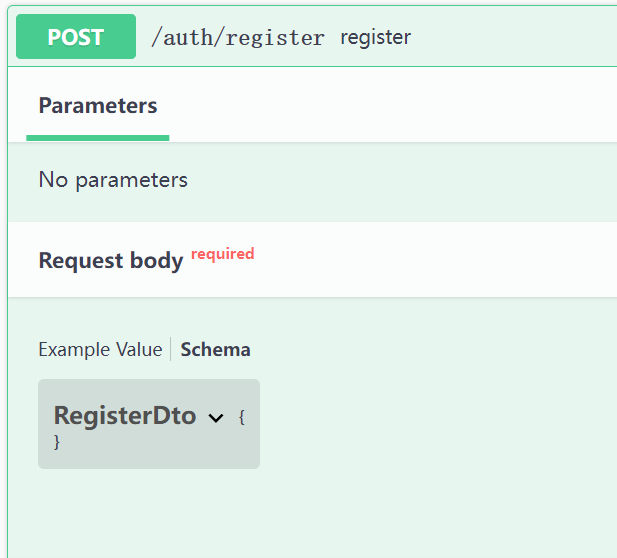
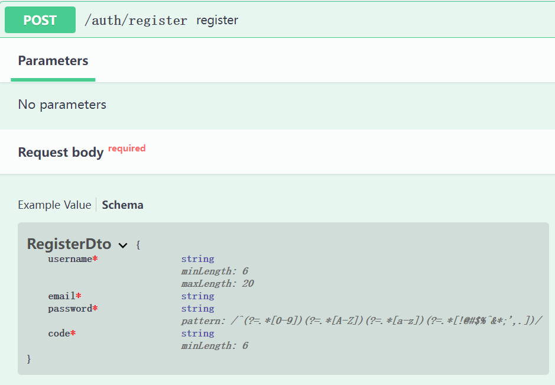
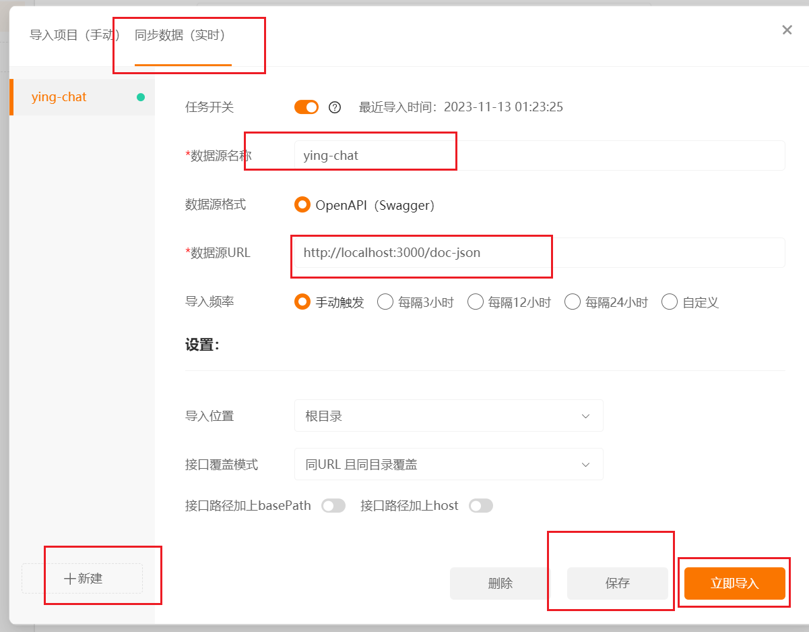

本节来实现后端服务端对前端传输数据的校验，因为我们是一个前后端同一个仓库的 monorepo 项目，这样我们可以把 DTO 抽离到一个共享包中去，那么前后端就直接共用一套检验逻辑。

### 服务端 DTO 校验

在项目的根目录去添加 `class-validator` 和 `class-transformer` 库。

```shell title="/"
pnpm i class-validator class-transformer -w
```

然后修改一下 `auth.dto.ts` 里的 `RegisterDto`

```ts title="apps/server/src/modules/user/auth.dto.ts"
import {
  IsEmail,
  IsNotEmpty,
  Length,
  Matches,
  MaxLength,
  MinLength
} from 'class-validator'

export class RegisterDto {
  @MinLength(6)
  @MaxLength(20)
  @IsNotEmpty()
  username: string

  @IsEmail()
  @IsNotEmpty()
  email: string

  @Matches(/^(?=.*[0-9])(?=.*[A-Z])(?=.*[a-z])(?=.*[!@#$%^&*;',.])/, {
    message: `password must contain digits, lowercase letters, uppercase letters, and special symbols[!@#$%^&*;',.]`
  })
  @IsNotEmpty()
  password: string

  @Length(6)
  @IsNotEmpty()
  code: string
}
```

在入口文件里用一下官方的全局过滤器。

```ts title="apps/server/src/main.ts"
// ...
import { Logger, ValidationPipe } from '@nestjs/common'
// ...

async function bootstrap() {
  // ...

  app.useGlobalPipes(
    new ValidationPipe({
      whitelist: true, // 如果设置为true, validator将剥离被验证对象中没有任何装饰器的任何属性。
      forbidNonWhitelisted: true, // 如果设置为true，验证器将抛出错误，而不是剥离非白名单属性， whitelist 为 true 才生效
      forbidUnknownValues: true // 设置为true将导致未知对象验证失败。值必须被class-validator的装饰器装饰
    })
  )

  await app.listen(apiConf.port)

  // ...
}
bootstrap()
```

测试一下前面的注册接口，把值改为不符合条件的。


### openapi 文档

接下里先把 `openapi` 文档引入一下。

[openapi](https://docs.nestjs.com/openapi/introduction)

先安装一下依赖。

```shell title="apps/server"
pnpm i @nestjs/swagger
```

```ts title="apps/server/src/main.ts"
// ...
import { DocumentBuilder, SwaggerModule } from '@nestjs/swagger'

async function bootstrap() {
  // ...

  const config = new DocumentBuilder()
    .setTitle('ying chat app')
    .setDescription('a real-time chat app')
    .setVersion('1.0')
    .build()
  const document = SwaggerModule.createDocument(app, config, {
    ignoreGlobalPrefix: true
  })
  SwaggerModule.setup('doc', app, document)

  await app.listen(apiConf.port)

  // ...
}
bootstrap()
```

给 `AuthController` 加上一些文档描述。

```ts title="apps/server/src/modules/user/auth.controller.ts"
// ...
import { ApiTags, ApiOperation } from '@nestjs/swagger'

@ApiTags('auth')
@Controller('auth')
export class AuthController {
  // ...

  @ApiOperation({
    summary: 'register'
  })
  @Post('register')
  register(@Body() registerDto: RegisterDto) {
    return this.authService.register(registerDto)
  }

  @ApiOperation({
    summary: 'sendCode',
    description: 'send email verification code for register'
  })
  @Post('sendCode')
  sendCode(@Body('email') email: string) {
    return this.authService.sendCode(email)
  }
}
```

打开文档链接 [http://localhost:3000/doc](http://localhost:3000/doc)

此时会发现之前写的注册接口，显示了一个 `RegisterDto`，但并没有参数类型的描述。



加上下面的内容，`pnpm dev` 重启整个项目，即可自动获取 DTO 的参数描述。

```json title="apps/server/nest-cli.json"
{
  "$schema": "https://json.schemastore.org/nest-cli",
  "collection": "@nestjs/schematics",
  "sourceRoot": "src",
  "generateOptions": {
    "spec": false
  },
  "compilerOptions": {
    "deleteOutDir": true,
    "plugins": ["@nestjs/swagger"] // 加上这句
  }
}
```



### 自动生成文档

一般的 Api 请求工具都实现了对 openapi 文档数据的转换，这里我用个人使用 Apipost7 作为示例




其实就是直接导入 `http://localhost:3000/doc-json` 即可自动把接口都解析到文档上。

## 与前端共享 DTO

### shared 包准备

在项目根目录新建一个 `packages` 文件夹，再在里面加上一个 `shared` 文件夹。

往 `pnpm-workspace.yaml` 加上一个 `packages`，这样 `packages` 下面所有的包都会纳入 pnpm 的项目管理了。

```yaml
packages:
  - 'apps/*'
  - 'packages/*'
```

这样 `packages` 文件夹我们用来放上可以被其他项目使用的库，通过 pnpm 的管理可以自由安装到其他应用项目。

先在 `shared` 的 `package.json` 文件定义一些基本信息。

```json title="packages/shared/package.json"
{
  "name": "@ying-chat/shared",
  "private": true,
  "version": "0.0.0",
  "description": "local shared package",
  "author": "Jack Ying",
  "license": "MIT"
}
```

再添加一个 `tsconfig.json` 文件，让本项目支持 ts 的装饰器。

```json title="packages/shared/tsconfig.json"
{
  "compilerOptions": {
    "module": "CommonJS",
    "target": "ESNext",
    "moduleResolution": "Node",
    "emitDecoratorMetadata": true,
    "experimentalDecorators": true,
    "declaration": true,
    "sourceMap": true,
    "rootDir": "./src",
    "outDir": "./dist/cjs"
  }
}
```

新建一个 `src` 文件夹和 `dto` 文件，然后把 server 的 `auth.dto.ts` 移动到这里来。

```ts title="packages/shared/src/dto/auth.dto.ts"
import {
  IsEmail,
  IsNotEmpty,
  Length,
  Matches,
  MaxLength,
  MinLength
} from 'class-validator'

export class RegisterDto {
  @MinLength(6)
  @MaxLength(20)
  @IsNotEmpty()
  username: string

  @IsEmail()
  @IsNotEmpty()
  email: string

  @Matches(/^(?=.*[0-9])(?=.*[A-Z])(?=.*[a-z])(?=.*[!@#$%^&*;',.])/, {
    message: `password must contain digits, lowercase letters, uppercase letters, and special symbols[!@#$%^&*;',.]`
  })
  @IsNotEmpty()
  password: string

  @Length(6)
  @IsNotEmpty()
  code: string
}
```

在 `dto` 文件夹新建一个 `index.ts` 导出。

```ts title="packages/shared/src/dto/index.ts"
export * from './auth.dto'
```

在 `src` 文件夹新建一个 `index.ts` 导出。

```ts title="packages/shared/src/index.ts"
export * from './dto'
```

再在 `package.json` 加上这两句。

```json title="packages/shared/package.json"
{
  // ...
  "main": "./dist/cjs/index.js",
  "scripts": {
    "build": "rm -rf dist && tsc -b tsconfig.json"
  }
}
```

在项目根目录的 `package.json` 里加上 `packages` 下所有项目的打包命令。

```json title="package.json"
{
  "name": "ying-chat",
  "version": "1.0.0",
  "description": "",
  "main": "index.js",
  "scripts": {
    // ...
    "dev": "pnpm --reporter append-only -F ./apps/* dev",
    "build:pkg": "pnpm --reporter append-only -F ./packages/* build" // 加上
  }
  // ...
}
```

最后在根目录执行一下

```shell title="/"
pnpm build:pkg
```

执行完后可以看到 `shared` 下面多了一个 `dist` 文件夹，到时从服务端和客户端引入的包文件实际是打包后的文件。

### 服务端引入

在服务端目录下执行

```shell title="apps/server"
pnpm i @ying-chat/shared
```

安装完成后可以看到服务端的 `package.json` 里多了一个这样的依赖项： `"@ying-chat/shared": "workspace:^",`，这表明此依赖项来自本地的工作区目录，pnpm 会自动帮我们找到处理。

把 `AuthController` 和 `AuthService` 原来的引入的依赖改掉。

```ts title="apps/server/src/modules/user/auth.controller.ts"
// ...
import { RegisterDto } from '@ying-chat/shared'

// ...
```

```ts title="apps/server/src/modules/user/auth.service.ts"
// ...
import { RegisterDto } from '@ying-chat/shared'

// ...
```

原来的 `auth.dto.ts` 就可以删掉了，下面再自行去调试一下看看有没有问题。

### 客户端引入

在客户端目录下执行

```shell title="apps/client"
pnpm i @ying-chat/shared
```

安装完成后可以看到服务端的 `package.json` 里多了一个这样的依赖项： `"@ying-chat/shared": "workspace:^",`，就说明成功了。

在注册页面随便引入一下 `RegisterDto`。

```tsx title="apps/client/src/pages/account/register.tsx"
// ...
import { RegisterDto } from '@ying-chat/shared'

console.log(RegisterDto)
// ...
```

这时候会发现前端控制台报了个错误 `Uncaught SyntaxError: The requested module '/@fs/D:/MySourceCode/Projects/MyProject/ying-chat/packages/shared/dist/cjs/index.js?t=1704186767025' does not provide an export named 'RegisterDto'`，这是因为 shared 包文件只导出了 `cjs` 规范的代码，我们需要再带出一份 `esm` 规范的代码才能在前端项目中使用这个库。

回到`shared` 包，加入以下 `tsconfig.esm.json` 文件

```json title="packages/shared/tsconfig.esm.json"
{
  "compilerOptions": {
    "module": "ESNext",
    "target": "ES2021",
    "moduleResolution": "Bundler",
    "emitDecoratorMetadata": true,
    "experimentalDecorators": true,
    "declaration": true,
    "sourceMap": true,
    "rootDir": "./src",
    "outDir": "./dist/esm"
  }
}
```

修改 `package.json` 文件

```json title="packages/shared/package.json"
{
  // ...
  "main": "./dist/cjs/index.js",
  "module": "./dist/esm/index.js",
  "scripts": {
    "build": "rm -rf dist && tsc -b tsconfig.json && tsc -b tsconfig.esm.json"
  }
}
```

重新打包一下

```shell title="/"
pnpm build:pkg
```

这时候客户端项目就不会再报错了，如果 ts 在报红，重启一下 vscode 即可，本节到此结束。
