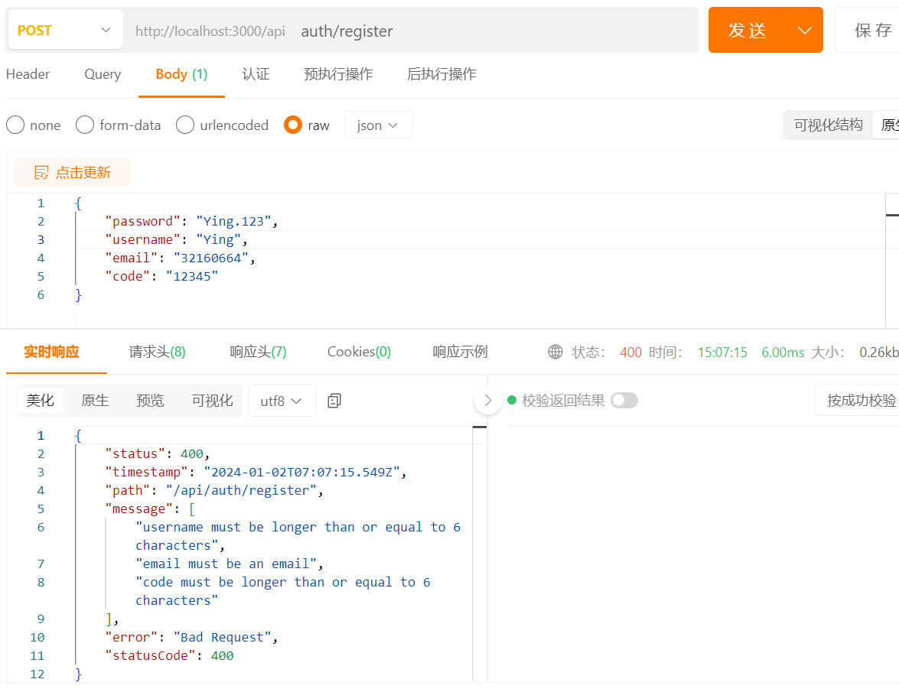
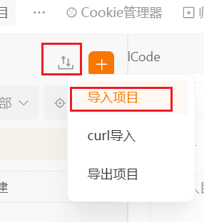

验证 email 的真实性通过 nodemailer 发验证码，因此需要一个发送验证码的接口。

### 引入 redis

```shell
pnpm i redis
```

docker 启动 redis

```json title="apps/server/.env"
// ...
# redis
REDIS_HOST=localhost
REDIS_PORT=6379
```

```ts title="apps/server/src/config/redis.config.ts"
import { registerAs } from '@nestjs/config'

export const redisConfig = registerAs('redisConfig', () => {
  if (!process.env.REDIS_HOST) {
    throw new Error('REDIS_HOST is not exist')
  }
  if (!process.env.REDIS_PORT) {
    throw new Error('REDIS_PORT is not exist')
  }
  return {
    host: process.env.REDIS_HOST,
    port: +process.env.REDIS_PORT
  }
})
```

```ts title="apps/server/src/config/index.ts"
// ...
export * from './redis.config'
```

```ts title="apps/server/src/app.module.ts"
import { Module } from '@nestjs/common'
import { ConfigModule } from '@nestjs/config'
import { apiConfig, dbConfig, redisConfig } from '@/config'
import { DbModule } from '@/modules/db/db.module'
import { UserModule } from '@/modules/user/user.module'
import { RedisModule } from '@/modules/redis/redis.module'

@Module({
  imports: [
    ConfigModule.forRoot({
      isGlobal: true,
      load: [apiConfig, dbConfig, redisConfig]
    })
    // ...
  ]
})
export class AppModule {}
```

创建 redis 模块

```ts title="apps/server/src/modules/redis/contants.ts"
export const RedisToken = 'REDIS_CLIENT'
```

```ts title="apps/server/src/modules/redis/redis.module.ts"
import { Global, Module } from '@nestjs/common'
import { ConfigType } from '@nestjs/config'
import { createClient } from 'redis'
import { redisConfig } from '@/config/redis.config'
import { RedisToken } from './contants'

@Global()
@Module({
  providers: [
    {
      provide: RedisToken,
      async useFactory(redisConf: ConfigType<typeof redisConfig>) {
        const client = createClient({
          socket: {
            host: redisConf.host,
            port: redisConf.port
          }
        })
        await client.connect()
        return client
      },
      inject: [redisConfig.KEY]
    }
  ],
  exports: [RedisToken]
})
export class RedisModule {}
```

最后在 `apps/server/src/app.module.ts` 中引入 redis 模块

接下来修改 AuthController 和 AuthService

```ts title="apps/server/src/modules/user/auth.controller.ts"
import { Controller, Post } from '@nestjs/common'
import { AuthService } from './auth.service'

@Controller('auth')
export class AuthController {
  constructor(private readonly authService: AuthService) {}

  @Post('login')
  login() {
    return this.authService.login()
  }

  @Post('register')
  register() {
    return this.authService.register()
  }

  @Post('sendCode')
  sendCode() {
    return this.authService.sendCode()
  }
}
```

```ts title="apps/server/src/modules/user/auth.service.ts"
import { Injectable, Inject } from '@nestjs/common'
import { Repository } from 'typeorm'
import { InjectRepository } from '@nestjs/typeorm'
import { RedisClientType } from 'redis'
import { User } from './entities/user.entity'
import { RedisToken } from '@/modules/redis/contants'

@Injectable()
export class AuthService {
  @InjectRepository(User)
  private readonly userRepository: Repository<User>

  @Inject(RedisToken)
  private redisClient: RedisClientType

  login() {}

  register() {}

  sendCode() {}
}
```

### 配置 qq 邮箱





```json title="apps/server/.env"
# email
EMAIl_HOST=smtp.qq.com
EMAIL_PORT=465
EMAIL_USER=jackdeng155@qq.com
EMAIL_AUTH_CODE=somjvruefdgbided
```

```ts title="apps/server/src/config/email.config.ts"
import { registerAs } from '@nestjs/config'

export const emailConfig = registerAs('emailConfig', () => {
  if (!process.env.EMAIl_HOST) {
    throw new Error('EMAIl_HOST is not exist')
  }
  if (!process.env.EMAIL_PORT) {
    throw new Error('EMAIL_PORT is not exist')
  }
  if (!process.env.EMAIL_USER) {
    throw new Error('EMAIL_USER is not exist')
  }
  if (!process.env.EMAIL_AUTH_CODE) {
    throw new Error('EMAIL_AUTH_CODE is not exist')
  }
  return {
    host: process.env.EMAIl_HOST,
    port: +process.env.EMAIL_PORT,
    user: process.env.EMAIL_USER,
    code: process.env.EMAIL_AUTH_CODE
  }
})
```

然后同样在 `app.module.ts` 导入，在 `config/index.ts` 导出

```shell
pnpm i nodemailer
pnpm i @types/nodemailer -D
```

```ts title="apps/server/src/modules/email/email.module.ts"
import { Global, Module } from '@nestjs/common'
import { EmailService } from './email.service'

@Global()
@Module({
  providers: [EmailService],
  exports: [EmailService]
})
export class EmailModule {}
```

```ts title="apps/server/src/modules/email/email.service.ts"
import { emailConfig } from '@/config'
import { Inject, Injectable } from '@nestjs/common'
import { ConfigType } from '@nestjs/config'
import { createTransport, Transporter } from 'nodemailer'

@Injectable()
export class EmailService {
  transporter: Transporter

  constructor(
    @Inject(emailConfig.KEY)
    private readonly emConfig: ConfigType<typeof emailConfig>
  ) {
    this.transporter = createTransport({
      host: this.emConfig.host,
      port: this.emConfig.port,
      auth: {
        user: this.emConfig.user,
        pass: this.emConfig.code
      }
    })
  }

  async sendMail(email: string, subject: string, html: string) {
    await this.transporter.sendMail({
      from: this.emConfig.user,
      to: email,
      subject,
      html
    })
  }
}
```

然后在 `app.module.ts` 引入 EmailModule 即可

### 发送验证码接口

根目录安装 `nanoid` 因为后面前端项目也会用到，安装版本 3， 因为新版不再支持 commonjs， nestjs 使用会报错。

```shell
pnpm i nanoid@3 -w
```

发送验证码的接口，检查 email 是否已经注册，通过 redis 存对应邮箱的验证码。

```ts title="apps/server/src/modules/user/auth.service.ts"
// ...

@Injectable()
export class AuthService {
  @InjectRepository(User)
  private readonly userRepository: Repository<User>

  @Inject(RedisToken)
  private redisClient: RedisClientType

  @Inject(EmailService)
  private emailService: EmailService

  // ...

  async sendCode(email: string) {
    const expireTime = await this.redisClient.expireTime(
      RedisKey.RegisterCode + email
    )
    if (expireTime > 0) {
      const dv = expireTime - Math.floor(Date.now() / 1000)
      if (dv > 2 * 60) {
        throw new HttpException(
          'please try again in 1 minutes',
          HttpStatus.NOT_ACCEPTABLE
        )
      }
    }

    const user = await this.userRepository.findOne({ where: { email } })
    if (user) {
      return new HttpException(
        'user email already exists',
        HttpStatus.BAD_REQUEST
      )
    }
    const nanoid = customAlphabet('1234567890', 6)
    const code = nanoid()
    await this.emailService.sendMail(
      email,
      '验证码',
      `
        <p>您的验证码为：</p>
        <div style="width: 100px;height: 35px;">${code}</div>
        <p style="color:#999;">5分钟内有效</p>
      `
    )
    await this.redisClient.set(RedisKey.RegisterCode + email, code, {
      EX: 5 * 60
    })
  }
}
```

### 注册接口

- username
- email
- password（加密存入）
- code

- email 是否唯一
- email 的真实性（通过 code 验证）
- username 是否唯一
- code redis 里对应邮箱是否有 code

```ts title="apps/server/src/modules/user/dto/auth.dto.ts"
export class SendCodeDto {
  email: string
}

export class RegisterDto {
  username: string
  email: string
  password: string
  code: string
}
```

```ts title="apps/server/src/modules/user/auth.controller.ts"
import { Body, Controller, Post } from '@nestjs/common'
import { AuthService } from './auth.service'
import { RegisterDto, SendCodeDto } from './dto/auth.dto'

@Controller('auth')
export class AuthController {
  constructor(private readonly authService: AuthService) {}

  @Post('login')
  login() {
    return this.authService.login()
  }

  @Post('register')
  register(@Body() registerDto: RegisterDto) {
    return this.authService.register(registerDto)
  }

  @Post('sendCode')
  sendCode(@Body() sendCodeDto: SendCodeDto) {
    return this.authService.sendCode(sendCodeDto.email)
  }
}
```

```ts title="apps/server/src/modules/user/auth.service.ts"
// ...

@Injectable()
export class AuthService {
  // ...

  async register(registerDto: RegisterDto) {
    const registerCode = await this.redisClient.get(
      RedisKey.RegisterCode + registerDto.email
    )
    if (!registerCode || registerCode !== registerDto.code) {
      throw new HttpException(
        'email verification code is incorrect',
        HttpStatus.NOT_ACCEPTABLE
      )
    }

    const user = await this.userRepository.findOne({
      where: { username: registerDto.username }
    })
    if (user) {
      throw new HttpException(
        'username already exists',
        HttpStatus.NOT_ACCEPTABLE
      )
    }

    const newUser = this.userRepository.create({
      username: registerDto.username,
      email: registerDto.email,
      nickname: 'ying#' + nanoid(8),
      password: generatePass(registerDto.password)
    })

    await this.userRepository.save(newUser)
    await this.redisClient.del(RedisKey.RegisterCode + registerDto.email)
  }

  // ...
}
```
