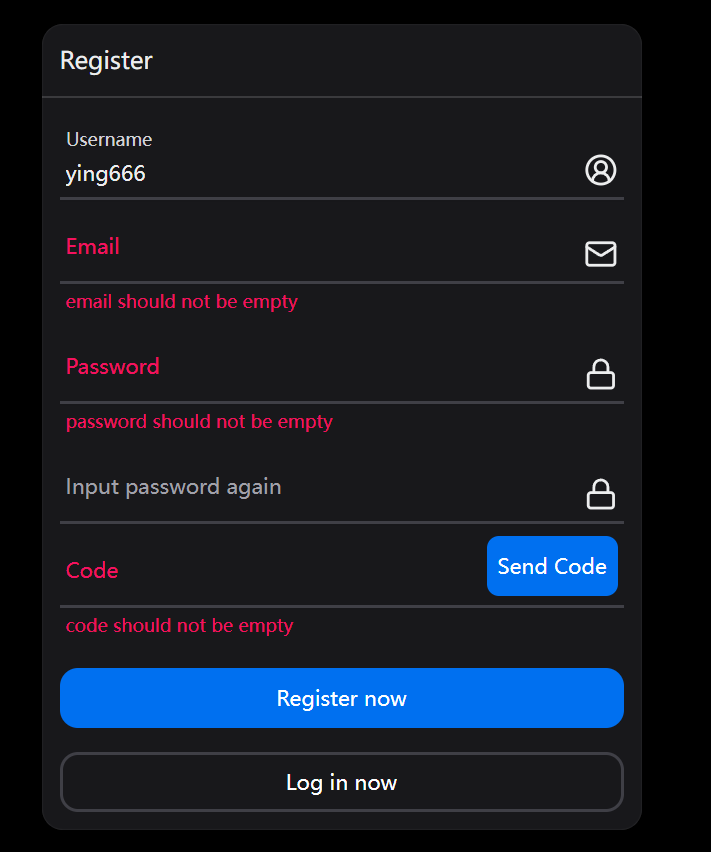

本节将在客户端对接注册接口。

## 表单检验逻辑

我们将通过 `react-hook-form` 来实现表单校验，同时从 `@hookform/resolvers` 里使用 `class-validator` 这个 `resolver` 去使用 `@ying-chat/shared` 导出的 DTO 类，这样前端也可以和后端一样去检验同一个类了。

先在 `client` 下载以下依赖。

```shell title="apps/client"
pnpm i react-hook-form @hookform/resolvers
```

修改注册页面，加入表单校验逻辑。

```tsx title="apps/client/src/pages/account/register.tsx"
// ...
import { RegisterDto } from '@ying-chat/shared'
import { useForm } from 'react-hook-form'
import { classValidatorResolver } from '@hookform/resolvers/class-validator'

const resolver = classValidatorResolver(RegisterDto)

export const Register = () => {
  const navigate = useNavigate()

  const {
    register,
    handleSubmit,
    formState: { errors }
  } = useForm<RegisterDto>({
    resolver
  })

  const registerAccount = async () => {
    console.log('registerAccount')
  }

  return (
    //...
    <form onSubmit={handleSubmit(registerAccount)}>
      <Input
        endContent={<CircleUserRound />}
        label="Username"
        autoComplete="new-username"
        variant="underlined"
        isInvalid={Boolean(errors.username)}
        errorMessage={errors.username?.message}
        {...register('username')}
      />
      <Input
        endContent={<Mail />}
        label="Email"
        variant="underlined"
        isInvalid={Boolean(errors.email)}
        errorMessage={errors.email?.message}
        {...register('email')}
      />
      <Input
        endContent={<Lock />}
        type="password"
        label="Password"
        autoComplete="new-password"
        variant="underlined"
        isInvalid={Boolean(errors.password)}
        errorMessage={errors.password?.message}
        {...register('password')}
      />
      <Input
        endContent={<Lock />}
        type="password"
        label="Input password again"
        autoComplete="off"
        variant="underlined"
      />

      <Input
        label="Code"
        variant="underlined"
        maxLength={6}
        isInvalid={Boolean(errors.code)}
        errorMessage={errors.code?.message}
        {...register('code')}
        endContent={
          <Button color="primary" radius="sm">
            Send Code
          </Button>
        }
      />

      <div className="flex flex-col gap-4 mt-4">
        <Button color="primary" type="submit">
          Register now
        </Button>
        <Button
          variant="ghost"
          onClick={() => {
            navigate('/login')
          }}
        >
          Log in now
        </Button>
      </div>
    </form>
    //...
  )
}
```

效果如下



可以看到还差一个再次输入密码的检验，直接检验只需检查是否和前面输入的密码一致即可，但是这个检验服务端并没有去写，而前端需要，同时 `class-validator` 也并没有提供对应的注解去直接判断一个字段的值是否和另一个相等，所以我们先来加一个这样的注解。

在 `shared` 包新建一个 `validation` 文件夹，然后添加一个 `equal-to.validation.ts`。

```ts title="packages/shared/src/validation/equal-to.validation.ts"
import {
  registerDecorator,
  ValidationOptions,
  ValidationArguments
} from 'class-validator'

export function IsEqualTo(
  property: string,
  validationOptions?: ValidationOptions
) {
  return function (object: object, propertyName: string) {
    registerDecorator({
      name: 'isEqualTo',
      target: object.constructor,
      propertyName: propertyName,
      constraints: [property],
      options: validationOptions,
      validator: {
        validate(value: any, args: ValidationArguments) {
          const [relatedPropertyName] = args.constraints
          const relatedValue = (args.object as any)[relatedPropertyName]
          return value === relatedValue
        }
      }
    })
  }
}
```

在 `validation` 文件夹新建一个 `index.ts` 导出。

```ts title="packages/shared/src/validation/index.ts"
export * from './equal-to.validation'
```

在 `src` 的 `index.ts` 导出。

```ts title="packages/shared/src/index.ts"
// ...
export * from './validation'
```

在 `auth.dto.ts` 里再加 一个 `RegisterDtoWithSubPass` 继承自 `RegisterDto`，然后里面再实现一个 `subPassword` 并使用刚刚编写的`IsEqualTo` 注解。

```ts title="packages/shared/src/dto/auth.dto.ts"
// ...
import { IsEqualTo } from '../validation'

// ...

export class RegisterDtoWithSubPass extends RegisterDto {
  @IsNotEmpty({ message: 'Please input your Password again!' })
  @IsEqualTo('password', {
    message: 'Entered passwords differ from the another!'
  })
  subPassword: string
}
```

再次重新打包一下 `shared`。

```shell title="/"
pnpm build:pkg
```

修改注册页面的 `RegisterDto` 为 `RegisterDtoWithSubPass` 即可。

```tsx title="apps/client/src/pages/account/register.tsx"
// ...
import { RegisterDtoWithSubPass } from '@ying-chat/shared'
// ...

const resolver = classValidatorResolver(RegisterDtoWithSubPass)

export const Register = () => {
  // ...
  const {
    register,
    handleSubmit,
    formState: { errors }
  } = useForm<RegisterDtoWithSubPass>({
    resolver
  })

  // ...

  return (
    //...
    <Input
      endContent={<Lock />}
      type="password"
      label="Input password again"
      autoComplete="off"
      variant="underlined"
      isInvalid={Boolean(errors.subPassword)}
      errorMessage={errors.subPassword?.message}
      {...register('subPassword')}
    />
    //...
  )
}
```

如果发现运行有报错把项目重启一下，最后再次测试一下。


## 接口初始化

先下载 `axios`。

```shell title="apps/client"
pnpm i axios
```

客户端新建一个 `api` 目录，编写一个 `request.ts` 文件。

```ts title="apps/client/src/api/request.ts"
import axios, { AxiosError } from 'axios'

export const request = axios.create({
  baseURL: '/api'
})

export type ErrorRes = {
  status: number
  message: string | string[]
  timestamp?: string
  path?: string
  [key: string]: unknown
}

request.interceptors.request.use((config) => {
  return config
})

request.interceptors.response.use(
  (response) => {
    if (response.data.data) {
      return response.data.data
    }
    return response.data
  },
  (error: AxiosError<ErrorRes>) => {
    return Promise.reject(error)
  }
)
```

然后添加一个 `auth.ts` 文件，写好注册和发送验证码接口。

```ts title="apps/client/src/api/auth.ts"
import { RegisterDto } from '@ying-chat/shared'
import { request } from './request'

export function register(body: RegisterDto) {
  return request.post('/auth/register', body)
}

export async function sendCode(email: string) {
  return request.post('/auth/sendCode', { email })
}
```

新建一个 `index.ts` 去导出。

```ts title="apps/client/src/api/index.ts"
import * as authApi from './auth'

export { authApi }
```

在 `vite.config.ts` 添加接口代理。

```ts title="apps/client/vite.config.ts"
// ...
export default defineConfig({
  // ...
  server: {
    proxy: {
      '/api': {
        target: 'http://localhost:3000'
      }
    }
  }
})
```

## 对接注册接口

到此的话接口已经准备完毕了，接下来需要开始对接注册接口。

修改注册页面。

```tsx title="apps/client/src/pages/account/register.tsx"
// ...
import { useState } from 'react'
import { authApi } from '@/api'

// ...

export const Register = () => {
  const navigate = useNavigate()

  const {
    register,
    handleSubmit,
    getValues, // +
    formState: { errors }
  } = useForm<RegisterDtoWithSubPass>({
    resolver
  })

  const [sendCodeLoading, setSendCodeLoading] = useState(false)
  const [registerLoading, setRegisterLoading] = useState(false)

  const sendCode = async () => {
    const email = getValues('email')

    if (!email) {
      return
    }
    try {
      setSendCodeLoading(true)
      await authApi.sendCode(email)
    } catch {
    } finally {
      setSendCodeLoading(false)
    }
  }

  const registerAccount = async (values: RegisterDtoWithSubPass) => {
    try {
      setRegisterLoading(true)
      await authApi.register(Object.assign(values, { subPassword: undefined }))
      navigate('/login')
    } catch {
    } finally {
      setRegisterLoading(false)
    }
  }

  return (
    // ...
    <Input
      label="Code"
      variant="underlined"
      maxLength={6}
      isInvalid={Boolean(errors.code)}
      errorMessage={errors.code?.message}
      {...register('code')}
      endContent={
        <Button
          color="primary"
          radius="sm"
          isLoading={sendCodeLoading}
          onClick={sendCode}
        >
          Send Code
        </Button>
      }
    />

    <div className="flex flex-col gap-4 mt-4">
      <Button color="primary" type="submit" isLoading={registerLoading}>
        Register now
      </Button>
      <Button
        variant="ghost"
        onClick={() => {
          navigate('/login')
        }}
      >
        Log in now
      </Button>
    </div>
    // ...
  )
}
```

这个时候将会看到编辑器报了 eslint 的错误。


现在是不允许有空的块语句的，那我们改一下 eslint 配置，允许空的块出现。

```js title="apps/client/.eslintrc.cjs"
module.exports = {
  // ...
  rules: {
    'no-empty': 'off', // +
    'react-refresh/only-export-components': [
      'warn',
      { allowConstantExport: true }
    ]
  }
}
```

这样就不会报错了，

## 加入全局 toast 提示

```shell title="apps/client"
pnpm i sonner
```

[sonner 文档](https://sonner.emilkowal.ski/)

```tsx title="apps/client/src/App.tsx"
// ...
import { Toaster } from 'sonner'

function App() {
  return (
    <ThemeProvider defaultTheme="dark">
      <Toaster richColors position="top-center" />
      <RouterProvider router={router}></RouterProvider>
    </ThemeProvider>
  )
}

export default App
```

给注册页面用户的操作添加反馈。

```tsx title="apps/client/src/pages/account/register.tsx"
// ...
import { toast } from 'sonner'

export const Register = () => {
  // ...

  const sendCode = async () => {
    const email = getValues('email')

    if (!email) {
      return toast.warning('Please input your email first!') // +
    }
    try {
      setSendCodeLoading(true)
      await authApi.sendCode(email)
      toast.success('send code success!') // +
    } catch {
    } finally {
      setSendCodeLoading(false)
    }
  }

  const registerAccount = async (values: RegisterDtoWithSubPass) => {
    try {
      setRegisterLoading(true)
      await authApi.register(Object.assign(values, { subPassword: undefined }))
      toast.success('register success!') // +
      navigate('/login')
    } catch {
    } finally {
      setRegisterLoading(false)
    }
  }

  return (
    // ...
  )
}
```

在接口拦截里统一添加错误提示。

```ts title="apps/client/src/api/request.ts"
// ...
import { toast } from 'sonner'

// ...

request.interceptors.response.use(
  (response) => {
    if (response.data.data) {
      return response.data.data
    }
    return response.data
  },
  (error: AxiosError<ErrorRes>) => {
    const res = error.response
    if (res) {
      const msg = res.data.message
      if (Array.isArray(msg)) {
        toast.error(msg[0])
      } else {
        toast.error(msg)
      }
      return Promise.reject(res.data)
    }
    return Promise.reject(error)
  }
)
```

那么最后就可以自行调试一下整个注册流程是否正常了。


本节到此结束。
