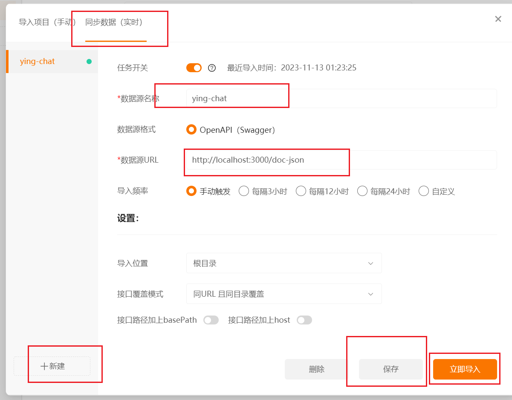

### validation

server 根目录

```shell
pnpm i class-validator class-transformer
```

```ts title="apps/server/src/modules/user/dto/auth.dto.ts"
import {
  IsEmail,
  IsNotEmpty,
  Length,
  Matches,
  MaxLength,
  MinLength
} from 'class-validator'
import { ApiProperty } from '@nestjs/swagger'

export class SendCodeDto {
  @IsEmail()
  @IsNotEmpty()
  email: string
}

export class RegisterDto {
  @MinLength(6)
  @MaxLength(20)
  @IsNotEmpty()
  username: string

  @IsEmail()
  @IsNotEmpty()
  email: string

  @ApiProperty({
    description: `password must contain digits, lowercase letters, uppercase letters, and special symbols[!@#$%^&*;',.]`
  })
  @Matches(/^(?=.*[0-9])(?=.*[A-Z])(?=.*[a-z])(?=.*[!@#$%^&*;',.])/, {
    message: `password must contain digits, lowercase letters, uppercase letters, and special symbols[!@#$%^&*;',.]`
  })
  @IsNotEmpty()
  password: string

  @Length(6)
  @IsNotEmpty()
  code: string
}
```

```ts
async function bootstrap() {
  // ...

  app.useGlobalPipes(
    new ValidationPipe({
      whitelist: true, // 如果设置为true, validator将剥离被验证对象中没有任何装饰器的任何属性。
      forbidNonWhitelisted: true, // 如果设置为true，验证器将抛出错误，而不是剥离非白名单属性 whitelist 为 true 才生效
      forbidUnknownValues: true // 设置为true将导致未知对象验证失败。值必须被class-validator的装饰器装饰
    })
  )

  await app.listen(apiConf.port)

  // ...
}
bootstrap()
```

### api 文档

[openapi](https://docs.nestjs.com/openapi/introduction)

```shell
pnpm i @nestjs/swagger
```

```ts
async function bootstrap() {
  // ...

  const config = new DocumentBuilder()
    .setTitle('ying chat app')
    .setDescription('a real-time chat app')
    .setVersion('1.0')
    .build()
  const document = SwaggerModule.createDocument(app, config, {
    ignoreGlobalPrefix: true
  })
  SwaggerModule.setup('doc', app, document)

  await app.listen(apiConf.port)

  // ...
}
bootstrap()
```

`http://localhost:3000/api-doc` 打开

此时会发现没有参数类型

加上下面的内容，`pnpm dev` 重启整个项目，即可自动获取所有。

```json title="apps/server/nest-cli.json"
{
  "$schema": "https://json.schemastore.org/nest-cli",
  "collection": "@nestjs/schematics",
  "sourceRoot": "src",
  "generateOptions": {
    "spec": false
  },
  "compilerOptions": {
    "deleteOutDir": true,
    "plugins": ["@nestjs/swagger"] // 加上这句
  }
}
```

```ts title="apps/server/src/modules/user/auth.controller.ts"
// ...

@ApiTags('auth')
@Controller('auth')
// ...
```

<!-- ### 自定义密码校验

```ts title="apps/server/src/common/constraints/password.constraint.ts"
import {
  registerDecorator,
  ValidationArguments,
  ValidationOptions,
  ValidatorConstraint,
  ValidatorConstraintInterface
} from 'class-validator'

const TypeKey = {
  Kind: 'kind',
  Normal: 'normal',
  Strict: 'strict'
} as const

type PasswordConstraintType = (typeof TypeKey)[keyof typeof TypeKey]

@ValidatorConstraint({ name: 'isPassword' })
export class IsPasswordConstraint implements ValidatorConstraintInterface {
  validate(value: string, args: ValidationArguments) {
    const validateType: PasswordConstraintType =
      args.constraints[0] ?? TypeKey.Strict

    switch (validateType) {
      case TypeKey.Kind:
        return /\d/.test(value) && /[a-zA-Z]/.test(value)
      case TypeKey.Normal:
        return /\d/.test(value) && /[a-z]/.test(value) && /[A-Z]/.test(value)
      case TypeKey.Strict:
        return (
          /\d/.test(value) &&
          /[a-z]/.test(value) &&
          /[A-Z]/.test(value) &&
          /[!@#$%^&*;',.]/.test(value)
        )
    }
  }

  defaultMessage(args: ValidationArguments) {
    const validateType: PasswordConstraintType =
      args.constraints[0] ?? TypeKey.Strict

    switch (validateType) {
      case TypeKey.Kind:
        return '$property must contain numbers, either uppercase or lowercase letters'
      case TypeKey.Normal:
        return '$property must contain numbers, lowercase letters, and uppercase letters'
      case TypeKey.Strict:
        return '$property must contain digits, lowercase letters, uppercase letters, and special symbols'
    }
  }
}

export function IsPassword(
  type?: PasswordConstraintType,
  validationOptions?: ValidationOptions
) {
  return (object: Record<string, any>, propertyName: string) => {
    registerDecorator({
      target: object.constructor,
      propertyName,
      options: validationOptions,
      constraints: [type],
      validator: IsPasswordConstraint
    })
  }
}
``` -->

```ts title="apps/server/src/modules/user/dto/auth.dto.ts"
// ...
export class RegisterDto {
  // ...
  @ApiProperty({
    description: `password must contain digits, lowercase letters, uppercase letters, and special symbols[!@#$%^&*;',.]`
  })
  // ...
  password: string
}
```

### 自动生成文档

Apipost 导入 `http://localhost:3000/doc-json` 即可



