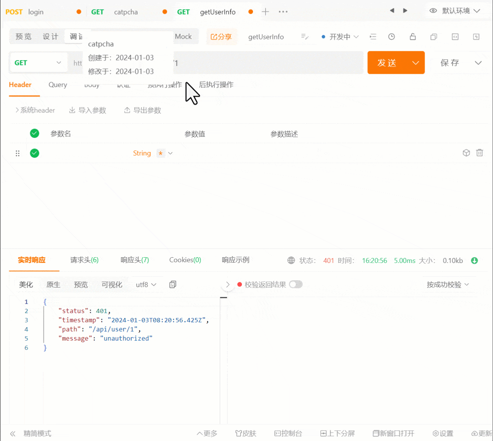

本节我们将来实现登录与鉴权的接口逻辑。

## 登录接口实现

### 流程图


### 验证码获取接口

根据流程图我们先要实现一个获取验证码接口。

在服务端添加 `svg-captcha` 依赖，接下来将用这个库来生成验证码的 SVG 图。

```shell title="apps/server"
pnpm i svg-captcha
```

先在 `redis` 模块加上登录码的常量

```ts title="apps/server/src/modules/redis/constant.ts"
// ...

export const RedisKey = {
  RegisterCode: 'register-code:',
  LoginCode: 'login-code:'
}
```

在 `AuthService` 实现一个 `getCaptcha` 函数，此函数接受一个 `uid` 作为 key 存进 redis，这个 uid 将是客户端传过来的唯一码，最后返回一个 svg 的字符串。

```ts title="apps/server/src/modules/user/auth.service.ts"
// ...
import { create } from 'svg-captcha'

@Injectable()
export class AuthService {
  // ...

  async getCaptcha(uid: string) {
    const newCaptcha = create({ width: 100, height: 35, noise: 4 })
    await this.redisClient.set(RedisKey.LoginCode + uid, newCaptcha.text, {
      EX: 3 * 60
    })
    return newCaptcha.data
  }
}
```

在 `AuthController` 里加上验证码接口，调用 `getCaptcha`， 用 `Response` 把 svg 字符直接以文件流的方式返回给前端。

```ts title="apps/server/src/modules/user/auth.controller.ts"
// ...
import { Body, Controller, Get, Post, Query, Res } from '@nestjs/common'
import { Response } from 'express'

@ApiTags('auth')
@Controller('auth')
export class AuthController {
  // ...

  @ApiOperation({
    summary: 'catpcha'
  })
  @Get('/catpcha')
  async getCaptcha(@Query('uid') uid: string, @Res() res: Response) {
    res.send(await this.authService.getCaptcha(uid))
  }
}
```

### 登录逻辑实现

在 `shared` 包里添加一个 `LoginDto`。

```ts title="package/shared/src/dto/auth.dto.ts"
// ...

export class LoginDto {
  @IsNotEmpty()
  loginName: string

  @Matches(/^(?=.*[0-9])(?=.*[A-Z])(?=.*[a-z])(?=.*[!@#$%^&*;',.])/, {
    message: `password must contain digits, lowercase letters, uppercase letters, and special symbols[!@#$%^&*;',.]`
  })
  @IsNotEmpty()
  password: string

  @Length(4)
  @IsNotEmpty()
  code: string

  @IsNotEmpty()
  uid: string
}
```

在 `AuthService` 里面添加 `login` 函数，完成登录的检验逻辑，剩下的 token 生成后面再写。

```ts title="apps/server/src/modules/user/auth.service.ts"
// ...
import { LoginDto, RegisterDto } from '@ying-chat/shared'
import { comparePass, generatePass } from '@/lib/utils'

@Injectable()
export class AuthService {
  // ...

  compareCode(codeA: string, codeB: string) {
    return codeA.toLowerCase() === codeB.toLowerCase()
  }

  async login(loginDto: LoginDto) {
    const code = await this.redisClient.get(RedisKey.LoginCode + loginDto.uid)
    if (!code || !this.compareCode(code, loginDto.code)) {
      throw new HttpException(
        { message: 'captcha error' },
        HttpStatus.NOT_ACCEPTABLE
      )
    }
    const user = await this.userRepository.findOne({
      where: [
        {
          username: loginDto.loginName
        },
        {
          email: loginDto.loginName
        }
      ]
    })
    if (!user) {
      throw new HttpException(
        { message: 'account does not exist' },
        HttpStatus.NOT_ACCEPTABLE
      )
    }
    if (!comparePass(loginDto.password, user.password)) {
      throw new HttpException(
        { message: 'wrong password' },
        HttpStatus.NOT_ACCEPTABLE
      )
    }
  }
}
```

在 `AuthController` 里加上登录接口，直接调用 `login`。

```ts title="apps/server/src/modules/user/auth.controller.ts"
// ...
import { LoginDto, RegisterDto } from '@ying-chat/shared'

@ApiTags('auth')
@Controller('auth')
export class AuthController {
  // ...

  @ApiOperation({
    summary: 'login'
  })
  @Post('login')
  login(@Body() loginDto: LoginDto) {
    return this.authService.login(loginDto)
  }
}
```

但是 `LoginDto` 还是得打包一下才能引用，每次添加都要打包太麻烦了，往`shared` 包的`package.json`加上一个 dev 命令，这个命令以监听包内文件变化的形式打包编译 ts 文件，启动这个命令，就不用每次都重新打包了。

```json title="packages/shared/package.json"
{
  // ...
  "scripts": {
    "dev": "tsc -b -w tsconfig.json --preserveWatchOutput | tsc -b -w tsconfig.esm.json --preserveWatchOutput"
    // ...
  }
}
```

```json title="packages/shared/tsconfig.esm.json"
{
  // ...
  "exclude": ["dist"]
}
```

```json title="packages/shared/tsconfig.json"
{
  // ...
  "exclude": ["dist"]
}
```

在这两个 ts 配置文件加上一个 `"exclude": ["dist"]` 忽略掉 dist 的变化。

## jwt 实现鉴权

### 登录返回 token

登录完成后，还需要返回一个 token 给前端去请求其他受保护的接口，到时不需要 token 检验的接口就只有登录和注册相关的这几个。

先安装 `@nestjs/jwt` 这个依赖。

```shell title="apps/server"
pnpm i @nestjs/jwt
```

在 `UserModule` 里引入 `JwtModule`。

```ts title="apps/server/src/modules/user/user.module.ts"
// ...
import { JwtModule } from '@nestjs/jwt'

@Module({
  imports: [TypeOrmModule.forFeature([User]), JwtModule.register({})]
  // ...
})
export class UserModule {}
```

在配置文件的 api 里再加上一个 jwt 的密钥配置。

```json title="apps/server/.env"
# api
// ...
SERVER_JWT_SECRET=4h4gdsf2ds1f2
//...
```

```ts title="apps/server/src/config/api.config.ts"
import { registerAs } from '@nestjs/config'

export const apiConfig = registerAs('apiConfig', () => {
  return {
    port: process.env.SERVER_PORT || 3000,
    jwtSecret: process.env.SERVER_JWT_SECRET || '' // +
  }
})
```

在 `AuthService` 里完善 `login` 函数，校验全部通过后，用`jwtService`签发一个 token，然后存进 redis 里设置 24 小时后过期，删除 LoginCode，最后返回用户信息和 token，然后再添加一个 `verify` 函数去验证传递的 token 是否正确，这个函数后面添加路由守卫时再使用。

```ts title="apps/server/src/modules/user/auth.service.ts"
// ...
import { JwtService } from '@nestjs/jwt'
import { ConfigType } from '@nestjs/config'
import { apiConfig } from '@/config'

@Injectable()
export class AuthService {
  // ...

  @Inject()
  private readonly jwtService: JwtService

  @Inject(apiConfig.KEY)
  private readonly apiConfig: ConfigType<typeof apiConfig>

  // ...

  async login(loginDto: LoginDto) {
    // ...

    const token = this.jwtService.sign(
      {
        id: user.id
      },
      {
        secret: this.apiConfig.jwtSecret
      }
    )

    await this.redisClient.set(token, user.id, {
      EX: 24 * 60 * 60
    })

    await this.redisClient.del(RedisKey.LoginCode + loginDto.uid)

    return {
      user,
      token
    }
  }

  verify(token: string) {
    return this.jwtService.verify(token, { secret: this.apiConfig.jwtSecret })
  }
}
```

调试一下。


可以发现最后返回的用户信息里面把加密后的密码都返回出来了，接下来我们先把这个解决一下。

### 禁止用户实体返回密码

修改一下 `UserEntity`，在密码上面添加一个 `class-transformer` 的 `Exclude` 装饰器，最后添加一个 `toJSON` 函数即可。

```ts title="apps/server/src/modules/db/entities/user.entity.ts"
// ...
import { Exclude, instanceToPlain } from 'class-transformer'

@Entity({ name: 'user' })
export class UserEntity extends BaseEntity {
  @Column({
    length: 32,
    unique: true
  })
  username: string

  @Column({
    length: 50,
    unique: true
  })
  email: string

  @Column()
  @Exclude() // ++
  password: string

  @Column({
    length: 32,
    nullable: true
  })
  nickname: string

  // ++
  toJSON() {
    return instanceToPlain(this)
  }
}
```

再登录一下看看，发现密码已经没了。


### 授权守卫添加

在 `common` 目录， 新建 `decorator` 文件夹，再添加一个 `no-auth.decorator.ts` 文件，我们在里面添一个 `NotRequiredAuth` 装饰器。

```ts title="apps/server/src/common/decorator/no-auth.decorator.ts"
import { SetMetadata } from '@nestjs/common'

export const NOT_REQUIRED_AUTH = 'notRequiredAuth'

export const NotRequiredAuth = () => SetMetadata(NOT_REQUIRED_AUTH, true)
```

新建一个`index.ts`导出。

```ts title="apps\server\src\common\decorator\index.ts"
export * from './no-auth.decorator'
```

把 `NotRequiredAuth` 装饰器添加到 `AuthController` 对应的函数上，这样表明这些接口都是不需要授权验证的，然后其他所有不加`NotRequiredAuth` 的都是需要验证的。

```ts title="apps/server/src/modules/user/auth.controller.ts"
// ...
import { NotRequiredAuth } from '@/common/decorator'

// ...
export class AuthController {
  // ...
  @NotRequiredAuth()
  register() {}

  // ...
  @NotRequiredAuth()
  sendCode() {}

  // ...
  @NotRequiredAuth()
  async getCaptcha() {}

  // ...
  @NotRequiredAuth()
  login() {}
}
```

在 `common` 目录， 新建 `guard` 文件夹，再添加一个 `auth.guard.ts` 文件，我们在里面实现一个 `AuthGuard` 守卫来对用户的 token 进行校验。

主要逻辑为，如果被`NotRequiredAuth`标记过，说明接口不需要检验，直接放行，如果没有，则从 redis 看看用户的 token 是否正确。

```ts title="apps/server/src/common/guard/auth.guard.ts"
import {
  CanActivate,
  ExecutionContext,
  HttpException,
  HttpStatus,
  Inject,
  Injectable
} from '@nestjs/common'
import { Reflector } from '@nestjs/core'
import { Request } from 'express'
import { RedisClientType } from 'redis'
import { AuthService } from '@/modules/user/auth.service'
import { NOT_REQUIRED_AUTH } from '@/common/decorator'
import { RedisToken } from '@/modules/redis/constant'

declare module 'express' {
  interface Request {
    userId: number
  }
}

@Injectable()
export class AuthGuard implements CanActivate {
  constructor(
    private readonly reflector: Reflector,
    private readonly authService: AuthService,
    @Inject(RedisToken)
    private readonly redisClient: RedisClientType
  ) {}

  async canActivate(context: ExecutionContext): Promise<boolean> {
    const handler = context.getHandler()
    const classContext = context.getClass()
    const isNotRequiredAuth = this.reflector.getAllAndOverride<boolean>(
      NOT_REQUIRED_AUTH,
      [handler, classContext]
    )

    if (isNotRequiredAuth) {
      return true
    }

    const request = context.switchToHttp().getRequest<Request>()

    try {
      const token = request.headers['authorization'].split('Bearer ')[1]

      const verifyData = this.authService.verify(token)
      const id = Number(await this.redisClient.get(token))

      if (id === verifyData.id) {
        request.userId = id
        return true
      }

      throw new HttpException('unauthorized', HttpStatus.UNAUTHORIZED)
    } catch (error) {
      throw new HttpException('unauthorized', HttpStatus.UNAUTHORIZED)
    }
  }
}
```

新建一个 `index.ts` 导出。

```ts title="apps/server/src/common/guard/index.ts"
export * from './auth.guard'
```

```ts title="apps/server/src/app.module.ts"
// ...
import { APP_GUARD } from '@nestjs/core'
import { AuthGuard } from '@/common/guard'

@Module({
  // ...
  providers: [
    {
      provide: APP_GUARD,
      useClass: AuthGuard
    }
  ]
})
export class AppModule {}
```

此时保存会报错，因为`AuthGuard`使用到了`UserModule`里的`AuthService`，所以还要把`AuthService`导出一下。

```ts title="apps/server/src/modules/user/user.module.ts"
// ...

@Module({
  // ...
  exports: [AuthService]
})
export class UserModule {}
```

## 用户信息接口

接下来添加一下查看用户信息的接口去调试一下授权检验是否生效。

添加一个`user.service.ts`，实现`getUserInfo`函数获取用户信息。

```ts title="apps/server/src/modules/user/user.service.ts"
import { HttpException, HttpStatus, Injectable } from '@nestjs/common'
import { InjectRepository } from '@nestjs/typeorm'
import { Repository } from 'typeorm'
import { UserEntity } from '@/modules/db/entities'

@Injectable()
export class UserService {
  @InjectRepository(UserEntity)
  private readonly userRepository: Repository<UserEntity>

  async getUserInfo(userId: number) {
    const user = await this.userRepository.findOne({
      where: { id: userId }
    })

    if (!user) {
      throw new HttpException('user is not exists', HttpStatus.NOT_FOUND)
    }

    return user
  }
}
```

添加一个 `user.controller.ts`。

```ts title="apps/server/src/modules/user/user.controller.ts"
import { Controller, Get, Param } from '@nestjs/common'
import { ApiOperation, ApiTags } from '@nestjs/swagger'
import { UserService } from './user.service'

@ApiTags('user')
@Controller('user')
export class UserController {
  constructor(private readonly userService: UserService) {}

  @ApiOperation({
    summary: 'getUserInfo'
  })
  @Get(':id')
  getUserInfo(@Param('id') id: number) {
    return this.userService.getUserInfo(id)
  }
}
```

在 `UserModule` 里添加 `UserController` 和 `UserService`。

```ts title="apps/server/src/modules/user/user.module.ts"
// ...
import { UserController } from './user.controller'
import { UserService } from './user.service'

@Module({
  // ...
  controllers: [AuthController, UserController],
  providers: [AuthService, UserService]
})
export class UserModule {}
```

调试一下。



调试完后把`getUserInfo`改成直接读取用户在经过路由守卫时添加的 userId，不要让其根据 id 直接获取用户信息。

```ts title="apps/server/src/modules/user/user.controller.ts"
import { Controller, Get, Req, Param } from '@nestjs/common'
import { ApiOperation, ApiTags } from '@nestjs/swagger'
import { Request } from 'express'
import { UserService } from './user.service'

@ApiTags('user')
@Controller('user')
export class UserController {
  constructor(private readonly userService: UserService) {}

  @ApiOperation({
    summary: 'getUserInfo'
  })
  @Get()
  getUserInfo(@Req() request: Request) {
    return this.userService.getUserInfo(request.userId)
  }
}
```

## 退出登录接口

在结束之前再顺便添加一个退出登录接口。

```ts title="apps/server/src/modules/user/auth.service.ts"
// ...

@Injectable()
export class AuthService {
  // ...

  async logout(token: string) {
    await this.redisClient.del(token)
  }
}
```

```ts title="apps/server/src/modules/user/auth.controller.ts"
import {
  // ...
  Headers
} from '@nestjs/common'

@ApiTags('auth')
@Controller('auth')
export class AuthController {
  // ...

  @ApiOperation({
    summary: 'logout'
  })
  @Get('logout')
  logout(@Headers('authorization') authorization: string) {
    return this.authService.logout(authorization.split('Bearer ')[1])
  }
}
```

那么本节到此结束。
