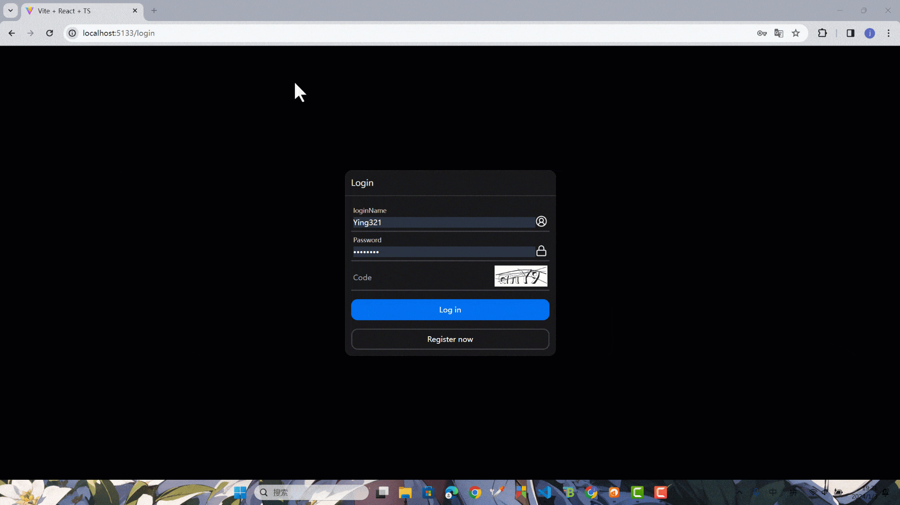

本节来实现前端对接整个登录接口，并实现前端的路由守卫，即只有登录后用户才能访问主页面，未登陆前只能访问登录和注册页面。

### 添加接口

先往`shared`里添加一个`vo`文件夹，再添加几个`vo`对象。

```ts title="packages/shared/src/vo/user.vo.ts"
export type UserVo = {
  id: number
  username: string
  email: string
  nickname: string
  createAt: string
  updateAt: string
}
```

```ts title="packages/shared/src/vo/login.vo.ts"
import { UserVo } from './user.vo'

export type LoginVo = {
  token: string
  user: UserVo
}
```

新建一个 `index.ts` 导出。

```ts title="packages/shared/src/vo/index.ts"
export * from './login.vo'
export * from './user.vo'
```

整体导出 vo 模块。

```ts title="packages/shared/src/index.ts"
// ...
export * from './vo'
```

然后添加对应的接口函数。

```ts title="apps/client/src/api/auth.ts"
import { LoginDto, LoginVo, RegisterDto } from '@ying-chat/shared'
// ...

export async function getCaptcha(uid: string): Promise<string> {
  return request.get('auth/catpcha', {
    params: { uid },
    headers: { Accept: 'text/plain' }
  })
}

export function login(body: LoginDto): Promise<LoginVo> {
  return request.post('/auth/login', body)
}

export function logout() {
  return request.get('/auth/logout')
}
```

再实现一个通用的`useApi`hook，后面所有和获取相关的接口都可以用这个 hook，就不用重复去写设置数据和 loading 状态的 state 了。

```ts title="apps/client/src/api/use-api.ts"
import { useCallback, useEffect, useState } from 'react'

type UseApiOptions<T> = {
  func: () => Promise<T>
  immediately?: boolean
}

export const useApi = <T>({ func, immediately = true }: UseApiOptions<T>) => {
  const [loading, setLoading] = useState(false)
  const [data, setData] = useState<T>()

  const run = useCallback(async () => {
    try {
      setLoading(true)
      const res = await func()
      setData(res)
    } catch (error) {
    } finally {
      setLoading(false)
    }
  }, [func])

  useEffect(() => {
    if (immediately) run()
  }, [run, immediately])

  return {
    loading,
    data,
    setData,
    run
  }
}
```

### 使用 zustand 进行状态管理

为了方便 react 里整个应用能够感知用户的登录状态，我们将使用 `zustand` 进行全局状态管理。

先安装一下依赖。

```shell title="apps/client"
pnpm i zustand
```

新建一个`stores`文件夹并往里面添加一个`use-auth-store.ts`。

```ts title="apps/client/src/stores/use-auth-store.ts"
import { create } from 'zustand'
import { nanoid } from 'nanoid'
import { authApi } from '@/api'
import { toast } from 'sonner'
import { LoginDto, UserVo } from '@ying-chat/shared'

export const SESSION_UID = 'session-uid'

export const TOKEN = 'token'

export const USER_INFO = 'user-info'

export const useAuthStore = create(() => {
  let sessionUid = sessionStorage.getItem(SESSION_UID) || ''
  if (!sessionUid) {
    sessionUid = nanoid()
    sessionStorage.setItem(SESSION_UID, sessionUid)
  }

  const token = localStorage.getItem(TOKEN) || ''

  const userInfoStr = localStorage.getItem(USER_INFO)
  let userInfo: UserVo | null = null
  if (userInfoStr) {
    userInfo = JSON.parse(userInfoStr)
  }

  return {
    sessionUid,
    token,
    userInfo
  }
})

export const setUserInfo = (userInfo: UserVo) => {
  localStorage.setItem(USER_INFO, JSON.stringify(userInfo))
  useAuthStore.setState({ userInfo })
}

export const login = async (loginDto: LoginDto) => {
  const data = await authApi.login(loginDto)
  localStorage.setItem(TOKEN, data.token)
  localStorage.setItem(USER_INFO, JSON.stringify(data.user))
  useAuthStore.setState({ token: data.token, userInfo: data.user })
}

export const logout = async () => {
  try {
    await authApi.logout()
    resetAuth()
    toast.success('logout success!')
  } catch {}
}

export const resetAuth = () => {
  localStorage.removeItem(TOKEN)
  localStorage.removeItem(USER_INFO)
  useAuthStore.setState({ token: '', userInfo: null })
}
```

新建一个`index.ts`导出。

```ts title="apps/client/src/stores/index.ts"
export * from './use-auth-store'
```

### 对接登录接口

在登录页面里按照之前注册页面的逻辑把校验写了，然后登录就直接使用`AuthStore`里的登录函数即可。

```tsx title="apps/client/src/pages/account/login.tsx"
import { useCallback } from 'react'
import { useNavigate } from 'react-router-dom'
import {
  Button,
  Card,
  CardBody,
  CardHeader,
  Divider,
  Input
} from '@nextui-org/react'
import { CircleUserRound, Lock } from 'lucide-react'
import { useForm } from 'react-hook-form'
import { classValidatorResolver } from '@hookform/resolvers/class-validator'
import { toast } from 'sonner'
import { LoginDto } from '@ying-chat/shared'
import { authApi } from '@/api'
import { useAuthStore, login } from '@/stores'
import { useApi } from '@/api/use-api'

const resolver = classValidatorResolver(LoginDto)

export const Login = () => {
  const navigate = useNavigate()

  const sessionUid = useAuthStore(state => state.sessionUid)

  const { data: svgData, run: getCaptcha } = useApi<string>({
    func: useCallback(() => authApi.getCaptcha(sessionUid), [sessionUid])
  })

  const {
    register,
    handleSubmit,
    formState: { errors }
  } = useForm<LoginDto>({
    resolver,
    defaultValues: {
      uid: sessionUid
    }
  })

  const onFinish = async (values: LoginDto) => {
    try {
      await login(values)
      navigate('/')
      toast.success('login success!')
    } catch {}
  }

  return (
    <div className="h-full flex justify-center items-center">
      <Card className="w-[25rem]">
        <CardHeader>Login</CardHeader>
        <Divider />
        <CardBody>
          <form onSubmit={handleSubmit(onFinish)}>
            <Input
              variant="underlined"
              label="loginName"
              autoComplete="loginName"
              endContent={<CircleUserRound />}
              isInvalid={Boolean(errors.loginName)}
              errorMessage={errors.loginName?.message}
              {...register('loginName')}
            />
            <Input
              label="Password"
              variant="underlined"
              endContent={<Lock />}
              type="password"
              autoComplete="password"
              isInvalid={Boolean(errors.password)}
              errorMessage={errors.password?.message}
              {...register('password')}
            />

            <Input
              label="Code"
              variant="underlined"
              maxLength={4}
              isInvalid={Boolean(errors.code)}
              errorMessage={errors.code?.message}
              endContent={
                <div
                  className="bg-white cursor-pointer w-[120px] h-[40px]"
                  dangerouslySetInnerHTML={{ __html: svgData || '' }}
                  onClick={getCaptcha}
                ></div>
              }
              {...register('code')}
            />

            <div className="flex flex-col gap-4 mt-4">
              <Button color="primary" type="submit">
                Log in
              </Button>
              <Button
                onClick={() => {
                  navigate('/register')
                }}
                variant="ghost"
              >
                Register now
              </Button>
            </div>
          </form>
        </CardBody>
      </Card>
    </div>
  )
}
```

记得在请求拦截里给`headers`加上`Authorization`字段，把存在`localStorage`的 token 给带过去，在响应拦截里添加判断状态为 401 则重置授权状态。

```ts title="apps/client/src/api/request.ts"
// ...
import { TOKEN, resetAuth } from '@/stores'

// ...

request.interceptors.request.use(config => {
  const token = localStorage.getItem(TOKEN)
  if (token) {
    config.headers.Authorization = `Bearer ${token}`
  }
  return config
})

request.interceptors.response.use(
  // ...
  (error: AxiosError<ErrorRes>) => {
    const res = error.response
    if (res) {
      if (res.status === 401) {
        resetAuth()
      }
      // ...
    }
    return Promise.reject(error)
  }
)
// ...
```

### 添加路由守卫逻辑

先添加一个`use-auth-route.tsx`文件。

```tsx title="apps/client/src/router/use-auth-route.tsx"
import { Navigate } from 'react-router-dom'
import { useAuthStore } from '@/stores'

export const useAuthRoute = (children: React.ReactElement) => {
  const token = useAuthStore(state => state.token)

  if (!token) {
    return <Navigate to="/login" />
  }

  return <>{children}</>
}
```

```tsx title="apps/client/src/components/layout/index.tsx"
import { Outlet } from 'react-router-dom'
import { useAuthRoute } from '@/router/use-auth-route'
import { NavSidebar } from './nav-sidebar'

export const AppLayout = () => {
  return useAuthRoute(
    <div className="h-full flex flex-row">
      <NavSidebar />

      <main className="h-full flex-1">
        <Outlet />
      </main>
    </div>
  )
}
```

### 添加退出登录功能

修改一下 `NavSidebar`，添加一个用户的小图标到左侧，点击后会出现用户信息小窗，然后先把退出登录的按钮事件接上。

```tsx title="apps/client/src/components/layout/index.tsx"
// ...
import {
  Dropdown,
  DropdownTrigger,
  DropdownSection,
  DropdownMenu,
  DropdownItem,
  Avatar
} from '@nextui-org/react'
import { UserRound, FileEdit, LogOut, Users, MessageSquare } from 'lucide-react'
import { useAuthStore, logout } from '@/stores'

export const NavSidebar = () => {
  // ...

  const userInfo = useAuthStore(state => state.userInfo)

  return (
    <div className="flex flex-col gap-4 items-center w-[72px] py-4 bg-content1">
      {/* ... */}

      <Dropdown placement="top-start" showArrow>
        <DropdownTrigger>
          <Avatar className="cursor-pointer h-[48px] w-[48px]" />
        </DropdownTrigger>
        <DropdownMenu
          aria-label="Profile Actions"
          disabledKeys={['profile']}
          variant="flat"
        >
          <DropdownSection showDivider>
            <DropdownItem key="profile">{userInfo?.nickname}</DropdownItem>
          </DropdownSection>

          <DropdownSection showDivider>
            <DropdownItem
              key="user-info"
              startContent={<UserRound className="w-5 h-5" />}
            >
              User Info
            </DropdownItem>
            <DropdownItem
              key="change-password"
              startContent={<FileEdit className="w-5 h-5" />}
            >
              Change Password
            </DropdownItem>
          </DropdownSection>

          <DropdownItem
            key="logout"
            color="danger"
            onClick={logout}
            startContent={<LogOut className="w-5 h-5" />}
          >
            Log Out
          </DropdownItem>
        </DropdownMenu>
      </Dropdown>
    </div>
  )
}
```

整体测试一下。



那么本节到此结束。
