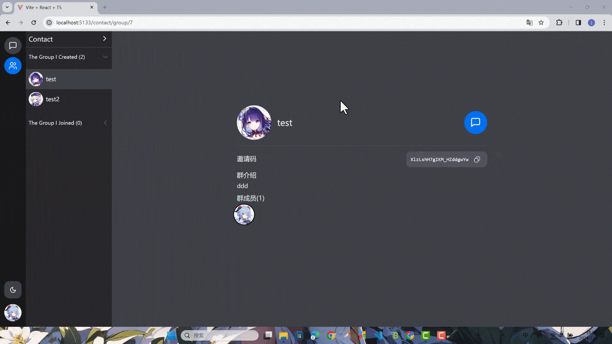

本节来对接上节的群聊 api。

## 前端接口准备

### vo 文件准备

```ts title="packages/shared/src/vo/group.vo.ts"
import { FileVo } from './file.vo'
import { UserVo } from './user.vo'

export type GroupVo = {
  id: number
  name: string
  description?: string
  inviteCode?: string
  coverId: number
  cover: FileVo
  createById: number
  createAt: string
  updateAt: string
  users?: UserVo[]
}

export type GroupListVo = {
  owner: GroupVo[]
  member: GroupVo[]
}
```

导出。

```ts title="packages/shared/src/vo/index.ts"
// ...
export * from './group.vo'
```

### 接口文件

在`api`下新建一个`group.ts`接口文件。

```ts title="apps/client/src/api/group.ts"
import { CreateGroupDto, FileVo, GroupVo, GroupListVo } from '@ying-chat/shared'
import { request } from './request'

export function createGroup(groupDto: CreateGroupDto): Promise<GroupVo> {
  return request.post('/group', groupDto)
}

export function uploadGroupCover(file: File): Promise<FileVo> {
  const form = new FormData()
  form.append('file', file)
  return request.post('/group/cover', form)
}

export function joinGroup(inviteCode: string): Promise<null> {
  return request.get(`/group/join/${inviteCode}`)
}

export function getUserGroupList(): Promise<GroupListVo> {
  return request.get('/group/list')
}

export function getGroupInfo(id: string): Promise<GroupVo> {
  return request.get(`/group/${id}`)
}
```

导出。

```ts title="apps/client/src/api/index.ts"
// ...
import * as groupApi from './group'

export {
  // ...
  groupApi
}
```

## 页面对接

### `ContactPage`修改

在`contact`下面添加一个`sidebar`组件作为展示用户群列表的展示。

```tsx title="apps/client/src/pages/contact/sidebar.tsx"
import { useCallback, useState, FC } from 'react'
import {
  Dropdown,
  DropdownTrigger,
  DropdownMenu,
  DropdownItem,
  Avatar,
  Divider,
  Accordion,
  AccordionItem,
  cn
} from '@nextui-org/react'
import { ChevronRight, PlusCircle, UserPlus } from 'lucide-react'
import { useNavigate } from 'react-router-dom'
import { GroupListVo, GroupVo } from '@ying-chat/shared'
import { groupApi } from '@/api'
import { useApi } from '@/api/use-api'

type GroupListProps = {
  list: GroupVo[]
}

const GroupList: FC<GroupListProps> = ({ list }) => {
  const navigate = useNavigate()

  return (
    <div>
      {list.map((el, index) => (
        <div
          className="flex items-center p-2 w-full cursor-pointer"
          key={index}
        >
          <Avatar className="mr-2 flex-shrink-0" src={el.cover?.url} />
          <p className="text-ellipsis overflow-hidden break-all whitespace-nowrap text-base">
            {el.name}
          </p>
        </div>
      ))}
    </div>
  )
}

export const Sidebar = () => {
  const { data: group } = useApi<GroupListVo>({
    func: useCallback(() => groupApi.getUserGroupList(), [])
  })

  const [openDropdown, setOpenDropdown] = useState(false)

  return (
    <div className="w-[240px] flex flex-col bg-content2">
      <Dropdown
        className="w-[230px]"
        placement="bottom-start"
        onOpenChange={open => {
          setOpenDropdown(open)
        }}
      >
        <DropdownTrigger>
          <div className="flex justify-between text-lg p-2 cursor-pointer">
            <p>Contact</p>
            <ChevronRight
              className={cn(
                'transition-all text-sm',
                openDropdown && 'rotate-90'
              )}
            />
          </div>
        </DropdownTrigger>
        <DropdownMenu aria-label="Group Actions" variant="flat">
          <DropdownItem
            key="user-info"
            startContent={<PlusCircle className="w-5 h-5" />}
          >
            create a group chat
          </DropdownItem>
          <DropdownItem
            key="change-password"
            startContent={<UserPlus className="w-5 h-5" />}
          >
            join a group chat
          </DropdownItem>
        </DropdownMenu>
      </Dropdown>

      <Divider />

      <Accordion
        selectionMode="multiple"
        showDivider={false}
        className="flex flex-col gap-1 w-full box-border px-0"
        itemClasses={{
          title: 'font-normal text-sm',
          trigger: 'px-2',
          indicator: 'text-xl'
        }}
      >
        <AccordionItem
          key="1"
          aria-label="The Group I Created"
          title={`The Group I Created (${group?.owner.length})`}
        >
          <GroupList list={group?.owner || []} />
        </AccordionItem>
        <AccordionItem
          key="2"
          aria-label="The Group I Joined"
          title={`The Group I Joined (${group?.member.length})`}
        >
          <GroupList list={group?.member || []} />
        </AccordionItem>
      </Accordion>
    </div>
  )
}
```

修改一下`ContactPage`。

```tsx title="apps/client/src/pages/contact/index.tsx"
import { Sidebar } from './sidebar'

export const ContactPage = () => {
  return (
    <div className="h-full flex flex-row">
      <Sidebar />

      <main className="flex-1"></main>
    </div>
  )
}
```

### 弹框添加

现在还没有创建过任何群组，我们先添加两个弹框，一个创建群组`GroupModal`，一个加入群组`JoinGroupModal`，在里面实现对接逻辑。

```tsx title="apps/client/src/components/modals/group-modal.tsx"
import {
  Button,
  Input,
  Modal,
  ModalBody,
  ModalContent,
  ModalFooter,
  ModalHeader,
  Textarea,
  cn
} from '@nextui-org/react'
import { FC, useState } from 'react'
import { toast } from 'sonner'
import { useForm } from 'react-hook-form'
import { classValidatorResolver } from '@hookform/resolvers/class-validator'
import { CreateGroupDto } from '@ying-chat/shared'
import { groupApi } from '@/api'
import { ImageUpload } from '@/components/upload/image-upload'

type UserInfoModalProps = {
  open: boolean
  close: () => void
  confirmSuccess?: () => void
}

const resolver = classValidatorResolver(CreateGroupDto)

export const GroupModal: FC<UserInfoModalProps> = ({
  open,
  close,
  confirmSuccess
}) => {
  const {
    register,
    setValue,
    reset,
    handleSubmit,
    formState: { errors }
  } = useForm<CreateGroupDto>({
    resolver
  })

  const [confirmLoading, setConfirmLoading] = useState(false)

  const onFinish = async (values: CreateGroupDto) => {
    try {
      setConfirmLoading(true)
      await groupApi.createGroup(values)
      toast.success('Group chat successfully created!')
      close()
      confirmSuccess && confirmSuccess()
      reset()
    } catch {
    } finally {
      setConfirmLoading(false)
    }
  }

  return (
    <Modal isOpen={open} onClose={close} isDismissable={false}>
      <ModalContent>
        {onClose => (
          <>
            <ModalHeader className="flex flex-col gap-1">
              Create group info
            </ModalHeader>
            <form onSubmit={handleSubmit(onFinish)}>
              <ModalBody>
                <Input
                  label="Group Name"
                  maxLength={32}
                  {...register('name')}
                  isInvalid={Boolean(errors.name)}
                  errorMessage={errors.name?.message}
                />
                <Textarea
                  label="Group Description"
                  maxRows={3}
                  maxLength={100}
                  {...register('description')}
                  isInvalid={Boolean(errors.description)}
                  errorMessage={errors.description?.message}
                />
                <p
                  className={cn(
                    'text-sm text-foreground-500',
                    Boolean(errors.coverId) && 'text-danger'
                  )}
                >
                  Group Cover
                </p>
                <div>
                  <ImageUpload
                    aria-label="cover"
                    handleUpload={(file: File) =>
                      groupApi.uploadGroupCover(file)
                    }
                    onSuccess={minioFile => {
                      setValue('coverId', minioFile.id)
                    }}
                  />
                </div>
                <p className="text-tiny text-danger">
                  {errors.coverId?.message}
                </p>
              </ModalBody>
              <ModalFooter>
                <Button
                  color="danger"
                  variant="ghost"
                  isDisabled={confirmLoading}
                  onPress={onClose}
                >
                  Close
                </Button>
                <Button
                  color="primary"
                  type="submit"
                  isLoading={confirmLoading}
                >
                  Create
                </Button>
              </ModalFooter>
            </form>
          </>
        )}
      </ModalContent>
    </Modal>
  )
}
```

```tsx title="apps/client/src/components/modals/join-group-modal.tsx"
import {
  Button,
  Input,
  Modal,
  ModalBody,
  ModalContent,
  ModalFooter,
  ModalHeader
} from '@nextui-org/react'
import { useState } from 'react'
import { toast } from 'sonner'
import { groupApi } from '@/api'

type JoinGroupModalProps = {
  open: boolean
  close: () => void
  confirmSuccess?: () => void
}

export const JoinGroupModal = ({
  open,
  close,
  confirmSuccess
}: JoinGroupModalProps) => {
  const [inviteCode, setInviteCode] = useState('')
  const [errorMessage, setErrorMessage] = useState('')
  const [confirmLoading, setConfirmLoading] = useState(false)

  const handleJoin = async () => {
    if (!inviteCode) {
      return setErrorMessage('Please input invite code!')
    }
    setErrorMessage('')
    try {
      setConfirmLoading(true)
      await groupApi.joinGroup(inviteCode)
      toast.success('Join the group chat successfully!')
      setInviteCode('')
      close()
      confirmSuccess && confirmSuccess()
    } catch {
    } finally {
      setConfirmLoading(false)
    }
  }

  return (
    <Modal isOpen={open} onClose={close} isDismissable={false}>
      <ModalContent>
        {onClose => (
          <>
            <ModalHeader className="flex flex-col gap-1">
              Join a group chat
            </ModalHeader>
            <ModalBody>
              <Input
                label="Invite Code"
                variant="underlined"
                maxLength={32}
                value={inviteCode}
                onChange={e => {
                  setInviteCode(e.target.value)
                }}
                isInvalid={Boolean(errorMessage)}
                errorMessage={errorMessage}
              />
            </ModalBody>
            <ModalFooter>
              <Button
                color="danger"
                variant="ghost"
                isDisabled={confirmLoading}
                onPress={onClose}
              >
                Close
              </Button>
              <Button
                color="primary"
                isLoading={confirmLoading}
                onPress={handleJoin}
              >
                Join
              </Button>
            </ModalFooter>
          </>
        )}
      </ModalContent>
    </Modal>
  )
}
```

导出一下。

```tsx title="apps/client/src/components/modals/index.ts"
// ...
export * from './group-modal'
export * from './join-group-modal'
```

### 在`Sidebar`里面添加弹框

```tsx title="apps/client/src/pages/contact/sidebar.tsx"
// ...
import { GroupModal, JoinGroupModal } from '@/components/modals'

// ...

export const Sidebar = () => {
  const { data: group, run: getGroupList } = useApi<GroupListVo>({
    func: useCallback(() => groupApi.getUserGroupList(), [])
  })

  const [openDropdown, setOpenDropdown] = useState(false)

  const [openGroupModal, setOpenGroupModal] = useState(false)
  const [openJoinGroupModal, setOpenJoinGroupModal] = useState(false)

  return (
    <div className="w-[240px] flex flex-col bg-content2">
      <Dropdown
        className="w-[230px]"
        placement="bottom-start"
        onOpenChange={open => {
          setOpenDropdown(open)
        }}
      >
        {/*  */}
        <DropdownMenu aria-label="Group Actions" variant="flat">
          <DropdownItem
            key="user-info"
            startContent={<PlusCircle className="w-5 h-5" />}
            onClick={() => {
              setOpenGroupModal(true)
            }}
          >
            create a group chat
          </DropdownItem>
          <DropdownItem
            key="change-password"
            startContent={<UserPlus className="w-5 h-5" />}
            onClick={() => {
              setOpenJoinGroupModal(true)
            }}
          >
            join a group chat
          </DropdownItem>
        </DropdownMenu>
      </Dropdown>

      {/*  */}

      <GroupModal
        open={openGroupModal}
        close={() => setOpenGroupModal(false)}
        confirmSuccess={getGroupList}
      />

      <JoinGroupModal
        open={openJoinGroupModal}
        close={() => setOpenJoinGroupModal(false)}
        confirmSuccess={getGroupList}
      />
    </div>
  )
}
```

测试一下。


## 群详情页面

### 二级路由配置

群详情页面我们将其作为`contact`的二级路由去显示。

先简单添加一个`ContactDetail`。

```tsx title="app/client/src/pages/contact/contact-detail.tsx"
export const ContactDetail = () => {
  return (
    <div className="h-full fc overflow-y-auto no-scrollbar bg-content3">
      ContactDetail
    </div>
  )
}
```

在`ContactPage`里加上`Outlet`，同时导出`ContactDetail`。

```tsx title="apps/client/src/pages/contact/index.tsx"
import { Outlet } from 'react-router-dom'
import { Sidebar } from './sidebar'
export { ContactDetail } from './contact-detail'

export const ContactPage = () => {
  return (
    <div className="h-full flex flex-row">
      <Sidebar />

      <main className="flex-1">
        <Outlet />
      </main>
    </div>
  )
}
```

接下来在`router`文件夹添加一个`DefaultWrap`组件。

```tsx title="apps/client/src/router/default-wrap.tsx"
import React from 'react'

export const DefaultWrap = ({ children }: { children?: React.ReactNode }) => {
  return (
    <div className="h-full fc bg-content3 dark:bg-content3">{children}</div>
  )
}
```

在`routes.tsx`里添加一下配置。

```tsx title="apps/client/src/router/routes.tsx"
// ...
import { Users } from 'lucide-react'
import { DefaultWrap } from './default-wrap'
import { ContactDetail, ContactPage } from '@/pages/contact'

export const routes = [
  {
    path: '/',
    element: <AppLayout />,
    children: [
      // ...
      {
        path: 'contact',
        element: <ContactPage />,
        children: [
          {
            path: 'group/:groupId',
            element: <ContactDetail />
          }
        ]
      }
    ]
  }
  // ...
]
```

修改一下`sidebar.tsx`文件，实现点击群时跳转链接。

```tsx title="apps/client/src/pages/contact/sidebar.tsx"
// ...
import {
  // ...
  useParams
} from 'react-router-dom'

const GroupList: FC<GroupListProps> = ({ list }) => {
  const navigate = useNavigate()

  const { groupId } = useParams()
  const isActived = (currentId: number) => {
    return currentId === Number(groupId)
  }

  return (
    <div>
      {list.map((el, index) => (
        <div
          className={cn(
            'flex items-center p-2 w-full cursor-pointer',
            isActived(el.id) && 'bg-content3 dark:bg-content3'
          )}
          key={index}
          onClick={() => {
            navigate(`group/${el.id}`)
          }}
        >
          <Avatar className="mr-2 flex-shrink-0" src={el.cover?.url} />
          <p className="text-ellipsis overflow-hidden break-all whitespace-nowrap text-base">
            {el.name}
          </p>
        </div>
      ))}
    </div>
  )
}
// ...
```

### `ContactDetail`完善

最后完善一下`ContactDetail`。

```tsx title="apps/client/src/pages/contact/contact-detail.tsx"
import { useCallback } from 'react'
import { useParams } from 'react-router-dom'
import {
  Avatar,
  AvatarGroup,
  Button,
  CircularProgress,
  Divider,
  Snippet,
  Tooltip
} from '@nextui-org/react'
import { MessageSquare } from 'lucide-react'
import { groupApi } from '@/api'
import { useApi } from '@/api/use-api'
import { GroupVo } from '@ying-chat/shared'

export const ContactDetail = () => {
  const { groupId } = useParams()
  const { loading, data } = useApi<GroupVo>({
    func: useCallback(() => groupApi.getGroupInfo(groupId!), [groupId])
  })

  const Detail = () => {
    if (!data) {
      return null
    }

    return (
      <div className="w-[50%] h-[50%]">
        <div className="flex items-center">
          <Avatar src={data.cover?.url} className="w-24 h-24" />
          <p className="text-ellipsis overflow-hidden break-all whitespace-nowrap text-2xl ml-4 flex-1">
            {data.name}
          </p>
          <Button color="primary" isIconOnly className="rounded-full w-16 h-16">
            <MessageSquare size={30} />
          </Button>
        </div>

        <Divider className="my-4" />

        {data.inviteCode && (
          <div className="mb-2 flex justify-between items-center">
            <p className="text-lg mb-1">邀请码</p>
            <Snippet symbol="" className="bg-content4 dark:bg-content4">
              {data.inviteCode}
            </Snippet>
          </div>
        )}

        <div className="mb-2">
          <p className="text-lg mb-1">群介绍</p>
          <p className="break-all">{data.description}</p>
        </div>

        <div className="mb-2">
          <p className="text-lg mb-1">群成员({data.users?.length})</p>
          <AvatarGroup className="justify-start" size="lg">
            {data.users?.map(user => (
              <Tooltip content={user.nickname} key={user.id}>
                <Avatar src={user.avatar?.url} isBordered />
              </Tooltip>
            ))}
          </AvatarGroup>
        </div>
      </div>
    )
  }

  return (
    <div className="h-full fc overflow-y-auto no-scrollbar bg-content3">
      {loading ? (
        <CircularProgress size="lg" aria-label="Loading..." />
      ) : (
        <Detail />
      )}
    </div>
  )
}
```

再创建一个群组测试一下。



最后创建另一个账号，然后测试一下加入群组。


本节到此结束。
