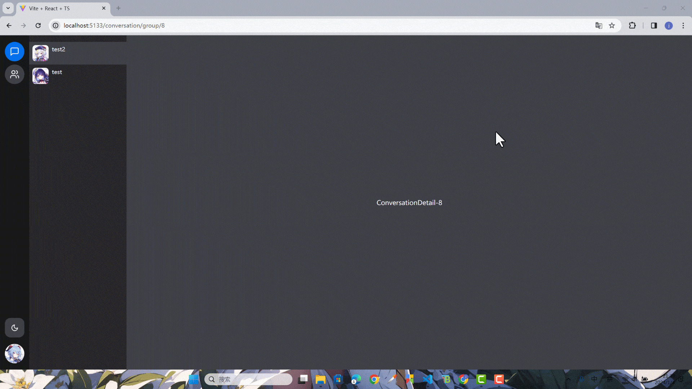

## 准备

### vo 文件

添加一个`conversation.vo.ts`文件。

```ts title="packages/shared/src/vo/conversation.vo.ts"
import { GroupMessageType } from '../enum'
import { FileVo } from './file.vo'
import { GroupVo } from './group.vo'
import { UserVo } from './user.vo'

export type ConversationVo = {
  id: number
  userId: number
  groupId: number
  unreadNum: number
  group: GroupVo
}

export type GroupMessageVo = {
  id: number
  type: GroupMessageType
  content: string
  groupId: number
  coverId?: number
  cover?: FileVo
  fileId?: number
  file?: FileVo
  userId: number
  user: UserVo
  createAt: string
  updateAt: string
}
```

导出一下。

```ts title="packages/shared/src/vo/index.ts"
// ...
export * from './conversation.vo'
```

### api 文件

添加一个`conversation.ts`文件。

```ts title="apps/client/src/api/conversation.ts"
import {
  ConversationVo,
  GroupMessageListDto,
  GroupMessageVo,
  SendMsgDto
} from '@ying-chat/shared'
import { request } from './request'

export function getConversationList(): Promise<ConversationVo[]> {
  return request.get('/conversation/list')
}

export function getGroupConversationMessageList(
  query: GroupMessageListDto
): Promise<GroupMessageVo[]> {
  return request.get('/conversation/group/message/list', { params: query })
}

export function sendTextGroupMessage(dto: SendMsgDto): Promise<GroupMessageVo> {
  return request.post('/conversation/group/message/text', dto)
}

export function sendImageGroupMessage(
  file: File,
  groupId: string
): Promise<GroupMessageVo> {
  const form = new FormData()
  form.append('file', file)
  form.append('groupId', groupId)
  return request.post('/conversation/group/message/image', form)
}

export function sendVideoGroupMessage(
  file: File,
  coverFile: File,
  groupId: string
): Promise<GroupMessageVo> {
  const form = new FormData()
  form.append('file', file)
  form.append('coverFile', coverFile)
  form.append('groupId', groupId)
  return request.post('/conversation/group/message/video', form)
}
```

导出。

```ts title="apps/client/src/api/index.ts"
// ...
import * as conversationApi from './conversation'

export {
  // ...
  conversationApi
}
```

## 会话列表对接

### ConversationProvider

接下来先实现一个`ConversationProvider`，写这个 Provider 是为了方便在后面即时通讯时，统一更新左侧会话列表。

在`conversation`文件夹下，添加一个`use-conversation.ts`文件，在里面写好对话列表相关的逻辑。

```ts title="apps/client/src/pages/conversation/use-conversation.ts"
import { createContext, useContext, useMemo } from 'react'
import { useCallback } from 'react'
import { useLocation, useParams } from 'react-router-dom'
import { conversationApi } from '@/api'
import { useApi } from '@/api/use-api'
import { ConversationVo } from '@ying-chat/shared'

export const useConversationLogic = () => {
  const { pathname } = useLocation()
  const { groupId } = useParams()

  const { data } = useApi<ConversationVo[]>({
    func: useCallback(() => conversationApi.getConversationList(), [])
  })

  const currentConversation = useMemo(() => {
    if (pathname.startsWith('/conversation/group/')) {
      const conversation = data?.find(el => el.groupId === Number(groupId))
      return conversation
    }

    return undefined
  }, [data, pathname, groupId])

  const isActived = useCallback(
    (currentId: number) => {
      return currentId === currentConversation?.id
    },
    [currentConversation]
  )

  return {
    coversations: data,
    isActived
  }
}

type TConversationContext = {
  coversations: ConversationVo[] | undefined
  isActived: (id: number) => boolean
}

export const ConversationContext = createContext<TConversationContext>({
  coversations: undefined,
  isActived: () => false
})

export const useConversation = () => {
  return useContext(ConversationContext)
}
```

新建`conversation-provider.tsx`使用`use-conversation`。

```tsx title="apps\client\src\pages\conversation\conversation-provider.tsx"
import React from 'react'
import { ConversationContext, useConversationLogic } from './use-conversation'

type ConversationProviderProps = {
  children: React.ReactNode
}

export const ConversationProvider: React.FC<ConversationProviderProps> = ({
  children
}) => {
  const { coversations, isActived } = useConversationLogic()

  return (
    <ConversationContext.Provider
      value={{
        coversations,
        isActived
      }}
    >
      {children}
    </ConversationContext.Provider>
  )
}
```

### 路由完善

按照上次群组那里那样把路由搭建好。

在`conversation`下面添加一个`sidebar`组件作为展示用户群会话列表的展示。

```tsx title="apps/client/src/pages/conversation/sidebar.tsx"
import { useNavigate, useParams } from 'react-router-dom'
import { Avatar, Badge, cn } from '@nextui-org/react'
import {
  ConversationVo,
  GroupMessageType,
  GroupMessageVo
} from '@ying-chat/shared'
import { useConversation } from './use-conversation'

const renderMessage = (message?: GroupMessageVo) => {
  if (!message) return ''
  let recentMsg = message.user.nickname + ': '

  switch (message.type) {
    case GroupMessageType.Text:
      recentMsg = recentMsg + message.content
      break
    case GroupMessageType.Image:
      recentMsg = recentMsg + '[图片]'
      break
    case GroupMessageType.Video:
      recentMsg = recentMsg + '[视频]'
      break
  }

  return recentMsg
}

export const Sidebar = () => {
  const navigate = useNavigate()
  const { groupId } = useParams()

  const { coversations, isActived } = useConversation()

  const handleClick = (conversation: ConversationVo) => {
    if (conversation.groupId !== Number(groupId)) {
      const routeKey = `group/${conversation.groupId}`
      navigate(routeKey)
    }
  }

  return (
    <div className="w-60 py-4 overflow-y-auto no-scrollbar flex flex-col bg-content2">
      {coversations?.map(el => (
        <Badge
          content={el.unreadNum}
          color="danger"
          shape="rectangle"
          isInvisible={!el.unreadNum}
          key={el.id}
        >
          <div
            className={cn(
              'flex p-2 w-full cursor-pointer',
              isActived(el.id) && 'bg-content3'
            )}
            onClick={() => handleClick(el)}
          >
            <Avatar
              radius="sm"
              className="mr-2 flex-shrink-0"
              src={el.group.cover.url}
            />

            <div className="flex-1 w-0">
              <div className="flex justify-between">
                <p className="text-sm">{el.group.name}</p>
              </div>

              <p className="text-sm text-foreground-500 text-ellipsis overflow-hidden break-all whitespace-nowrap">
                {renderMessage(el.recentMsg)}
              </p>
            </div>
          </div>
        </Badge>
      ))}
    </div>
  )
}
```

先简单添加一个`ConversationDetail`

```ts title="apps/client/src/pages/conversation/conversation-detail.tsx"
import { useParams } from 'react-router-dom'

export const ConversationDetail = () => {
  const { groupId } = useParams()
  return (
    <div className="h-full fc overflow-y-auto no-scrollbar bg-content3">
      ConversationDetail-{groupId}
    </div>
  )
}
```

修改`ConversationPage`，在里面加上`ConversationProvider`、`Outlet`、`Sidebar`，同时导出`ConversationDetail`。

```tsx title="apps/client/src/pages/contact/index.tsx"
import { Outlet } from 'react-router-dom'
import { Sidebar } from './sidebar'
import { ConversationProvider } from './conversation-provider'
export { ConversationDetail } from './conversation-detail'

export const ConversationPage = () => {
  return (
    <ConversationProvider>
      <div className="h-full flex flex-row">
        <Sidebar />

        <main className="flex-1">
          <Outlet />
        </main>
      </div>
    </ConversationProvider>
  )
}
```

在`routes.tsx`里添加一下配置。

```tsx title="apps/client/src/router/routes.tsx"
// ...
import { MessageSquare, Users } from 'lucide-react'
import { ConversationDetail, ConversationPage } from '@/pages/conversation'

export const routes = [
  {
    path: '/',
    element: <AppLayout />,
    children: [
      // ...
      {
        path: 'conversation',
        element: <ConversationPage />,
        children: [
          {
            index: true,
            element: (
              <DefaultWrap>
                <Users size={60} />
              </DefaultWrap>
            )
          },
          {
            path: 'group/:groupId',
            element: <ConversationDetail />
          }
        ]
      }
      // ...
    ]
  }
  // ...
]
```

先来测试一下。



## 对话页面对接。

### 发送消息组件编写

在`components`文件夹添加一个`chat`文件夹，在里面实现所有需要用到的聊天组件。

实现`ChatSelectFile`组件。

```tsx title="apps/client/src/components/chat/chat-select-file.tsx"
import React from 'react'
import { PlusCircle } from 'lucide-react'
import { SelectFileType, selectFile } from '@/components/upload'
import {
  Dropdown,
  DropdownTrigger,
  DropdownMenu,
  DropdownItem
} from '@nextui-org/react'

type ChatSelectFileProps = {
  onFileSelect: (file: File, type: SelectFileType) => void
}

export const ChatSelectFile: React.FC<ChatSelectFileProps> = ({
  onFileSelect
}) => {
  return (
    <Dropdown backdrop="opaque">
      <DropdownTrigger>
        <PlusCircle className="cursor-pointer" />
      </DropdownTrigger>
      <DropdownMenu aria-label="Message Actions">
        <DropdownItem
          key="Image"
          onClick={() => {
            selectFile(SelectFileType.Image).then(file => {
              onFileSelect(file, SelectFileType.Image)
            })
          }}
        >
          Image
        </DropdownItem>
        <DropdownItem
          key="Video"
          onClick={() => {
            selectFile(SelectFileType.Video).then(file => {
              onFileSelect(file, SelectFileType.Video)
            })
          }}
        >
          Video
        </DropdownItem>
      </DropdownMenu>
    </Dropdown>
  )
}
```

安装一下表情包组件。

```shell title="apps/client"
pnpm i @emoji-mart/react @emoji-mart/data
```

实现`ChatEmoji`。

```tsx title="apps/client/src/components/chat/chat-emoji.tsx"
import React from 'react'
import { Popover, PopoverTrigger, PopoverContent } from '@nextui-org/react'
import Picker from '@emoji-mart/react'
import data from '@emoji-mart/data'
import { Smile } from 'lucide-react'
import { useTheme } from '../theme-provider'

type ChatEmojiProps = {
  onEmojiSelect?: (emoji: string) => void
}

export const ChatEmoji: React.FC<ChatEmojiProps> = ({ onEmojiSelect }) => {
  const { theme } = useTheme()

  return (
    <Popover placement="top" backdrop="opaque">
      <PopoverTrigger>
        <Smile className="cursor-pointer" />
      </PopoverTrigger>
      <PopoverContent className="bg-transparent shadow-none">
        <Picker
          theme={theme}
          data={data}
          // eslint-disable-next-line @typescript-eslint/no-explicit-any
          onEmojiSelect={(emoji: any) => {
            onEmojiSelect && onEmojiSelect(emoji.native)
          }}
        />
      </PopoverContent>
    </Popover>
  )
}
```

实现`ChatInput`。

```tsx title="apps/client/src/components/chat/chat-input.tsx"
import React, { useEffect, useRef, useState } from 'react'
import { Textarea } from '@nextui-org/react'
import { Loader2, SendHorizontal } from 'lucide-react'
import { toast } from 'sonner'
import { GroupMessageType } from '@ying-chat/shared'
import { SelectFileType } from '@/components/upload'
import { ChatEmoji } from './chat-emoji'
import { ChatSelectFile } from './chat-select-file'

type ChatInputProps = {
  onSend: (type: GroupMessageType, content: string | File) => Promise<void>
}

export const ChatInput: React.FC<ChatInputProps> = ({ onSend }) => {
  const [inputValue, setInputValue] = useState('')
  const [sendLoading, setSendLoading] = useState(false)
  const inputRef = useRef<HTMLTextAreaElement>(null)

  const sendTextMsg = () => {
    if (!inputValue) {
      return toast.warning('Please enter the message content!')
    }
    send(GroupMessageType.Text, inputValue)
  }

  const send = async (type: GroupMessageType, content: string | File) => {
    try {
      setSendLoading(true)

      await onSend(type, content)

      setInputValue('')
      toast.success('Message sent successfully!')
    } catch {
    } finally {
      setSendLoading(false)
    }
  }

  useEffect(() => {
    inputRef.current?.focus()
  }, [sendLoading, inputValue])

  return (
    <div className="flex flex-shrink-0 items-end rounded-md m-4 p-2 bg-content2">
      <Textarea
        ref={inputRef}
        classNames={{
          inputWrapper: 'shadow-none'
        }}
        placeholder="input message here"
        maxRows={3}
        isDisabled={sendLoading}
        value={inputValue}
        onChange={e => {
          setInputValue(e.target.value)
        }}
        onKeyDown={e => {
          if (!e.shiftKey && e.key == 'Enter') {
            e.preventDefault()
            sendTextMsg()
          }
        }}
      />
      <div className="flex gap-1 ml-2">
        <ChatSelectFile
          onFileSelect={(file, type) => {
            if (type === SelectFileType.Image) {
              send(GroupMessageType.Image, file)
            } else if (type === SelectFileType.Video) {
              send(GroupMessageType.Video, file)
            }
          }}
        />
        <ChatEmoji
          onEmojiSelect={emoji => {
            setInputValue(prevValue => prevValue + emoji)
          }}
        />
        {sendLoading ? (
          <Loader2 className="animate-spin" />
        ) : (
          <SendHorizontal className="cursor-pointer" onClick={sendTextMsg} />
        )}
      </div>
    </div>
  )
}
```

### 通用滚动组件的编写

在实现之前，先在`src`添加一个`utils.ts`文件，在里面先实现一个`debounce`函数，后面要用到。

```ts title="apps/client/src/utils.ts"
export function debounce<T>(callback: (params: T) => void, delay = 200) {
  let timer = 0
  return function (params: T) {
    if (timer) clearTimeout(timer)
    timer = setTimeout(() => {
      callback(params)
    }, delay)
  }
}
```

在`components`文件夹添加一个`scroll-box`文件夹，然后先添加一个`scroll-provider.ts`文件。

```tsx title="apps/client/src/components/scroll-box/scroll-provider.ts"
import {
  createContext,
  useCallback,
  useContext,
  useEffect,
  useRef,
  useState
} from 'react'

export type IntersectingCallback = () => void

export type UnObserverCallback = () => void

type TScrollBoxContext = {
  observer:
    | ((el: Element, func: IntersectingCallback) => UnObserverCallback)
    | undefined
}

export const useIntersectionObserver = () => {
  const [intersectionObserver, setIntersectionObserver] =
    useState<IntersectionObserver>()

  const mapRef = useRef(new Map<Element, IntersectingCallback>())

  useEffect(() => {
    const intersectionObserver = new IntersectionObserver(
      entries => {
        for (const entry of entries) {
          if (entry.isIntersecting) {
            const element = entry.target
            const func = mapRef.current.get(element)
            func && func()
          }
        }
      },
      {
        threshold: 0.6
      }
    )
    setIntersectionObserver(intersectionObserver)
  }, [])

  const observer = useCallback(
    (el: Element, func: IntersectingCallback) => {
      intersectionObserver?.observe(el)
      mapRef.current.set(el, func)

      return () => {
        intersectionObserver?.unobserve(el)
        mapRef.current.delete(el)
      }
    },
    [intersectionObserver]
  )

  return {
    observer
  }
}

export const useObserver = () => {
  return useContext(ScrollBoxContext)
}

export const ScrollBoxContext = createContext<TScrollBoxContext>({
  observer: undefined
})
```

实现`ScollBox`。

```tsx title="apps/client/src/components/scroll-box/scroll-box.tsx"
import React, {
  forwardRef,
  useEffect,
  useImperativeHandle,
  useLayoutEffect,
  useRef
} from 'react'
import { cn } from '@nextui-org/react'
import { debounce } from '@/utils'
import { ScrollBoxContext, useIntersectionObserver } from './scroll-provider'

type ScollBoxProps = {
  children: React.ReactNode
  className?: string
  onTop?: () => void
  onBottom?: () => void
}

export type ScollBoxHandle = {
  scrollToBottom: (behavior?: ScrollBehavior) => void
  getDistanceFromBottom: () => number
  keepBottom: (callback: () => void) => void
  keepPosition: (callback: () => void) => void
}

export const ScollBox = forwardRef<ScollBoxHandle, ScollBoxProps>(
  ({ children, className, onTop, onBottom }, ref) => {
    const scrollDivRef = useRef<HTMLDivElement>(null)
    const originHeight = useRef(0)
    const { observer } = useIntersectionObserver()

    const scrollToBottom = (behavior: ScrollBehavior = 'instant') => {
      scrollDivRef.current?.scrollTo({
        top: scrollDivRef.current.scrollHeight,
        behavior
      })
    }

    const getDistanceFromBottom = () => {
      const dom = scrollDivRef.current
      if (!dom) return 0
      return dom.scrollHeight - dom.scrollTop - dom.clientHeight
    }

    const keepBottom = (callback: () => void) => {
      const distanceFromBottom = getDistanceFromBottom()

      callback()

      setTimeout(() => {
        if (distanceFromBottom <= 300) {
          scrollToBottom('smooth')
        } else {
          scrollToBottom('instant')
        }
      })
    }

    const keepPosition = async (callback: () => void) => {
      const dom = scrollDivRef.current
      if (!dom) return

      originHeight.current = dom.scrollHeight
      callback()
    }

    useLayoutEffect(() => {
      const dom = scrollDivRef.current
      if (!dom) return

      if (originHeight.current) {
        dom.scrollTo({
          top: dom.scrollHeight - originHeight.current
        })
        originHeight.current = 0
      }
    }, [children])

    useImperativeHandle(
      ref,
      () => ({
        scrollToBottom,
        getDistanceFromBottom,
        keepBottom,
        keepPosition
      }),
      []
    )

    useEffect(() => {
      const dom = scrollDivRef.current
      if (!dom) return

      const scollCallback = debounce<Event>((e: Event) => {
        const el = e.target as HTMLDivElement,
          scrollTop = el.scrollTop,
          scrollHeight = el.scrollHeight,
          offsetHeight = el.offsetHeight
        if (onTop && scrollTop <= 0) {
          onTop()
        } else if (onBottom && offsetHeight + scrollTop + 5 >= scrollHeight) {
          onBottom()
        }
      }, 200)

      dom.addEventListener('scroll', scollCallback)

      return () => {
        dom.removeEventListener('scroll', scollCallback)
      }
    }, [onTop, onBottom, observer])

    return (
      <ScrollBoxContext.Provider value={{ observer }}>
        <div
          id="scroll-box"
          className={cn('overflow-y-auto scroll-box', className)}
          ref={scrollDivRef}
          aria-label="scrollbox"
        >
          {children}
        </div>
      </ScrollBoxContext.Provider>
    )
  }
)
```

导出一下。

```tsx title="apps/client/src/components/scroll-box/index.ts"
export * from './scroll-box'
export * from './scroll-provider'
```

### 群聊页面完善对接

安装一下`moment` 用来格式化时间。

```shell title="apps/client"
pnpm i moment
```

新建`messages`文件夹，添加一个`message-item.tsx`文件。

```tsx title="apps/client/src/pages/conversation/messages/message-item.tsx"
import { forwardRef, memo, useMemo, useRef } from 'react'
import moment from 'moment'
import { Avatar, Image, cn } from '@nextui-org/react'
import { useAuthStore } from '@/stores'
import { GroupMessageType, GroupMessageVo } from '@ying-chat/shared'

type ChatMessageItemProps = {
  message: GroupMessageVo
}

const MessageItem = memo(
  forwardRef<HTMLDivElement, ChatMessageItemProps>(
    ({ message }, messageItemRef) => {
      const userInfo = useAuthStore(state => state.userInfo)

      const isCurrentUser = useMemo(() => {
        return message.userId === userInfo?.id
      }, [userInfo, message])

      return (
        <div
          ref={messageItemRef}
          className={cn(
            'flex min-w-[400px] p-4',
            'hover:bg-content2',
            isCurrentUser && 'flex-row-reverse'
          )}
        >
          <Avatar
            className="flex-shrink-0 h-14 w-14"
            src={message.user.avatar?.url}
          />
          <div
            className={cn(
              'flex flex-col items-start mx-2',
              isCurrentUser && 'items-end'
            )}
          >
            <div
              className={cn('flex mb-2', isCurrentUser && 'flex-row-reverse')}
            >
              <p className="text-sm font-semibold text-foreground-700">
                {message.user.nickname}
              </p>
              <p className="text-sm mx-2 text-foreground-500">
                {moment(message.createAt).format('YYYY-MM-DD HH:mm:ss')}
              </p>
            </div>
            {message.type === GroupMessageType.Text && (
              <p className="whitespace-pre-wrap text-foreground">
                {message.content}
              </p>
            )}
            {message.type === GroupMessageType.Image && (
              <Image
                src={message.file?.url}
                className="w-auto h-[200px] cursor-pointer"
              />
            )}

            {message.type === GroupMessageType.Video && (
              <Image
                className="w-auto h-[200px] cursor-pointer"
                src={message.cover?.url}
              />
            )}
          </div>
        </div>
      )
    }
  ),
  (prevProps, nextProps) => {
    return prevProps.message.id === nextProps.message.id
  }
)

export const ChatMessageItem = ({ message }: ChatMessageItemProps) => {
  const messageItemRef = useRef(null)

  return <MessageItem ref={messageItemRef} message={message} />
}
```

实现`ChatMessages`组件。

```tsx title="apps/client/src/pages/conversation/messages/messages.tsx"
import { useCallback, useEffect, useRef, useState } from 'react'
import { useNavigate, useParams } from 'react-router-dom'
import { CircularProgress } from '@nextui-org/react'
import { GroupMessageVo } from '@ying-chat/shared'
import { conversationApi } from '@/api'
import { ScollBox, ScollBoxHandle } from '@/components/scroll-box'
import { ChatMessageItem } from './message-item'

const SIZE = 30

const useMessages = () => {
  const navigate = useNavigate()
  const { groupId } = useParams()

  const topMessageId = useRef(0)
  const [messages, setMessageList] = useState<GroupMessageVo[]>([])
  const [firstLoaded, setFirstLoaded] = useState(false)
  const [loaded, setLoaded] = useState(false)

  const addPrevMessage = useCallback((prevMessage: GroupMessageVo[]) => {
    setMessageList(messages => [...prevMessage, ...messages])
  }, [])

  const addNewMessage = useCallback((newMessage: GroupMessageVo) => {
    setMessageList(messages => [...messages, newMessage])
  }, [])

  const loadMessages = async (groupId: number, cursorId?: number) => {
    const res = await conversationApi.getGroupConversationMessageList({
      groupId,
      size: SIZE,
      cursorId: cursorId || undefined
    })
    if (!res.length || res.length < SIZE) {
      setLoaded(true)
    }
    return res
  }

  useEffect(() => {
    if (messages.length) {
      topMessageId.current = messages[0].id
    }
  }, [messages])

  const loadPrevMessages = useCallback(async () => {
    console.log('loadPrevMessages')
    if (!groupId) return
    const res = await loadMessages(Number(groupId), topMessageId.current)
    addPrevMessage(res.reverse())
  }, [groupId, addPrevMessage])

  const firstLoadMessages = useCallback(async () => {
    console.log('firstLoadMessages', groupId)
    if (!groupId) return
    try {
      const res = await loadMessages(Number(groupId))
      setMessageList(res.reverse())
      setFirstLoaded(true)
    } catch (error) {
      navigate('/conversation', { replace: true })
    }
  }, [groupId, navigate])

  useEffect(() => {
    firstLoadMessages()
  }, [firstLoadMessages])

  return {
    messages,
    firstLoaded,
    loaded,
    addNewMessage,
    loadPrevMessages
  }
}

export const ChatMessages = () => {
  const scrollBoxRef = useRef<ScollBoxHandle>(null)
  const { messages, firstLoaded, loaded, loadPrevMessages } = useMessages()

  useEffect(() => {
    if (firstLoaded) {
      scrollBoxRef.current?.scrollToBottom()
    }
  }, [firstLoaded])

  const onTop = useCallback(() => {
    if (!loaded) {
      scrollBoxRef.current?.keepPosition(loadPrevMessages)
    }
  }, [loaded, loadPrevMessages])

  return (
    <div className="flex-1 h-[1px] relative">
      <ScollBox className="h-full" ref={scrollBoxRef} onTop={onTop}>
        <div className="w-full flex justify-center my-4" aria-label="tip">
          {!loaded ? (
            <CircularProgress aria-label="loading" />
          ) : (
            <p className="text-sm text-foreground-500">no more messages</p>
          )}
        </div>
        {messages.map(el => (
          <ChatMessageItem key={el.id} message={el} />
        ))}
      </ScollBox>
    </div>
  )
}
```

先更新一下`utils.ts`。

```ts title="apps/client/src/utils.ts"
// ...
export function createBlobURL(file: File) {
  if (window.URL) {
    return window.URL.createObjectURL(file)
  } else if (window.webkitURL) {
    return window.webkitURL.createObjectURL(file)
  } else {
    return ''
  }
}

export function getVideoFileCover(file: File): Promise<File> {
  return new Promise((resolve, reject) => {
    const videoUrl = createBlobURL(file)
    const video = document.createElement('video')
    video.src = videoUrl
    video.currentTime = 0.5
    video.onerror = reject
    video.onloadeddata = () => {
      const canvas = document.createElement('canvas'),
        width = video.videoWidth,
        height = video.videoHeight
      canvas.width = width
      canvas.height = height
      canvas
        .getContext('2d')
        ?.drawImage(video, 0, 0, canvas.width, canvas.height)
      canvas.toBlob(
        blob => {
          if (!blob) {
            reject(blob)
            return
          }
          resolve(new File([blob], 'cover', { type: 'image/jpeg' }))
        },
        'image/jpeg',
        1
      )
    }
  })
}
```

完善`ConversationDetail`。

```tsx title="apps/client/src/pages/conversation/conversation-detail.tsx"
import { useParams } from 'react-router-dom'
import { ChatInput } from '@/components/chat/chat-input'
import { conversationApi } from '@/api'
import { GroupMessageType } from '@ying-chat/shared'
import { getVideoFileCover } from '@/utils'
import { ChatMessages } from './messages/messages'

export const ConversationDetail = () => {
  const { groupId } = useParams()

  const onSend = async (type: GroupMessageType, content: string | File) => {
    if (type === GroupMessageType.Text) {
      await conversationApi.sendTextGroupMessage({
        groupId: Number(groupId),
        content: content as string
      })
    } else if (type === GroupMessageType.Image) {
      await conversationApi.sendImageGroupMessage(content as File, groupId + '')
    } else if (type === GroupMessageType.Video) {
      const coverFile = await getVideoFileCover(content as File)
      await conversationApi.sendVideoGroupMessage(
        content as File,
        coverFile,
        groupId + ''
      )
    }
  }

  return (
    <div className="h-full flex flex-col bg-content3">
      <ChatMessages />
      <ChatInput onSend={onSend} />
    </div>
  )
}
```

修改一下`scroll-box`滚动条的样式，在`index.css`文件添加如下代码。

```css title="apps/client/src/index.css"
// ...
.scroll-box::-webkit-scrollbar {
  width: 14px;
}

.scroll-box::-webkit-scrollbar-thumb {
  border-radius: 4px;
  --tw-bg-opacity: 1;
  background-color: hsl(
    var(--nextui-content2) / var(--nextui-content2-opacity, var(--tw-bg-opacity))
  );
}

.scroll-box::-webkit-scrollbar-track {
  --tw-bg-opacity: 1;
  background-color: hsl(
    var(--nextui-content3) / var(--nextui-content3-opacity, var(--tw-bg-opacity))
  );
}
```

最后可以整体测试一下。


本节到此结束。
