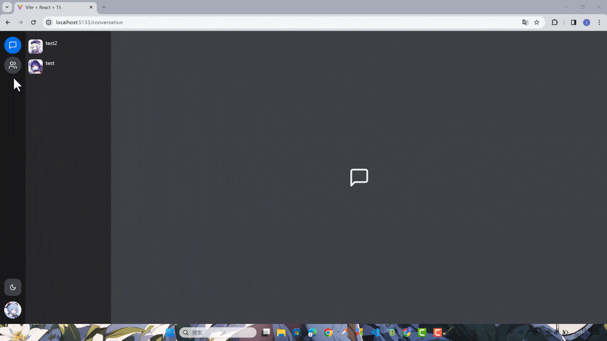

本节来实现图片和视频预览组件和路由的缓存。

## 图片和视频预览组件

### 组件准备

在`stores`文件夹里添加`use-preview-store.ts`。

```ts title="apps/client/src/stores/use-preview-store.ts"
import { create } from 'zustand'

type PreviewType = 'image' | 'video'

type PreviewStore = {
  type: PreviewType
  url: string
  open: boolean
}

export const usePreview = create<PreviewStore>(() => ({
  type: 'image',
  url: '',
  open: false
}))

export const openPreview = (type: PreviewType, url: string) => {
  usePreview.setState({ open: true, type, url })
}

export const closePreview = () => {
  usePreview.setState({ open: false })
}
```

导出一下。

```ts title="apps/client/src/stores/index.ts"
// ...
export * from './use-preview-store'
```

在`components`里面直接添加`PreviewModal`。

```tsx title="apps/client/src/components/preview-modal.tsx"
import { Modal, ModalContent } from '@nextui-org/react'
import { usePreview, closePreview } from '@/stores'

export const PreviewModal = () => {
  const { open, url, type } = usePreview()

  return (
    <Modal
      isOpen={open}
      onClose={() => closePreview()}
      className="bg-transparent"
      size="full"
      classNames={{ closeButton: 'top-5 right-5' }}
    >
      <ModalContent className="fc">
        {type === 'image' ? (
          
        ) : (
          <video className="max-w-full h-[80%]" src={url} controls autoPlay />
        )}
      </ModalContent>
    </Modal>
  )
}
```

### 使用

在`App.tsx`里使用`PreviewModal`。

```tsx title="apps/client/src/App.tsx"
// ...
import { PreviewModal } from '@/components/preview-modal'

function App() {
  return (
    <ThemeProvider defaultTheme="dark">
      <Toaster richColors position="top-center" />
      <PreviewModal />
      <RouterProvider router={router}></RouterProvider>
    </ThemeProvider>
  )
}

export default App
```

在`message-item.tsx`里使用`openPreview`。

```tsx title="apps/client/src/pages/conversation/messages/message-item.tsx"
// ...
import {
  // ...
  openPreview
} from '@/stores'

const MessageItem = memo(
  forwardRef<HTMLDivElement, ChatMessageItemProps>(
    ({ message }, messageItemRef) => {
      // ...

      return (
        {/*  */}
        {message.type === GroupMessageType.Image && (
          <Image
            src={message.file?.url}
            className="w-auto h-[200px] cursor-pointer"
            onClick={() => openPreview('image', message.file!.url)}
          />
        )}

        {message.type === GroupMessageType.Video && (
          <Image
            className="w-auto h-[200px] cursor-pointer"
            src={message.cover?.url}
            onClick={() => openPreview('video', message.file!.url)}
          />
        )}
        {/*  */}
      )
    }
  ),
  (prevProps, nextProps) => {
    return prevProps.message.id === nextProps.message.id
  }
)
// ...
```

测试一下。


## 路由缓存添加

### react-router 的缓存

先安装一下依赖。

```shell title="apps/client"
pnpm i react-freeze
```

添加一个`KeepAliveOutlet`。

```tsx title="apps/client/src/router/keep-alive.tsx"
import { ReactElement, useContext, useRef } from 'react'
import { Freeze } from 'react-freeze'
import { UNSAFE_RouteContext as RouteContext } from 'react-router-dom'

export const KeepAliveOutlet = () => {
  const caches = useRef<Record<string, ReactElement>>({})

  const routeContext = useContext(RouteContext)
  const matchedElement = routeContext.outlet
  const matchedPath = matchedElement?.props?.match?.pathname

  if (matchedElement && matchedPath) {
    caches.current[matchedPath] = matchedElement
  }

  return (
    <>
      {Object.entries(caches.current).map(([path, element]) => (
        <Freeze key={path} freeze={element !== matchedElement}>
          {element}
        </Freeze>
      ))}
    </>
  )
}
```

把先前使用的`react-router-dom`的`Outlet`全部换成`KeepAliveOutlet`。

```tsx title="apps/client/src/components/layout/index.tsx"
// ...
import { KeepAliveOutlet } from '@/router/keep-alive'

export const AppLayout = () => {
  return useAuthRoute(
    <div className="h-full flex flex-row">
      <NavSidebar />

      <main className="h-full flex-1">
        <KeepAliveOutlet />
      </main>
    </div>
  )
}
```

```tsx title="apps/client/src/pages/contact/index.tsx"
import { KeepAliveOutlet } from '@/router/keep-alive'
// ...

export const ContactPage = () => {
  return (
    <div className="h-full flex flex-row">
      <Sidebar />

      <main className="flex-1">
        <KeepAliveOutlet />
      </main>
    </div>
  )
}
```

```tsx title="apps/client/src/pages/conversation/index.tsx"
import { KeepAliveOutlet } from '@/router/keep-alive'
// ...

export const ConversationPage = () => {
  return (
    <ConversationProvider>
      <div className="h-full flex flex-row">
        <Sidebar />

        <main className="flex-1">
          <KeepAliveOutlet />
        </main>
      </div>
    </ConversationProvider>
  )
}
```

测试一下。



### 会话和群详情页面缓存

虽然路由页面的缓存添加上了，但是点击`NavSidebar`的跳转不会记录上次访问的页面，接下来在全局状态里添加一下。

修改一下`router`下的`index.tsx`。

```tsx title="apps/client/src/router/index.tsx"
import { createContext, useEffect } from 'react'
import { useLocation, useRoutes } from 'react-router-dom'
import { routes } from './routes'

type keyType = '/contact' | '/conversation'
type CacheType = Record<keyType, string>

const routeKeyCache: CacheType = {
  '/contact': '/contact',
  '/conversation': '/conversation'
}

const setRouteKeyCache = (key: keyType, value: string) => {
  routeKeyCache[key] = value
}

type RouterContextType = {
  routeKeyCache: CacheType
}

export const RouterContext = createContext<RouterContextType>({
  routeKeyCache
})

export const RouterProvider = () => {
  const routesElements = useRoutes(routes)
  const { pathname } = useLocation()

  useEffect(() => {
    if (pathname.startsWith('/contact')) {
      setRouteKeyCache('/contact', pathname)
    }

    if (pathname.startsWith('/conversation')) {
      setRouteKeyCache('/conversation', pathname)
    }
  }, [pathname])

  return (
    <RouterContext.Provider
      value={{
        routeKeyCache
      }}
    >
      {routesElements}
    </RouterContext.Provider>
  )
}
```

再添加一个`useRouterContext`。

```ts title="apps/client/src/router/use-router-context.ts"
import { useContext } from 'react'
import { RouterContext } from '.'

export const useRouterContext = () => {
  return useContext(RouterContext)
}
```

改变一下路由的引入方式，修改`App.tsx`。

```tsx title="apps/client/src/App.tsx"
import { BrowserRouter } from 'react-router-dom'
import { RouterProvider } from '@/router'
// ...

function App() {
  return (
    <ThemeProvider defaultTheme="dark">
      <Toaster richColors position="top-center" />
      <PreviewModal />
      <BrowserRouter>
        <RouterProvider />
      </BrowserRouter>
    </ThemeProvider>
  )
}

export default App
```

最后修改一下`NavSidebar`。

```tsx title="apps/client/src/components/layout/nav-sidebar.tsx"
// ...
import { useRouterContext } from '@/router/use-router-context'

export const NavSidebar = () => {
  // ...
  const { routeKeyCache } = useRouterContext()

  // ...

  return (
    <div className="flex flex-col gap-4 items-center w-[72px] py-4 bg-content1">
      <div className="flex-1 flex flex-col gap-2">
        <div
          className={cn(
            `fc text-xl w-[48px] h-[48px] cursor-pointer rounded-full transition-all duration-700`,
            'hover:rounded-2xl text-foreground bg-default',
            pathname.startsWith('/conversation') && 'rounded-2xl bg-primary'
          )}
          onClick={() => {
            const cacheRoute = routeKeyCache['/conversation']
            if (cacheRoute) {
              navigate(cacheRoute, { replace: true })
            } else {
              navigate('/conversation', { replace: true })
            }
          }}
        >
          <MessageSquare />
        </div>
        <div
          className={cn(
            `fc text-xl w-[48px] h-[48px] cursor-pointer rounded-full transition-all duration-700`,
            'hover:rounded-2xl text-foreground bg-default',
            pathname.startsWith('/contact') && 'rounded-2xl bg-primary'
          )}
          onClick={() => {
            const cacheRoute = routeKeyCache['/contact']
            if (cacheRoute) {
              navigate(cacheRoute, { replace: true })
            } else {
              navigate('/contact', { replace: true })
            }
          }}
        >
          <Users />
        </div>
      </div>
      {/*  */}
    </div>
  )
}
```

群详情页面还有一个点击事件未添加，顺便加一下。

```tsx title="apps/client/src/pages/contact/contact-detail.tsx"
// ...
import {
  // ...
  useNavigate
} from 'react-router-dom'
// ...

export const ContactDetail = () => {
  // ...
  const navigate = useNavigate()
  // ...

  const Detail = () => {
    // ...

    return (
      <div className="w-[50%] h-[50%]">
        <div className="flex items-center">
          {/*  */}
          <Button
            color="primary"
            isIconOnly
            className="rounded-full w-16 h-16"
            onClick={() => {
              navigate(`/conversation/group/${data.id}`)
            }}
          >
            <MessageSquare size={30} />
          </Button>
        </div>

        {/*  */}
      </div>
    )
  }

  // ...
}
```

整体测试一下。


那么本节到此结束。
